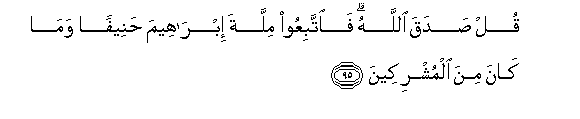

#قُلْ صَدَقَ اللَّهُ ۗ فَاتَّبِعُوا مِلَّةَ إِبْرَاهِيمَ حَنِيفًا وَمَا كَانَ مِنَ الْمُشْرِكِينَ 

##Qul sadaqa Allahu faittabiAAoo millata ibraheema haneefan wama kana mina almushrikeena 

## 翻译(Translation)：

| Translator | 译文(Translation)                                            |
| :--------: | ------------------------------------------------------------ |
|    马坚    | 你说：真主所说的是实话，故你们应当遵守崇奉正教的易卜拉欣的宗教，他不是以物配主的。 |
|  YUSUFALI  | Say: "Allah speaketh the Truth: follow the religion of Abraham, the sane in faith; he was not of the Pagans." |
|  PICKTHAL  | Say: Allah speaketh truth. So follow the religion of Abraham, the upright. He was not of the idolaters. |
|   SHAKIR   | Say: Allah has spoken the truth, therefore follow the religion of Ibrahim, the upright one; and he was not one of the polytheists. |

---

## 对位释义(Words Interpretation)：

| No   | العربية | 中文    | English | 曾用词 |
| ---- | ------: | ------- | ------- | ------ |
| 序号 |    阿文 | Chinese | 英文    | Used   |
| 3:95.1  | قُلْ       | 你说           | Say                 | 见2:80.8   |
| 3:95.2  | صَدَقَ      | 他说真实       | speak truth         |            |
| 3:95.3  | اللَّهُ     | 安拉，真主     | Allah               | 见1:1.2    |
| 3:95.4  | فَاتَّبِعُوا  | 因此你们应追随 | So follow           |            |
| 3:95.5  | مِلَّةَ      | 宗教           | the religion        | 见2:130.4  |
| 3:95.6  | إِبْرَاهِيمَ  | 易卜拉欣       | Ibrahim             | 见2:124.3  |
| 3:95.7  | حَنِيفًا    | 正教的         | the Hanif, the True | 见2:135.11 |
| 3:95.8  | وَمَا      | 和不           | And not             | 见2:9.9    |
| 3:95.9  | كَانَ      | 他是           | It was              | 见2:75.6   |
| 3:95.10 | مِنَ       | 从             | from                | 见2:4.8    |
| 3:95.11 | الْمُشْرِكِينَ | 以物配主者     | The polytheists     | 见2:105.9  |

---
