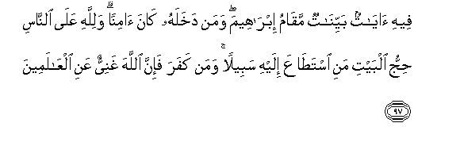

#فِيهِ آيَاتٌ بَيِّنَاتٌ مَقَامُ إِبْرَاهِيمَ ۖ وَمَنْ دَخَلَهُ كَانَ آمِنًا ۗ وَلِلَّهِ عَلَى النَّاسِ حِجُّ الْبَيْتِ مَنِ اسْتَطَاعَ إِلَيْهِ سَبِيلًا ۚ وَمَنْ كَفَرَ فَإِنَّ اللَّهَ غَنِيٌّ عَنِ الْعَالَمِينَ 

##Feehi ayatun bayyinatun maqamu ibraheema waman dakhalahu kana aminan walillahi AAala alnnasi hijju albayti mani istataAAa ilayhi sabeelan waman kafara fa-inna Allaha ghaniyyun AAani alAAalameena 

## 翻译(Translation)：

| Translator | 译文(Translation)                                            |
| :--------: | ------------------------------------------------------------ |
|    马坚    | 其中有许多明证，如易卜拉欣的立足地；凡入其中的人都得安宁。凡能旅行到天房的，人人都有为真主而朝觐天房的义务。不信道的人（无损于真主），因为真主确是无求于全世界的。 |
|  YUSUFALI  | In it are Signs Manifest; (for example), the Station of Abraham; whoever enters it attains security; Pilgrimage thereto is a duty men owe to Allah,- those who can afford the journey; but if any deny faith, Allah stands not in need of any of His creatures. |
|  PICKTHAL  | Wherein are plain memorials (of Allah's guidance); the place where Abraham stood up to pray; and whosoever entereth it is safe. And pilgrimage to the House is a duty unto Allah for mankind, for him who can find a way thither. As for him who disbelieveth, (let him know that) lo! Allah is Independent of (all) creatures. |
|   SHAKIR   | In it are clear signs, the standing place of Ibrahim, and whoever enters it shall be secure, and pilgrimage to the House is incumbent upon men for the sake of Allah, (upon) every one who is able to undertake the journey to it; and whoever disbelieves, then surely Allah is Self-sufficient, above any need of the worlds. |

---

## 对位释义(Words Interpretation)：

| No   | العربية | 中文    | English | 曾用词 |
| ---- | ------: | ------- | ------- | ------ |
| 序号 |    阿文 | Chinese | 英文    | Used   |
| 3:97.1  | فِيهِ      | 它，其中       | in it              | 见2:2.5     |
| 3:97.2  | آيَاتٌ     | 众迹象         | signs              | 与3:7.7不同 |
| 3:97.3  | بَيِّنَاتٌ    | 明确的         | clear              |             |
| 3:97.4  | مَقَامُ     | 立足地         | the standing place |             |
| 3:97.5  | إِبْرَاهِيمَ  | 易卜拉欣       | Ibrahim            | 见2:124.3   |
| 3:97.6  | وَمَنْ      | 和谁           | and who            | 见2:108.11  |
| 3:97.7  | دَخَلَهُ     | 他进入它       | he enters it       |             |
| 3:97.8  | كَانَ      | 他是           | It was             | 见2:75.6    |
| 3:97.9  | آمِنًا     | 安宁的         | Peace              | 见2:126.8   |
| 3:97.10 | وَلِلَّهِ     | 和真主         | and Allah          | 见2:115.1   |
| 3:97.11 | عَلَى      | 至             | On                 | 见2:5.2     |
| 3:97.12 | النَّاسِ    | 人             | People             | 见2:8.2     |
| 3:97.13 | حِجُّ       | 朝觐           | pilgrimage         |             |
| 3:97.14 | الْبَيْتِ    | 天房           | the House          | 见2:125.3   |
| 3:97.15 | مَنِ       | 谁             | who                | 见2:189.18  |
| 3:97.16 | اسْتَطَاعَ   | 他有能力       | he is able to      |             |
| 3:97.17 | إِلَيْهِ     | 至他           | to him             | 见2:28.12   |
| 3:97.18 | سَبِيلًا    | 旅行           | a way              |             |
| 3:97.19 | وَمَنْ      | 和谁           | and who            | 见2:108.11  |
| 3:97.20 | كَفَرَ      | 不信           | disbelieve         | 见2:102.9   |
| 3:97.21 | فَإِنَّ      | 和确实         | so surely          | 见2:98.9    |
| 3:97.22 | اللَّهَ     | 安拉，真主     | Allah              | 见1:1.2     |
| 3:97.23 | غَنِيٌّ      | 自足的         | Self-sufficient    | 见2:263.10  |
| 3:97.24 | عَنِ       | 关于           | about              | 见2:189.2   |
| 3:97.25 | الْعَالَمِينَ | 世界，众世界的 | worlds             | 见1:2.4     |

---
