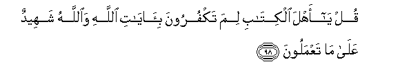

#قُلْ يَا أَهْلَ الْكِتَابِ لِمَ تَكْفُرُونَ بِآيَاتِ اللَّهِ وَاللَّهُ شَهِيدٌ عَلَىٰ مَا تَعْمَلُونَ 

##Qul ya ahla alkitabi lima takfuroona bi-ayati Allahi waAllahu shaheedun AAala ma taAAmaloona 

## 翻译(Translation)：

| Translator | 译文(Translation)                                            |
| :--------: | ------------------------------------------------------------ |
|    马坚    | 你说：信奉天经的人啊！真主是见证你们的行为的，你们为什么不信真主的迹象呢? |
|  YUSUFALI  | Say: "O People of the Book! Why reject ye the Signs of Allah, when Allah is Himself witness to all ye do?" |
|  PICKTHAL  | Say: O People of the Scripture! Why disbelieve ye in the revelations of Allah, when Allah (Himself) is Witness of what ye do? |
|   SHAKIR   | Say: O followers of the Book! why do you disbelieve in the communications of Allah? And Allah is a witness of what you do. |

---

## 对位释义(Words Interpretation)：

| No   | العربية | 中文    | English | 曾用词 |
| ---- | ------: | ------- | ------- | ------ |
| 序号 |    阿文 | Chinese | 英文    | Used   |
| 3:98.1  | قُلْ     | 你说         | Say              | 见2:80.8    |
| 3:98.2  | يَا     | 啊           | Oh               | 见2:21.1    |
| 3:98.3  | أَهْلَ    | 人们         | People           | 见3:64.3    |
| 3:98.4  | الْكِتَابِ | 这部经的     | of the Book      | 见2:85.25   |
| 3:98.5  | لِمَ     | 为什么       | why              | 见3:65.4    |
| 3:98.6  | تَكْفُرُونَ | 不信         | Disbelieve       | 见2:28.2    |
| 3:98.7  | بِآيَاتِ  | 在众迹象     | in the Signs of  | 见2:61.50   |
| 3:98.8  | اللَّهِ   | 安拉，真主   | Allah            | 见1:1.2     |
| 3:98.9  | وَاللَّهُ  | 和安拉，真主 | and Allah        | 见2:19.17   |
| 3:98.10 | شَهِيدٌ   | 作证者       | the witness      | 见2:282.116 |
| 3:98.11 | عَلَىٰ    | 至           | On               | 见2:5.2     |
| 3:98.12 | مَا     | 什么         | what/ that which | 见2:17.8    |
| 3:98.13 | تَعْمَلُونَ | 你们行为     | you do           | 见2:74.37   |

---
