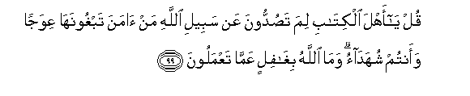

#قُلْ يَا أَهْلَ الْكِتَابِ لِمَ تَصُدُّونَ عَنْ سَبِيلِ اللَّهِ مَنْ آمَنَ تَبْغُونَهَا عِوَجًا وَأَنْتُمْ شُهَدَاءُ ۗ وَمَا اللَّهُ بِغَافِلٍ عَمَّا تَعْمَلُونَ 

##Qul ya ahla alkitabi lima tasuddoona AAan sabeeli Allahi man amana tabghoonaha AAiwajan waantum shuhadao wamaAllahu bighafilin AAamma taAAmaloona 

## 翻译(Translation)：

| Translator | 译文(Translation)                                            |
| :--------: | ------------------------------------------------------------ |
|    马坚    | 你说：信奉天经的人啊！你们既是见证，为什么你们要阻止信道的人入真主的大道，并想暗示它是邪道呢？真主决不忽视你们的行为。 |
|  YUSUFALI  | Say: "O ye People of the Book! Why obstruct ye those who believe, from the path of Allah, Seeking to make it crooked, while ye were yourselves witnesses (to Allah's Covenant)? but Allah is not unmindful of all that ye do." |
|  PICKTHAL  | Say: O People of the Scripture! Why drive ye back believers from the way of Allah, seeking to make it crooked, when ye are witnesses (to Allah's guidance)? Allah is not unaware of what ye do. |
|   SHAKIR   | Say: O followers of the Book! why do you hinder him who believes from the way of Allah? You seek (to make) it crooked, while you are witness, and Allah is not heedless of what you do. |

---

## 对位释义(Words Interpretation)：

| No   | العربية | 中文    | English | 曾用词 |
| ---- | ------: | ------- | ------- | ------ |
| 序号 |    阿文 | Chinese | 英文    | Used   |
| 3:99.1  | قُلْ      | 你说         | Say         | 见2:80.8  |
| 3:99.2  | يَا      | 啊           | Oh          | 见2:21.1  |
| 3:99.3  | أَهْلَ     | 人们         | People      | 见3:64.3  |
| 3:99.4  | الْكِتَابِ  | 这部经的     | of the Book | 见2:85.25 |
| 3:99.5  | لِمَ      | 为什么       | why         | 见3:65.4  |
| 3:99.6  | تَصُدُّونَ   | 你们阻止     | you hinder  |           |
| 3:99.7  | عَنْ      | 从           | on          | 见2:48.6  |
| 3:99.8  | سَبِيلِ    | 道路         | the way     | 见2:154.6 |
| 3:99.9  | اللَّهِ    | 安拉，真主   | Allah       | 见1:1.2   |
| 3:99.10 | مَنْ      | 谁           | who         | 见2:97.2  |
| 3:99.11 | آمَنَ     | 相信         | believe     | 见2:13.6  |
| 3:99.12 | تَبْغُونَهَا | 你们想暗示它 | You seek it |           |
| 3:99.13 | عِوَجًا    | 邪路         | crooked     |           |
| 3:99.14 | وَأَنْتُمْ   | 和你们       | and you     | 见2:22.22 |
| 3:99.15 | شُهَدَاءُ   | 见证         | witnesses   |           |
| 3:99.16 | وَمَا     | 和不         | And not     | 见2:9.9   |
| 3:99.17 | اللَّهُ    | 安拉，真主   | Allah       | 见1:1.2   |
| 3:99.18 | بِغَافِلٍ   | 忽视         | unmindful   | 见2:74.35 |
| 3:99.19 | عَمَّا     | 在什么       | of what     | 见2:74.36 |
| 3:99.20 | تَعْمَلُونَ  | 你们行为     | you do      | 见2:74.37 |

---
