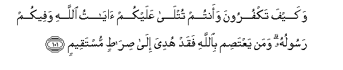

#وَكَيْفَ تَكْفُرُونَ وَأَنْتُمْ تُتْلَىٰ عَلَيْكُمْ آيَاتُ اللَّهِ وَفِيكُمْ رَسُولُهُ ۗ وَمَنْ يَعْتَصِمْ بِاللَّهِ فَقَدْ هُدِيَ إِلَىٰ صِرَاطٍ مُسْتَقِيمٍ 

##Wakayfa takfuroona waantum tutla AAalaykum ayatu Allahi wafeekum rasooluhu waman yaAAtasim biAllahi faqad hudiya ila siratin mustaqeemin 

## 翻译(Translation)：

| Translator | 译文(Translation)                                            |
| :--------: | ------------------------------------------------------------ |
|    马坚    | 你们常常听见别人对你们宣读真主的迹象，使者又与你们相处，你们怎么不信道呢？谁信托真主，谁确已被引导于正路。 |
|  YUSUFALI  | And how would ye deny Faith while unto you are rehearsed the Signs of Allah, and among you Lives the Messenger? Whoever holds firmly to Allah will be shown a way that is straight. |
|  PICKTHAL  | How can ye disbelieve, when it is ye unto whom Allah's revelations are recited, and His messenger is in your midst? He who holdeth fast to Allah, he indeed is guided unto a right path. |
|   SHAKIR   | But how can you disbelieve while it is you to whom the communications of Allah are recited, and among you is His Messenger? And whoever holds fast to Allah, he indeed is guided to the right path. |

---

## 对位释义(Words Interpretation)：

| No   | العربية | 中文    | English | 曾用词 |
| ---- | ------: | ------- | ------- | ------ |
| 序号 |    阿文 | Chinese | 英文    | Used   |
| 3:101.1  | وَكَيْفَ   | 和如何     | And how       |            |
| 3:101.2  | تَكْفُرُونَ | 不信       | Disbelieve    | 见2:28.2   |
| 3:101.3  | وَأَنْتُمْ  | 和你们     | and you       | 见2:22.22  |
| 3:101.4  | تُتْلَىٰ   | 它被宣读   | are recited   |            |
| 3:101.5  | عَلَيْكُمْ  | 在你们     | on you        | 见2:40.8   |
| 3:101.6  | آيَاتُ   | 迹象       | the Signs     | 见2:252.2  |
| 3:101.7  | اللَّهِ   | 安拉，真主 | Allah         | 见1:1.2    |
| 3:101.8  | وَفِيكُمْ  | 和在你们   | and among you |            |
| 3:101.9  | رَسُولُهُ  | 他的使者   | His messenger |            |
| 3:101.10 | وَمَنْ    | 和谁       | and who       | 见2:108.11 |
| 3:101.11 | يَعْتَصِمْ  | 他信托     | holds         |            |
| 3:101.12 | بِاللَّهِ  | 在真主     | in Allah      | 见2:8.6    |
| 3:101.13 | فَقَدْ    | 然后当然   | then may      | 见2:108.15 |
| 3:101.14 | هُدِيَ    | 他被引导   | is guided     |            |
| 3:101.15 | إِلَىٰ    | 至         | to            | 见2:14.9   |
| 3:101.16 | صِرَاطٍ   | 路径       | path, way     | 见1:7.1    |
| 3:101.17 | مُسْتَقِيمٍ | 端正的     | straight      | 见2:142.21 |

---
