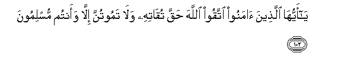

#يَا أَيُّهَا الَّذِينَ آمَنُوا اتَّقُوا اللَّهَ حَقَّ تُقَاتِهِ وَلَا تَمُوتُنَّ إِلَّا وَأَنْتُمْ مُسْلِمُونَ 

##Ya ayyuha allatheena amanoo ittaqoo Allaha haqqa tuqatihi wala tamootunna illa waantum muslimoona 

## 翻译(Translation)：

| Translator | 译文(Translation)                                            |
| :--------: | ------------------------------------------------------------ |
|    马坚    | 信道的人们啊！你们当真实地敬畏真主，你们除非成了顺主的人。   |
|  YUSUFALI  | O ye who believe! Fear Allah as He should be feared, and die not except in a state of Islam. |
|  PICKTHAL  | O ye who believe! Observe your duty to Allah with right observance, and die not save as those who have surrendered (unto Him) |
|   SHAKIR   | O you who believe! be careful of (your duty to) Allah with the care which is due to Him, and do not die unless you are Muslims. |

---

## 对位释义(Words Interpretation)：

| No   | العربية | 中文    | English | 曾用词 |
| ---- | ------: | ------- | ------- | ------ |
| 序号 |    阿文 | Chinese | 英文    | Used   |
| 3:102.1  | يَا     | 啊           | Oh                  | 见2:21.1   |
| 3:102.2  | أَيُّهَا   | 语气词       | O                   | 见2:21.2   |
| 3:102.3  | الَّذِينَ  | 谁，那些     | those who           | 见2:6.2    |
| 3:102.4  | آمَنُوا  | 诚信         | believe             | 见2:9.4    |
| 3:102.5  | اتَّقُوا  | 敬畏         | fear                | 见2:278.5  |
| 3:102.6  | اللَّهَ   | 安拉，真主   | Allah               | 见1:1.2    |
| 3:102.7  | حَقَّ     | 正确的，真理 | Right, truth        | 见2:121.5  |
| 3:102.8  | تُقَاتِهِ  | 他应被敬畏   | He should be feared |            |
| 3:102.9  | وَلَا    | 也不         | and not             | 见1:7.8    |
| 3:102.10 | تَمُوتُنَّ  | 死           | die                 | 见2:132.14 |
| 3:102.11 | إِلَّا    | 除了         | Except              | 见2:9.7    |
| 3:102.12 | وَأَنْتُمْ  | 和你们       | and you             | 见2:22.22  |
| 3:102.13 | مُسْلِمُونَ | 穆斯林，顺民 | Muslims, submissive | 见2:132.17 |

---
