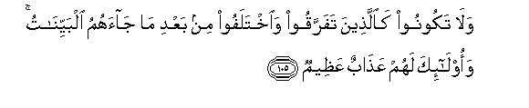

#وَلَا تَكُونُوا كَالَّذِينَ تَفَرَّقُوا وَاخْتَلَفُوا مِنْ بَعْدِ مَا جَاءَهُمُ الْبَيِّنَاتُ ۚ وَأُولَٰئِكَ لَهُمْ عَذَابٌ عَظِيمٌ 

##Wala takoonoo kaallatheena tafarraqoo waikhtalafoo min baAAdi ma jaahumu albayyinatu waola-ika lahum AAathabun AAatheemun 

## 翻译(Translation)：

| Translator | 译文(Translation)                                            |
| :--------: | ------------------------------------------------------------ |
|    马坚    | 你们不要象那样的人：在明证降临之后，自己分裂，常常争论；那等人，将受重大的刑罚。 |
|  YUSUFALI  | Be not like those who are divided amongst themselves and fall into disputations after receiving Clear Signs: For them is a dreadful penalty,- |
| PICKTHALL  | And be ye not as those who separated and disputed after the clear proofs had come unto them. For such there is an awful doom, |
|   SHAKIR   | And be not like those who became divided and disagreed after clear arguments had come to them, and these it is that shall have a grievous chastisement. |

---

## 对位释义(Words Interpretation)：

| No   | العربية | 中文    | English | 曾用词 |
| ---- | ------: | ------- | ------- | ------ |
| 序号 |    阿文 | Chinese | 英文    | Used   |
| 3:105.1  | وَلَا      | 也不       | and not             | 见1:7.8   |
| 3:105.2  | تَكُونُوا   | 你们是     | You will be         | 见2:41.8  |
| 3:105.3  | كَالَّذِينَ   | 像那些人   | like those          | 参2:6.2   |
| 3:105.4  | تَفَرَّقُوا   | 你们分裂   | separate            | 见3:103.6 |
| 3:105.5  | وَاخْتَلَفُوا | 和争论     | and differed        | 参2:176.9 |
| 3:105.6  | مِنْ       | 从         | from                | 见2:4.8   |
| 3:105.7  | بَعْدِ      | 之后       | after               | 见2:27.6  |
| 3:105.8  | مَا       | 什么       | what/ that which    | 见2:17.8  |
| 3:105.9  | جَاءَهُمُ    | 来至他们   | had come to them    | 见3:19.15 |
| 3:105.10 | الْبَيِّنَاتُ  | 明证       | the clear Signs     | 见2:209.7 |
| 3:105.11 | وَأُولَٰئِكَ   | 和这等人   | and these are       | 见2:5.6   |
| 3:105.12 | لَهُمْ      | 对他们     | for them            | 见2:11.3  |
| 3:105.13 | عَذَابٌ     | 煎熬，刑罚 | torment, punishment | 见2:7.11  |
| 3:105.14 | عَظِيمٌ     | 重大       | Great               | 见2:7.12  |

---
