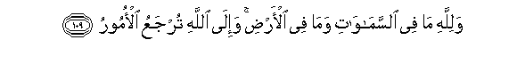

#وَلِلَّهِ مَا فِي السَّمَاوَاتِ وَمَا فِي الْأَرْضِ ۚ وَإِلَى اللَّهِ تُرْجَعُ الْأُمُورُ 

##Walillahi ma fee alssamawati wama fee al-ardi wa-ila Allahi turjaAAu al-omooru 

## 翻译(Translation)：

| Translator | 译文(Translation)                                            |
| :--------: | ------------------------------------------------------------ |
|    马坚    | 天地万物都是真主的，万事只归真主。                           |
|  YUSUFALI  | To Allah belongs all that is in the heavens and on earth: To Him do all questions go back (for decision). |
| PICKTHALL  | Unto Allah belongeth whatsoever is in the heavens and whatsoever is in the earth; and unto Allah all things are returned. |
|   SHAKIR   | And whatever is in the heavens and whatever is in the earth is Allah's; and to Allah all things return |

---

## 对位释义(Words Interpretation)：

| No   | العربية | 中文    | English | 曾用词 |
| ---- | ------: | ------- | ------- | ------ |
| 序号 |    阿文 | Chinese | 英文    | Used   |
| 3:109.1  | وَلِلَّهِ     | 和归真主 | and to Allah     | 见2:115.1  |
| 3:109.2  | مَا       | 什么       | what/ that which | 见2:17.8   |
| 3:109.3  | فِي       | 在         | in               | 见2:10.1   |
| 3:109.4  | السَّمَاوَاتِ | 诸天的 | of the heavens   | 见2:33.16  |
| 3:109.5  | وَمَا      | 和什么     | and that         | 见2:4.6    |
| 3:109.6  | فِي       | 在         | in               | 见2:10.1   |
| 3:109.7  | الْأَرْضِ    | 大地       | Earth            | 见2:22.4   |
| 3:109.8  | وَإِلَى     | 和至       | and to           | 见2:210.14 |
| 3:109.9  |     اللَّهِ | 真主的   | of Allah         | 见2:23.17  |
| 3:109.10 | تُرْجَعُ     | 它被返回   | are returned     | 见2:210.16 |
| 3:109.11 | الْأُمُورُ   | 一切事情   | all matters      | 见2:210.17 |

---
