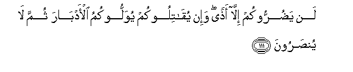

#لَنْ يَضُرُّوكُمْ إِلَّا أَذًى ۖ وَإِنْ يُقَاتِلُوكُمْ يُوَلُّوكُمُ الْأَدْبَارَ ثُمَّ لَا يُنْصَرُونَ 

##Lan yadurrookum illa athan wa-in yuqatilookum yuwallookumu al-adbara thumma la yunsaroona 

## 翻译(Translation)：

| Translator | 译文(Translation)                                            |
| :--------: | ------------------------------------------------------------ |
|    马坚    | 除恶言外，他们绝不能伤害你们；如果你们和他们交战，他们将要败北，且不获援助。 |
|  YUSUFALI  | They will do you no harm, barring a trifling annoyance; if they come out to fight you, they will show you their backs, and no help shall they get. |
| PICKTHALL  | They will not harm you save a trifling hurt, and if they fight against you they will turn and flee. And afterward they will not be helped. |
|   SHAKIR   | They shall by no means harm you but with a slight evil; and if they fight with you they shall turn (their) backs to you, then shall they not be helped. |

---

## 对位释义(Words Interpretation)：

| No   | العربية | 中文    | English | 曾用词 |
| ---- | ------: | ------- | ------- | ------ |
| 序号 |    阿文 | Chinese | 英文    | Used   |
| 3:111.1  | لَنْ       | 绝不           | will not            | 见2:55.5   |
| 3:111.2  | يَضُرُّوكُمْ   | 他们伤害你们   | they harm you       |            |
| 3:111.3  | إِلَّا      | 除了           | Except              | 见2:9.7    |
| 3:111.4  | أَذًى      | 些许伤害       | ailment             | 见2:196.24 |
| 3:111.5  | وَإِنْ      | 和如果         | and if              | 见2:137.9  |
| 3:111.6  | يُقَاتِلُوكُمْ | 他们进攻你们   | they fight with you | 见2:191.18 |
| 3:111.7  | يُوَلُّوكُمُ   | 他们转向至你们 | they shall turn     |            |
| 3:111.8  | الْأَدْبَارَ  | 背部           | their backs         |            |
| 3:111.9  | ثُمَّ       | 然后           | Then                | 见2:28.7   |
| 3:111.10 | لَا       | 不，不是，没有 | no                  | 见2:2.3    |
| 3:111.11 | يُنْصَرُونَ   | 被援助         | be helped           | 见2:48.19  |

---
