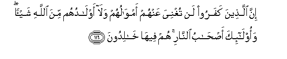

#إِنَّ الَّذِينَ كَفَرُوا لَنْ تُغْنِيَ عَنْهُمْ أَمْوَالُهُمْ وَلَا أَوْلَادُهُمْ مِنَ اللَّهِ شَيْئًا ۖ وَأُولَٰئِكَ أَصْحَابُ النَّارِ ۚ هُمْ فِيهَا خَالِدُونَ 

##Inna allatheena kafaroo lan tughniya AAanhum amwaluhum wala awladuhum mina Allahi shay-an waola-ika as-habu alnnari hum feeha khalidoona 

## 翻译(Translation)：

| Translator | 译文(Translation)                                            |
| :--------: | ------------------------------------------------------------ |
|    马坚    | 不信道的人，他们的财产和子嗣，对真主的刑罚，绝不能裨益他们一丝毫；这等人是火狱的居民，将永居其中。 |
|  YUSUFALI  | Those who reject Faith,- neither their possessions nor their (numerous) progeny will avail them aught against Allah: They will be companions of the Fire,-dwelling therein (for ever). |
| PICKTHALL  | Lo! the riches and the progeny of those who disbelieve will not avail them aught against Allah; and such are rightful owners of the Fire. They will abide therein. |
|   SHAKIR   | (As for) those who disbelieve, surely neither their wealth nor their children shall avail them in the least against Allah; and these are the inmates of the fire; therein they shall abide. |

---

## 对位释义(Words Interpretation)：

| No   | العربية | 中文    | English | 曾用词 |
| ---- | ------: | ------- | ------- | ------ |
| 序号 |    阿文 | Chinese | 英文    | Used   |
| 3:116.1  | إِنَّ      | 的确       | surely         | 见2:6.1   |
| 3:116.2  | الَّذِينَ   | 谁，那些   | those who      | 见2:6.2   |
| 3:116.3  | كَفَرُوا   | 不信       | disbelieve     | 见2:6.3   |
| 3:116.4  | لَنْ      | 绝不       | will not       | 见2:55.5  |
| 3:116.5  | تُغْنِيَ    | 裨益       | avail          | 见3:10.5  |
| 3:116.6  | عَنْهُمْ    | 在他们     | on them        | 见3:10.6  |
| 3:116.7  | أَمْوَالُهُمْ | 他们的财富 | their wealth   | 见3:10.7  |
| 3:116.8  | وَلَا     | 也不       | and not        | 见1:7.8   |
| 3:116.9  | أَوْلَادُهُمْ | 他们的子嗣 | their children | 见3:10.9  |
| 3:116.10 | مِنَ      | 从         | from           | 见2:4.8   |
| 3:116.11 | اللَّهِ    | 安拉，真主 | Allah          | 见1:1.2   |
| 3:116.12 | شَيْئًا    | 一件事情   | a thing        | 见2:48.8  |
| 3:116.13 | وَأُولَٰئِكَ  | 和这等人   | and these are  | 见2:5.6   |
| 3:116.14 | أَصْحَابُ   | 居民       | inmates        | 见2:39.6  |
| 3:116.15 | النَّارِ   | 火狱       | the Fire       | 见2:24.7  |
| 3:116.16 | هُمْ      | 他们       | they           | 见2:4.11  |
| 3:116.17 | فِيهَا    | 在其中     | therein        | 见2:25.29 |
| 3:116.18 | خَالِدُونَ  | 不朽，永居 | Immortal       | 见2:25.34 |

---
