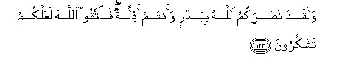

#وَلَقَدْ نَصَرَكُمُ اللَّهُ بِبَدْرٍ وَأَنْتُمْ أَذِلَّةٌ ۖ فَاتَّقُوا اللَّهَ لَعَلَّكُمْ تَشْكُرُونَ 

##Walaqad nasarakumu Allahu bibadrin waantum athillatun faittaqoo Allaha laAAallakum tashkuroona 

## 翻译(Translation)：

| Translator | 译文(Translation)                                            |
| :--------: | ------------------------------------------------------------ |
|    马坚    | 白德尔之役，你们是无势力的，而真主确已援助了你们。故你们应当敬畏真主，以便你们感谢。 |
|  YUSUFALI  | Allah had helped you at Badr, when ye were a contemptible little force; then fear Allah; thus May ye show your gratitude. |
| PICKTHALL  | Allah had already given you the victory at Badr, when ye were contemptible. So observe your duty to Allah in order that ye may be thankful. |
|   SHAKIR   | And Allah did certainly assist you at Badr when you were weak; be careful of (your duty to) Allah then, that you may give thanks. |

---

## 对位释义(Words Interpretation)：

| No   | العربية | 中文    | English | 曾用词 |
| ---- | ------: | ------- | ------- | ------ |
| 序号 |    阿文 | Chinese | 英文    | Used   |
| 3:123.1  | وَلَقَدْ   | 和确实     | And certainly | 见2:65.1  |
| 3:123.2  | نَصَرَكُمُ  | 他援助你们 | he assist you |           |
| 3:123.3  | اللَّهُ   | 安拉，真主 | Allah         | 见1:1.2   |
| 3:123.4  | بِبَدْرٍ   | 在白德尔   | at Badr       |           |
| 3:123.5  | وَأَنْتُمْ  | 和你们     | and you       | 见2:22.22 |
| 3:123.6  | أَذِلَّةٌ   | 无势力     | weak          |           |
| 3:123.7  | فَاتَّقُوا | 敬畏       | fear          | 见2:24.6  |
| 3:123.8  | اللَّهَ   | 安拉，真主 | Allah         | 见1:1.2   |
| 3:123.9  | لَعَلَّكُمْ  | 以便你们   | you may       | 见2:21.11 |
| 3:123.10 | تَشْكُرُونَ | 感谢       | give thanks   | 见2:52.7  |

---
