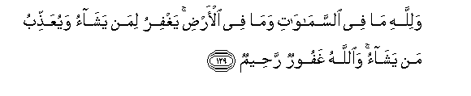

#وَلِلَّهِ مَا فِي السَّمَاوَاتِ وَمَا فِي الْأَرْضِ ۚ يَغْفِرُ لِمَنْ يَشَاءُ وَيُعَذِّبُ مَنْ يَشَاءُ ۚ وَاللَّهُ غَفُورٌ رَحِيمٌ 

##Walillahi ma fee alssamawati wama fee al-ardi yaghfiru liman yashao wayuAAaththibu man yashao waAllahu ghafoorun raheemun 

## 翻译(Translation)：

| Translator | 译文(Translation)                                            |
| :--------: | ------------------------------------------------------------ |
|    马坚    | 天地万物，都是真主的。他要恕饶谁，就恕饶谁；要惩罚谁，就惩罚谁。真主是至赦的，是至慈的。 |
|  YUSUFALI  | To Allah belongeth all that is in the heavens and on earth. He forgiveth whom He pleaseth and punisheth whom He pleaseth; but Allah is Oft-Forgiving, Most Merciful. |
| PICKTHALL  | Unto Allah belongeth whatsoever is in the heavens and whatsoever is in the earth. He forgiveth whom He will, and punisheth whom He will. Allah is Forgiving, Merciful. |
|   SHAKIR   | And whatever is in the heavens and whatever is in the earth is Allah's; He forgives whom He pleases and chastises whom He pleases; and Allah is Forgiving, Merciful. |

---

## 对位释义(Words Interpretation)：

| No   | العربية | 中文    | English | 曾用词 |
| ---- | ------: | ------- | ------- | ------ |
| 序号 |    阿文 | Chinese | 英文    | Used   |
| 3:129.1  | وَلِلَّهِ     | 和真主       | and Allah          | 见2:115.1  |
| 3:129.2  | مَا       | 什么         | what/ that which   | 见2:17.8   |
| 3:129.3  | فِي       | 在           | in                 | 见2:10.1   |
| 3:129.4  | السَّمَاوَاتِ | 天           | Heavens            | 见2:33.16  |
| 3:129.5  | وَمَا      | 和不         | And not            | 见2:9.9    |
| 3:129.6  | فِي       | 在           | in                 | 见2:10.1   |
| 3:129.7  | الْأَرْضِ    | 大地         | Earth              | 见2:22.4   |
| 3:129.8  | يَغْفِرُ     | 他饶恕       | He forgives        |            |
| 3:129.9  | لِمَنْ      | 对谁         | of who             | 见2:154.3  |
| 3:129.10 | يَشَاءُ     | 他意欲       | He pleases         | 见2:90.18  |
| 3:129.11 | وَيُعَذِّبُ    | 和他惩罚     | and He will punish | 见2:284.21 |
| 3:129.12 | مَنْ       | 谁           | who                | 见2:97.2   |
| 3:129.13 | يَشَاءُ     | 他意欲       | He pleases         | 见2:90.18  |
| 3:129.14 | وَاللَّهُ    | 和安拉，真主 | and Allah          | 见2:19.17  |
| 3:129.15 | غَفُورٌ     | 至赦的       | Forgiving          | 见2:173.24 |
| 3:129.16 | رَحِيمٌ     | 至慈的       | Merciful           | 见2:143.45 |

---
