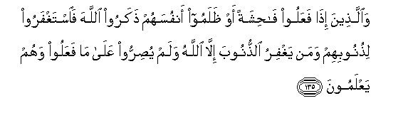

#وَالَّذِينَ إِذَا فَعَلُوا فَاحِشَةً أَوْ ظَلَمُوا أَنْفُسَهُمْ ذَكَرُوا اللَّهَ فَاسْتَغْفَرُوا لِذُنُوبِهِمْ وَمَنْ يَغْفِرُ الذُّنُوبَ إِلَّا اللَّهُ وَلَمْ يُصِرُّوا عَلَىٰ مَا فَعَلُوا وَهُمْ يَعْلَمُونَ 

##Waallatheena itha faAAaloo fahishatan aw thalamoo anfusahum thakaroo Allaha faistaghfaroo lithunoobihim waman yaghfiru alththunooba illa Allahu walam yusirroo AAala ma faAAaloo wahum yaAAlamoona 

## 翻译(Translation)：

| Translator | 译文(Translation)                                            |
| :--------: | ------------------------------------------------------------ |
|    马坚    | 敬畏者，当做了丑事或自欺的时候，记念真主，且为自己的罪恶而求饶--除真主外，谁能赦宥罪恶呢？--他们没有明知故犯地怙恶不悛。 |
|  YUSUFALI  | And those who, having done something to be ashamed of, or wronged their own souls, earnestly bring Allah to mind, and ask for forgiveness for their sins,- and who can forgive sins except Allah?- and are never obstinate in persisting knowingly in (the wrong) they have done. |
| PICKTHALL  | And those who, when they do an evil thing or wrong themselves, remember Allah and implore forgiveness for their sins - Who forgiveth sins save Allah only? - and will not knowingly repeat (the wrong) they did. |
|   SHAKIR   | And those who when they commit an indecency or do injustice to their souls remember Allah and ask forgiveness for their faults-- and who forgives the faults but Allah, and (who) do not knowingly persist in what they have done. |

---

## 对位释义(Words Interpretation)：

| No   | العربية | 中文    | English | 曾用词 |
| ---- | ------: | ------- | ------- | ------ |
| 序号 |    阿文 | Chinese | 英文    | Used   |
| 3:135.1  | وَالَّذِينَ    | 和那些       | and those who           | 见2:21.8   |
| 3:135.2  | إِذَا       | 当时         | when                    | 见2:156.2  |
| 3:135.3  | فَعَلُوا     | 他们做       | they do                 |            |
| 3:135.4  | فَاحِشَةً     | 不道德       | an evil thing           |            |
| 3:135.5  | أَوْ        | 或           | or                      | 见2:19.1   |
| 3:135.6  | ظَلَمُوا     | 不义的人     | unjust                  | 见2:59.3   |
| 3:135.7  | أَنْفُسَهُمْ    | 他们自己     | themselves              | 见2:9.8    |
| 3:135.8  | ذَكَرُوا     | 纪念         | remember                |            |
| 3:135.9  | اللَّهَ      | 安拉，真主   | Allah                   | 见2:9.2 |
| 3:135.10 | فَاسْتَغْفَرُوا | 因此他求饶恕 | then ask for forgiveness |            |
| 3:135.11 | لِذُنُوبِهِمْ   | 为他们的众罪 | for their sins          |            |
| 3:135.12 | وَمَنْ       | 和谁         | and who                 | 见2:108.11 |
| 3:135.13 | يَغْفِرُ      | 他饶恕       | He forgives             | 见3:129.8  |
| 3:135.14 | الذُّنُوبَ    | 众罪         | the sins                | 参3:135.11 |
| 3:135.15 | إِلَّا       | 除了         | Except                  | 见2:9.7    |
| 3:135.16 | اللَّهُ      | 安拉，真主   | Allah                   | 见2:7.2 |
| 3:135.17 | وَلَمْ       | 和不         | and did not             | 见2:247.21 |
| 3:135.18 | يُصِرُّوا     | 他们坚持     | they persist            |            |
| 3:135.19 | عَلَىٰ       | 至           | On                      | 见2:5.2    |
| 3:135.20 | مَا        | 什么         | what/ that which        | 见2:17.8   |
| 3:135.21 | فَعَلُوا     | 他们做       | they do                 | 见3:135.3  |
| 3:135.22 | وَهُمْ       | 和他们       | and in them             | 见2:25.32  |
| 3:135.23 | يَعْلَمُونَ    | 知道         | Know                    | 见2:13.19  |

---
