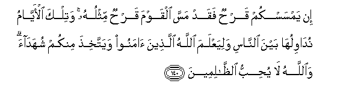

#إِنْ يَمْسَسْكُمْ قَرْحٌ فَقَدْ مَسَّ الْقَوْمَ قَرْحٌ مِثْلُهُ ۚ وَتِلْكَ الْأَيَّامُ نُدَاوِلُهَا بَيْنَ النَّاسِ وَلِيَعْلَمَ اللَّهُ الَّذِينَ آمَنُوا وَيَتَّخِذَ مِنْكُمْ شُهَدَاءَ ۗ وَاللَّهُ لَا يُحِبُّ الظَّالِمِينَ 

##In yamsaskum qarhun faqad massa alqawma qarhun mithluhu watilka al-ayyamu nudawiluha bayna alnnasi waliyaAAlama Allahu allatheena amanoo wayattakhitha minkum shuhadaa waAllahu la yuhibbu alththalimeena 

## 翻译(Translation)：

| Translator | 译文(Translation)                                            |
| :--------: | ------------------------------------------------------------ |
|    马坚    | 如果你们遭受创伤，那末，敌人确已遭受同样的创伤了。我使气运周流于世人之间，以便真主甄别信道的人，而以你们为见证--真主不喜爱不义的人。 |
|  YUSUFALI  | If a wound hath touched you, be sure a similar wound hath touched the others. Such days (of varying fortunes) We give to men and men by turns: that Allah may know those that believe, and that He may take to Himself from your ranks Martyr-witnesses (to Truth). And Allah loveth not those that do wrong. |
| PICKTHALL  | If ye have received a blow, the (disbelieving) people have received a blow the like thereof. These are (only) the vicissitudes which We cause to follow one another for mankind, to the end that Allah may know those who believe and may choose witnesses from among you; and Allah loveth not wrong-doers. |
|   SHAKIR   | If a wound has afflicted you (at Ohud), a wound like it has also afflicted the (unbelieving) people; and We bring these days to men by turns, and that Allah may know those who believe and take witnesses from among you; and Allah does not love the unjust. |

---

## 对位释义(Words Interpretation)：

| No   | العربية | 中文    | English | 曾用词 |
| ---- | ------: | ------- | ------- | ------ |
| 序号 |    阿文 | Chinese | 英文    | Used   |
| 3:140.1  | إِنْ       | 如果           | if              | 见2:23.18  |
| 3:140.2  | يَمْسَسْكُمْ   | 它接触你们     | it touched you  |            |
| 3:140.3  | قَرْحٌ      | 创伤           | a wound         |            |
| 3:140.4  | فَقَدْ      | 然后当然       | then may        | 见2:108.15 |
| 3:140.5  | مَسَّ       | 接触           | touch           |            |
| 3:140.6  | الْقَوْمَ    | 人们           | folk            | 见2:250.14 |
| 3:140.7  | قَرْحٌ      | 创伤           | a wound         | 见3:140.3  |
| 3:140.8  | مِثْلُهُ     | 相似它         | like it         |            |
| 3:140.9  | وَتِلْكَ     | 和这些         | and these are   | 见2:230.25 |
| 3:140.10 | الْأَيَّامُ   | 众日子         | the days        |            |
| 3:140.11 | نُدَاوِلُهَا  | 我们流转它     | We bring it to  |            |
| 3:140.12 | بَيْنَ      | 之间           | between         | 见2:66.4   |
| 3:140.13 | النَّاسِ    | 人             | People          | 见2:8.2    |
| 3:140.14 | وَلِيَعْلَمَ   | 和以便他知道   | and may to know |            |
| 3:140.15 | اللَّهُ     | 安拉，真主     | Allah           | 见2:7.2 |
| 3:140.16 | الَّذِينَ    | 谁，那些       | those who       | 见2:6.2    |
| 3:140.17 | آمَنُوا    | 诚信           | believe         | 见2:9.4    |
| 3:140.18 | وَيَتَّخِذَ    | 和他采取       | and he take     | 参3:64.20  |
| 3:140.19 | مِنْكُمْ     | 从你们         | Of you          | 见2:65.5   |
| 3:140.20 | شُهَدَاءَ    | 见证           | Witness         | 见2:133.3  |
| 3:140.21 | وَاللَّهُ    | 和安拉，真主   | and Allah       | 见2:19.17  |
| 3:140.22 | لَا       | 不，不是，没有 | no              | 见2:2.3    |
| 3:140.23 | يُحِبُّ      | 喜欢           | love            | 见2:190.12 |
| 3:140.24 | الظَّالِمِينَ | 不义的人       | unjust          | 见2:35.19  |

---
