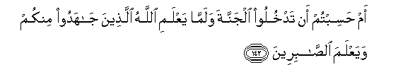

#أَمْ حَسِبْتُمْ أَنْ تَدْخُلُوا الْجَنَّةَ وَلَمَّا يَعْلَمِ اللَّهُ الَّذِينَ جَاهَدُوا مِنْكُمْ وَيَعْلَمَ الصَّابِرِينَ 

##Am hasibtum an tadkhuloo aljannata walamma yaAAlami Allahu allatheena jahadoo minkum wayaAAlama alssabireena 

## 翻译(Translation)：

| Translator | 译文(Translation)                                            |
| :--------: | ------------------------------------------------------------ |
|    马坚    | 真主还没有甄别你们中奋斗的人和坚忍的人，难道你们就以为自己得入乐园吗？ |
|  YUSUFALI  | Did ye think that ye would enter Heaven without Allah testing those of you who fought hard (In His Cause) and remained steadfast? |
| PICKTHALL  | Or deemed ye that ye would enter paradise while yet Allah knoweth not those of you who really strive, nor knoweth those (of you) who are steadfast? |
|   SHAKIR   | Do you think that you will enter the garden while Allah has not yet known those who strive hard from among you, and (He has not) known the patient. |

---

## 对位释义(Words Interpretation)：

| No   | العربية | 中文    | English | 曾用词 |
| ---- | ------: | ------- | ------- | ------ |
| 序号 |    阿文 | Chinese | 英文    | Used   |
| 3:142.1  | أَمْ       | 或         | or           | 见2:6.7    |
| 3:142.2  | حَسِبْتُمْ    | 你们想     | you think    | 见2:214.2  |
| 3:142.3  | أَنْ       | 该         | that         | 见2:26.5   |
| 3:142.4  | تَدْخُلُوا   | 你们进入   | you enter    | 见2:214.4  |
| 3:142.5  | الْجَنَّةَ    | 天园       | Paradise     | 见2:35.7   |
| 3:142.6  | وَلَمَّا     | 和当       | and when     | 见2:89.1   |
| 3:142.7  | يَعْلَمِ     | 他知道     | he knows     |            |
| 3:142.8  | اللَّهُ     | 安拉，真主 | Allah        | 见2:7.2 |
| 3:142.9  | الَّذِينَ    | 谁，那些   | those who    | 见2:6.2    |
| 3:142.10 | جَاهَدُوا   | 奋斗       | strive       |            |
| 3:142.11 | مِنْكُمْ     | 从你们     | Of you       | 见2:65.5   |
| 3:142.12 | وَيَعْلَمَ    | 和他知道   | and he knows | 参3:142.7  |
| 3:142.13 | الصَّابِرِينَ | 坚忍者     | the patient  | 见2:153.11 |

---
