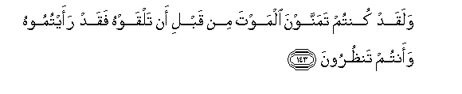

#وَلَقَدْ كُنْتُمْ تَمَنَّوْنَ الْمَوْتَ مِنْ قَبْلِ أَنْ تَلْقَوْهُ فَقَدْ رَأَيْتُمُوهُ وَأَنْتُمْ تَنْظُرُونَ 

##Walaqad kuntum tamannawna almawta min qabli an talqawhu faqad raaytumoohu waantum tanthuroona 

## 翻译(Translation)：

| Translator | 译文(Translation)                                            |
| :--------: | ------------------------------------------------------------ |
|    马坚    | 遭遇死亡之前，你们确已希望死亡；现在你们确已亲眼见到死亡了。 |
|  YUSUFALI  | Ye did indeed wish for death before ye met him: Now ye have seen him with your own eyes, (And ye flinch!) |
| PICKTHALL  | And verily ye used to wish for death before ye met it (in the field). Now ye have seen it with your eyes! |
|   SHAKIR   | And certainly you desired death before you met it, so indeed you have seen it and you look (at it) |

---

## 对位释义(Words Interpretation)：

| No   | العربية | 中文    | English | 曾用词 |
| ---- | ------: | ------- | ------- | ------ |
| 序号 |    阿文 | Chinese | 英文    | Used   |
| 3:143.1  | وَلَقَدْ    | 和确实     | And certainly    | 见2:65.1   |
| 3:143.2  | كُنْتُمْ    | 你们       | You              | 见2:23.2   |
| 3:143.3  | تَمَنَّوْنَ   | 你们渴望   | you wish         |            |
| 3:143.4  | الْمَوْتَ   | 死亡       | the death        | 见2:19.16  |
| 3:143.5  | مِنْ      | 从         | from             | 见2:4.8    |
| 3:143.6  | قَبْلِ     | 以前       | Before           | 见2:25.24  |
| 3:143.7  | أَنْ      | 该         | that             | 见2:26.5   |
| 3:143.8  | تَلْقَوْهُ   | 你们遇见它 | you met it       |            |
| 3:143.9  | فَقَدْ     | 然后当然   | then may         | 见2:108.15 |
| 3:143.10 | رَأَيْتُمُوهُ | 你们面对它 | you have seen it |            |
| 3:143.11 | وَأَنْتُمْ   | 和你们     | and you          | 见2:22.22  |
| 3:143.12 | تَنْظُرُونَ  | 你们看到   | You look         | 见2:50.10  |

---
