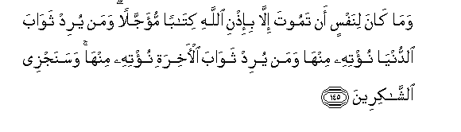

#وَمَا كَانَ لِنَفْسٍ أَنْ تَمُوتَ إِلَّا بِإِذْنِ اللَّهِ كِتَابًا مُؤَجَّلًا ۗ وَمَنْ يُرِدْ ثَوَابَ الدُّنْيَا نُؤْتِهِ مِنْهَا وَمَنْ يُرِدْ ثَوَابَ الْآخِرَةِ نُؤْتِهِ مِنْهَا ۚ وَسَنَجْزِي الشَّاكِرِينَ 

##Wama kana linafsin an tamoota illa bi-ithni Allahi kitaban mu-ajjalan waman yurid thawaba alddunya nu/tihi minhawaman yurid thawaba al-akhirati nu/tihi minha wasanajzee alshshakireena 

## 翻译(Translation)：

| Translator | 译文(Translation)                                            |
| :--------: | ------------------------------------------------------------ |
|    马坚    | 不得真主的许可，任何人都不会死亡；真主已注定各人的寿限了。谁想获得今世的报酬，我给谁今世的报酬；谁想获得后世的报酬，我给谁后世的报酬。我将报酬感谢的人。 |
|  YUSUFALI  | Nor can a soul die except by Allah's leave, the term being fixed as by writing. If any do desire a reward in this life, We shall give it to him; and if any do desire a reward in the Hereafter, We shall give it to him. And swiftly shall We reward those that (serve us with) gratitude. |
| PICKTHALL  | No soul can ever die except by Allah's leave and at a term appointed. Whoso desireth the reward of the world, We bestow on him thereof; and whoso desireth the reward of the Hereafter, We bestow on him thereof. We shall reward the thankful. |
|   SHAKIR   | And a soul will not die but with the permission of Allah the term is fixed; and whoever desires the reward of this world, I shall give him of it, and whoever desires the reward of the hereafter I shall give him of it, and I will reward the grateful. |

---

## 对位释义(Words Interpretation)：

| No   | العربية | 中文    | English | 曾用词 |
| ---- | ------: | ------- | ------- | ------ |
| 序号 |    阿文 | Chinese | 英文    | Used   |
| 3:145.1  | وَمَا      | 和不       | And not           | 见2:9.9    |
| 3:145.2  | كَانَ      | 他是       | It was            | 见2:75.6   |
| 3:145.3  | لِنَفْسٍ     | 对一个人   | for a soul        |            |
| 3:145.4  | أَنْ       | 该         | that              | 见2:26.5   |
| 3:145.5  | تَمُوتَ     | 她死       | she die           |            |
| 3:145.6  | إِلَّا      | 除了       | Except            | 见2:9.7    |
| 3:145.7  | بِإِذْنِ     | 在许可     | With permission   | 见2:102.50 |
| 3:145.8  | اللَّهِ     | 安拉，真主 | Allah             | 见1:1.2    |
| 3:145.9  | كِتَابًا    | 一个指定   | a appointed       |            |
| 3:145.10 | مُؤَجَّلًا    | 寿限的     | term              |            |
| 3:145.11 | وَمَنْ      | 和谁       | and who           | 见2:108.11 |
| 3:145.12 | يُرِدْ      | 他期望     | he desires        |            |
| 3:145.13 | ثَوَابَ     | 一个报酬   | a reward          |            |
| 3:145.14 | الدُّنْيَا   | 今世       | this world        | 见2:85.38  |
| 3:145.15 | نُؤْتِهِ     | 我给他     | I shall give him  |            |
| 3:145.16 | مِنْهَا     | 从它       | From it           | 见2:25.15  |
| 3:145.17 | وَمَنْ      | 和谁       | and who           | 见2:108.11 |
| 3:145.18 | يُرِدْ      | 他期望     | he desires        | 见3:145.12 |
| 3:145.19 | ثَوَابَ     | 一个报酬   | a reward          | 见3:145.13 |
| 3:145.20 | الْآخِرَةِ   | 后世       | the Hereafter     | 见2:102.64 |
| 3:145.21 | نُؤْتِهِ     | 我给他     | I shall give him  | 见3:145.15 |
| 3:145.22 | مِنْهَا     | 从它       | From it           | 见2:25.15  |
| 3:145.23 | وَسَنَجْزِي   | 和我将报酬 | and I will reward |            |
| 3:145.24 | الشَّاكِرِينَ | 众感谢者   | the thankful      | 见3:144.27 |

---
