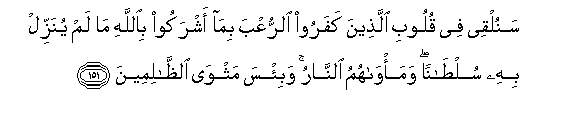

#سَنُلْقِي فِي قُلُوبِ الَّذِينَ كَفَرُوا الرُّعْبَ بِمَا أَشْرَكُوا بِاللَّهِ مَا لَمْ يُنَزِّلْ بِهِ سُلْطَانًا ۖ وَمَأْوَاهُمُ النَّارُ ۚ وَبِئْسَ مَثْوَى الظَّالِمِينَ 

##Sanulqee fee quloobi allatheena kafaroo alrruAAba bima ashrakoo biAllahi ma lam yunazzil bihi sultanan wama/wahumu alnnaru wabi/sa mathwa alththalimeena 

## 翻译(Translation)：

| Translator | 译文(Translation)                                            |
| :--------: | ------------------------------------------------------------ |
|    马坚    | 我要把恐怖投在不信道者的心中，因为他们把真主和真主所未证实的（偶像）去配他，他们的归宿是火狱。不义者的归宿真恶劣。 |
|  YUSUFALI  | Soon shall We cast terror into the hearts of the Unbelievers, for that they joined companions with Allah, for which He had sent no authority: their abode will be the Fire: And evil is the home of the wrong-doers! |
| PICKTHALL  | We shall cast terror into the hearts of those who disbelieve because they ascribe unto Allah partners, for which no warrant hath been revealed. Their habitation is the Fire, and hapless the abode of the wrong-doers. |
|   SHAKIR   | We will cast terror into the hearts of those who disbelieve, because they set up with Allah that for which He has sent down no authority, and their abode is the fire, and evil is the abode of the unjust. |

---

## 对位释义(Words Interpretation)：

| No   | العربية | 中文    | English | 曾用词 |
| ---- | ------: | ------- | ------- | ------ |
| 序号 |    阿文 | Chinese | 英文    | Used   |
| 3:151.1  | سَنُلْقِي    | 我们将投     | We shall cast    |            |
| 3:151.2  | فِي       | 在           | in               | 见2:10.1   |
| 3:151.3  | قُلُوبِ     | 众心         | the hearts       |            |
| 3:151.4  | الَّذِينَ    | 谁，那些     | those who        | 见2:6.2    |
| 3:151.5  | كَفَرُوا    | 不信         | disbelieve       | 见2:6.3    |
| 3:151.6  | الرُّعْبَ    | 恐怖         | terror           |            |
| 3:151.7  | بِمَا      | 在什么       | in what          | 见2:4.3    |
| 3:151.8  | أَشْرَكُوا   | 以物配主     | polytheists      | 见2:96.8   |
| 3:151.9  | بِاللَّهِ    | 在真主       | in Allah         | 见2:8.6    |
| 3:151.10 | مَا       | 什么         | what/ that which | 见2:17.8   |
| 3:151.11 | لَمْ       | 不，没有     | did not          | 见2:6.8    |
| 3:151.12 | يُنَزِّلْ     | 他降示       | He has sent down |            |
| 3:151.13 | بِهِ       | 以它         | with it          | 见2:22.13  |
| 3:151.14 | سُلْطَانًا   | 任何证实     | authority        |            |
| 3:151.15 | وَمَأْوَاهُمُ  | 和他们的归宿 | and their abode  |            |
| 3:151.16 | النَّارُ    | 火           | fire             | 见2:24.7   |
| 3:151.17 | وَبِئْسَ     | 和恶劣       | and evil         | 见2:126.29 |
| 3:151.18 | مَثْوَى     | 归宿         | the abode        |            |
| 3:151.19 | الظَّالِمِينَ | 不义的人     | unjust           | 见2:35.19  |

---
