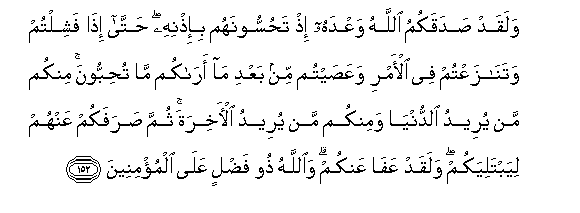

#وَلَقَدْ صَدَقَكُمُ اللَّهُ وَعْدَهُ إِذْ تَحُسُّونَهُمْ بِإِذْنِهِ ۖ حَتَّىٰ إِذَا فَشِلْتُمْ وَتَنَازَعْتُمْ فِي الْأَمْرِ وَعَصَيْتُمْ مِنْ بَعْدِ مَا أَرَاكُمْ مَا تُحِبُّونَ ۚ مِنْكُمْ مَنْ يُرِيدُ الدُّنْيَا وَمِنْكُمْ مَنْ يُرِيدُ الْآخِرَةَ ۚ ثُمَّ صَرَفَكُمْ عَنْهُمْ لِيَبْتَلِيَكُمْ ۖ وَلَقَدْ عَفَا عَنْكُمْ ۗ وَاللَّهُ ذُو فَضْلٍ عَلَى الْمُؤْمِنِينَ 

##Walaqad sadaqakumu Allahu waAAdahu ith tahussoonahum bi-ithnihi hatta itha fashiltum watanazaAAtum fee al-amri waAAasaytum min baAAdi ma arakum ma tuhibboona minkum man yureedu alddunya waminkum man yureedu al-akhirata thumma sarafakum AAanhum liyabtaliyakum walaqad AAafa AAankum waAllahu thoo fadlin AAala almu/mineena 

## 翻译(Translation)：

| Translator | 译文(Translation)                                            |
| :--------: | ------------------------------------------------------------ |
|    马坚    | 你们奉真主的命令而歼灭敌军之初，真主确已对你们实践他的约言；直到了在他使你们看见你们所喜爱的战利品之后，你们竟示弱、内争、违抗（使者的）命令。你们中有贪恋今世的，有企图后世的。嗣后，他使你们离开敌人，以便他试验你们。他确已饶恕你们。真主对于信士是有恩惠的。 |
|  YUSUFALI  | Allah did indeed fulfil His promise to you when ye with His permission Were about to annihilate your enemy,-until ye flinched and fell to disputing about the order, and disobeyed it after He brought you in sight (of the booty) which ye covet. Among you are some that hanker after this world and some that desire the Hereafter. Then did He divert you from your foes in order to test you but He forgave you: For Allah is full of grace to those who believe. |
| PICKTHALL  | Allah verily made good His promise unto you when ye routed them by His leave, until (the moment) when your courage failed you, and ye disagreed about the order and ye disobeyed, after He had shown you that for which ye long. Some of you desired the world, and some of you desired the Hereafter. Therefore He made you flee from them, that He might try you. Yet now He hath forgiven you. Allah is a Lord of Kindness to believers. |
|   SHAKIR   | And certainly Allah made good to you His promise when you slew them by His permission, until when you became weak-hearted and disputed about the affair and disobeyed after He had shown you that which you loved; of you were some who desired this world and of you were some who desired the hereafter; then He turned you away from them that He might try you; and He has certainly pardoned you, and Allah is Gracious to the believers. |

---

## 对位释义(Words Interpretation)：

| No   | العربية | 中文    | English | 曾用词 |
| ---- | ------: | ------- | ------- | ------ |
| 序号 |    阿文 | Chinese | 英文    | Used   |
| 3:152.1  | وَلَقَدْ     | 和确实         | And certainly           | 见2:65.1   |
| 3:152.2  | صَدَقَكُمُ    | 他实践你们     | made good to you        |            |
| 3:152.3  | اللَّهُ     | 安拉，真主     | Allah                   | 见1:1.2    |
| 3:152.4  | وَعْدَهُ     | 他的约言       | His promise             |            |
| 3:152.5  | إِذْ       | 当时           | when                    | 见2:131.1  |
| 3:152.6  | تَحُسُّونَهُمْ  | 你们歼灭他们   | you slew them           |            |
| 3:152.7  | بِإِذْنِهِ    | 以他的意旨     | by His will             | 见2:213.42 |
| 3:152.8  | حَتَّىٰ      | 直到           | Until                   | 见2:55.8   |
| 3:152.9  | إِذَا      | 当时           | when                    | 见2:156.2  |
| 3:152.10 | فَشِلْتُمْ    | 你们示弱       | you became weak-hearted |            |
| 3:152.11 | وَتَنَازَعْتُمْ | 和你们内争     | and you disputed        |            |
| 3:152.12 | فِي       | 在             | in                      | 见2:10.1   |
| 3:152.13 | الْأَمْرِ    | 事务           | the affair              | 见3:128.4  |
| 3:152.14 | وَعَصَيْتُمْ   | 和你们违抗     | and you disobeyed       |            |
| 3:152.15 | مِنْ       | 从             | from                    | 见2:4.8    |
| 3:152.16 | بَعْدِ      | 之后           | after                   | 见2:27.6   |
| 3:152.17 | مَا       | 什么           | what/ that which        | 见2:17.8   |
| 3:152.18 | أَرَاكُمْ    | 他显示你们     | He had shown you        |            |
| 3:152.19 | مَا       | 什么           | what/ that which        | 见2:17.8   |
| 3:152.20 | تُحِبُّونَ    | 你们喜爱       | you love                | 见3:31.4   |
| 3:152.21 | مِنْكُمْ     | 从你们         | Of you                  | 见2:65.5   |
| 3:152.22 | مَنْ       | 谁             | who                     | 见2:97.2   |
| 3:152.23 | يُرِيدُ     | 希望           | desire                  | 见2:185.29 |
| 3:152.24 | الدُّنْيَا   | 今世           | this world              | 见2:85.38  |
| 3:152.25 | وَمِنْكُمْ    | 和从你们       | and of you              | 参2:65.5   |
| 3:152.26 | مَنْ       | 谁             | who                     | 见2:97.2   |
| 3:152.27 | يُرِيدُ     | 希望           | desire                  | 见2:185.29 |
| 3:152.28 | الْآخِرَةَ   | 后世           | the Hereafter           |            |
| 3:152.29 | ثُمَّ       | 然后           | Then                    | 见2:28.7   |
| 3:152.30 | صَرَفَكُمْ    | 他使你们离开   | He turned you away      |            |
| 3:152.31 | عَنْهُمْ     | 在他们         | on them                 | 见3:10.6   |
| 3:152.32 | لِيَبْتَلِيَكُمْ | 以便他试验你们 | that He might try you   |            |
| 3:152.33 | وَلَقَدْ     | 和确实         | And certainly           | 见2:65.1   |
| 3:152.34 | عَفَا      | 他饶恕         | he pardoned             |            |
| 3:152.35 | عَنْكُمْ     | 在你们         | on you                  | 见2:52.3   |
| 3:152.36 | وَاللَّهُ    | 和安拉，真主   | and Allah               | 见2:19.17  |
| 3:152.37 | ذُو       | 拥有           | is of                   | 见2:105.23 |
| 3:152.38 | فَضْلٍ      | 恩惠的         | Gracious                | 见2:243.21 |
| 3:152.39 | عَلَى      | 至             | On                      | 见2:5.2    |
| 3:152.40 | الْمُؤْمِنِينَ | 信士们         | the believers           | 见2:223.16 |

---
