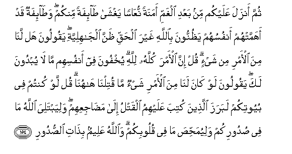

#ثُمَّ أَنْزَلَ عَلَيْكُمْ مِنْ بَعْدِ الْغَمِّ أَمَنَةً نُعَاسًا يَغْشَىٰ طَائِفَةً مِنْكُمْ ۖ وَطَائِفَةٌ قَدْ أَهَمَّتْهُمْ أَنْفُسُهُمْ يَظُنُّونَ بِاللَّهِ غَيْرَ الْحَقِّ ظَنَّ الْجَاهِلِيَّةِ ۖ يَقُولُونَ هَلْ لَنَا مِنَ الْأَمْرِ مِنْ شَيْءٍ ۗ قُلْ إِنَّ الْأَمْرَ كُلَّهُ لِلَّهِ ۗ يُخْفُونَ فِي أَنْفُسِهِمْ مَا لَا يُبْدُونَ لَكَ ۖ يَقُولُونَ لَوْ كَانَ لَنَا مِنَ الْأَمْرِ شَيْءٌ مَا قُتِلْنَا هَاهُنَا ۗ قُلْ لَوْ كُنْتُمْ فِي بُيُوتِكُمْ لَبَرَزَ الَّذِينَ كُتِبَ عَلَيْهِمُ الْقَتْلُ إِلَىٰ مَضَاجِعِهِمْ ۖ وَلِيَبْتَلِيَ اللَّهُ مَا فِي صُدُورِكُمْ وَلِيُمَحِّصَ مَا فِي قُلُوبِكُمْ ۗ وَاللَّهُ عَلِيمٌ بِذَاتِ الصُّدُورِ 

##Thumma anzala AAalaykum min baAAdi alghammi amanatan nuAAasan yaghsha ta-ifatan minkum wata-ifatun qad ahammat-hum anfusuhum yathunnoona biAllahi ghayra alhaqqi thanna aljahiliyyati yaqooloona hal lana mina al-amri min shay-in qul inna al-amra kullahu lillahi yukhfoona fee anfusihim ma la yubdoona laka yaqooloona law kana lana mina al-amri shay-on ma qutilna hahuna qul law kuntum fee buyootikum labaraza allatheena kutiba AAalayhimu alqatlu ila madajiAAihim waliyabtaliya Allahu ma fee sudoorikum waliyumahhisa ma fee quloobikum waAllahu AAaleemun bithati alssudoori 

## 翻译(Translation)：

| Translator | 译文(Translation)                                            |
| :--------: | ------------------------------------------------------------ |
|    马坚    | 在忧患之后，他又降安宁给你们，使你们中一部分人瞌睡；另一部分人则为自身而焦虑，他们象蒙昧时代的人一样，对真主妄加猜测，他们说：我们有一点胜利的希望吗? 你说：一切事情，的确都是真主所主持的。他们的心里怀着不敢对你表示的恶意；他们说：假若我们有一点胜利的希望，我们的同胞不致阵亡在这里。你说：假若你们坐在家里，那么命中注定要阵亡的人，必定外出，走到他们阵亡的地方；（真主这样做），以便他试验你们的心事，锻炼你们心中的信仰。真主是全知心事的。 |
|  YUSUFALI  | After (the excitement) of the distress, He sent down calm on a band of you overcome with slumber, while another band was stirred to anxiety by their own feelings, Moved by wrong suspicions of Allah-suspicions due to ignorance. They said: "What affair is this of ours?" Say thou: "Indeed, this affair is wholly Allah's." They hide in their minds what they dare not reveal to thee. They say (to themselves): "If we had had anything to do with this affair, We should not have been in the slaughter here." Say: "Even if you had remained in your homes, those for whom death was decreed would certainly have gone forth to the place of their death"; but (all this was) that Allah might test what is in your breasts and purge what is in your hearts. For Allah knoweth well the secrets of your hearts. |
| PICKTHALL  | Then, after grief, He sent down security for you. As slumber did it overcome a party of you, while (the other) party, who were anxious on their own account, thought wrongly of Allah, the thought of ignorance. They said: Have we any part in the cause? Say (O Muhammad): The cause belongeth wholly to Allah. They hide within themselves (a thought) which they reveal not unto thee, saying: Had we had any part in the cause we should not have been slain here. Say: Even though ye had been in your houses, those appointed to be slain would have gone forth to the places where they were to lie. (All this hath been) in order that Allah might try what is in your breasts and prove what is in your hearts. Allah is Aware of what is hidden in the breasts (of men). |
|   SHAKIR   | Then after sorrow He sent down security upon you, a calm coming upon a party of you, and (there was) another party whom their own souls had rendered anxious; they entertained about Allah thoughts of ignorance quite unjustly, saying: We have no hand in the affair. Say: Surely the affair is wholly (in the hands) of Allah. They conceal within their souls what they would not reveal to you. They say: Had we any hand in the affair, we would not have been slain here. Say: Had you remained in your houses, those for whom slaughter was ordained would certainly have gone forth to the places where they would be slain, and that Allah might test what was in your breasts and that He might purge what was in your hearts; and Allah knows what is in the breasts. |

---

## 对位释义(Words Interpretation)：

| No   | العربية | 中文    | English | 曾用词 |
| ---- | ------: | ------- | ------- | ------ |
| 序号 |    阿文 | Chinese | 英文    | Used   |
| 3:154.1  | ثُمَّ       | 然后                     | Then                      | 见2:28.7   |
| 3:154.2  | أَنْزَلَ     | 下降，颁降，降示，揭秘   | get down                  | 见2:4.4    |
| 3:154.3  | عَلَيْكُمْ    | 在你们                   | on you                    | 见2:40.8   |
| 3:154.4  | مِنْ       | 从                       | from                      | 见2:4.8    |
| 3:154.5  | بَعْدِ      | 之后                     | after                     | 见2:27.6   |
| 3:154.6  | الْغَمِّ     | 忧愁的                   | grief                     |            |
| 3:154.7  | أَمَنَةً     | 一个安宁                 | security                  |            |
| 3:154.8  | نُعَاسًا    | 瞌睡                     | slumber                   |            |
| 3:154.9  | يَغْشَىٰ     | 它克服                   | it overcome               |            |
| 3:154.10 | طَائِفَةً    | 一部分                   | a party                   |            |
| 3:154.11 | مِنْكُمْ     | 从你们                   | Of you                    | 见2:65.5   |
| 3:154.12 | وَطَائِفَةٌ   | 和一部分                 | and a party               | 参3:154.10 |
| 3:154.13 | قَدْ       | 当然                     | may                       | 见2:60.14  |
| 3:154.14 | أَهَمَّتْهُمْ   | 焦虑                     | had rendered anxious      |            |
| 3:154.15 | أَنْفُسُهُمْ   | 他们自己                 | themselves                |            |
| 3:154.16 | يَظُنُّونَ    | 他们认为                 | they thought              | 见2:46.2   |
| 3:154.17 | بِاللَّهِ    | 在真主                   | in Allah                  | 见2:8.6    |
| 3:154.18 | غَيْرَ      | 非，除了，除开，不是，但 | non, but                  | 见1:7.5    |
| 3:154.19 | الْحَقِّ     | 正确的，真理             | Right, truth              | 见2:26.17  |
| 3:154.20 | ظَنَّ       | 想法                     | the thought               | 参2:46.2   |
| 3:154.21 | الْجَاهِلِيَّةِ | 无知的                   | of ignorance              |            |
| 3:154.22 | يَقُولُونَ   | 他们说                   | They say                  | 见2:79.7   |
| 3:154.23 | هَلْ       | 是吗？                   | Do you                    | 见2:210.1  |
| 3:154.24 | لَنَا      | 为我们                   | for us                    | 见2:32.5   |
| 3:154.25 | مِنَ       | 从                       | from                      | 见2:4.8    |
| 3:154.26 | الْأَمْرِ    | 事务                     | the affair                | 见3:128.4  |
| 3:154.27 | مِنْ       | 从                       | from                      | 见2:4.8    |
| 3:154.28 | شَيْءٍ      | 事物                     | Thing                     | 见2:20.24  |
| 3:154.29 | قُلْ       | 你说                     | Say                       | 见2:80.8   |
| 3:154.30 | إِنَّ       | 的确                     | surely                    | 见2:6.1    |
| 3:154.31 | الْأَمْرَ    | 事务                     | the affair                | 参3:128.4  |
| 3:154.32 | كُلَّهُ      | 他的全部                 | wholly of he              |            |
| 3:154.33 | لِلَّهِ      | 为真主                   | for Allah                 | 见1:2.2    |
| 3:154.34 | يُخْفُونَ    | 他们隐藏                 | They hide                 |            |
| 3:154.35 | فِي       | 在                       | in                        | 见2:10.1   |
| 3:154.36 | أَنْفُسِهِمْ   | 他们自己                 | themselves                | 见2:9.8    |
| 3:154.37 | مَا       | 什么                     | what/ that which          | 见2:17.8   |
| 3:154.38 | لَا       | 不，不是，没有           | no                        | 见2:2.3    |
| 3:154.39 | يُبْدُونَ    | 他们显示                 | they reveal               |            |
| 3:154.40 | لَكَ       | 在你                     | in you                    | 见2:30.22  |
| 3:154.41 | يَقُولُونَ   | 他们说                   | They say                  | 见2:79.7   |
| 3:154.42 | لَوْ       | 如果                     | If                        | 见2:102.72 |
| 3:154.43 | كَانَ      | 他是                     | It was                    | 见2:75.6   |
| 3:154.44 | لَنَا      | 为我们                   | for us                    | 见2:32.5   |
| 3:154.45 | مِنَ       | 从                       | from                      | 见2:4.8    |
| 3:154.46 | الْأَمْرِ    | 事务                     | the affair                | 见3:128.4  |
| 3:154.47 | شَيْءٌ      | 事物                     | Thing                     | 见2:20.24  |
| 3:154.48 | مَا       | 什么                     | what/ that which          | 见2:17.8   |
| 3:154.49 | قُتِلْنَا    | 我们被杀                 | we have been slain        |            |
| 3:154.50 | هَاهُنَا    | 这里                     | here                      |            |
| 3:154.51 | قُلْ       | 你说                     | Say                       | 见2:80.8   |
| 3:154.52 | لَوْ       | 如果                     | If                        | 见2:102.72 |
| 3:154.53 | كُنْتُمْ     | 你们                     | You                       | 见2:23.2   |
| 3:154.54 | فِي       | 在                       | in                        | 见2:10.1   |
| 3:154.55 | بُيُوتِكُمْ   | 你们的家                 | your houses               | 见3:49.37  |
| 3:154.56 | لَبَرَزَ     | 必定他前去               | certainly have gone forth |            |
| 3:154.57 | الَّذِينَ    | 谁，那些                 | those who                 | 见2:6.2    |
| 3:154.58 | كُتِبَ      | 被规定                   | is prescribed             | 见2:178.5  |
| 3:154.59 | عَلَيْهِمُ    | 在他们                   | on they                   | 见1:7.4    |
| 3:154.60 | الْقَتْلُ    | 死亡                     | death                     |            |
| 3:154.61 | إِلَىٰ      | 至                       | to                        | 见2:14.9   |
| 3:154.62 | مَضَاجِعِهِمْ  | 他们死的地方             | the place of their death  |            |
| 3:154.63 | وَلِيَبْتَلِيَ  | 和以便他试验             | and he might test         |            |
| 3:154.64 | اللَّهُ     | 安拉，真主               | Allah                     | 见1:1.2    |
| 3:154.65 | مَا       | 什么                     | what/ that which          | 见2:17.8   |
| 3:154.66 | فِي       | 在                       | in                        | 见2:10.1   |
| 3:154.67 | صُدُورِكُمْ   | 你们的胸中               | your breasts              | 见3:29.6   |
| 3:154.68 | وَلِيُمَحِّصَ   | 和以便他锻炼             | and he may purge          | 见3:141.1  |
| 3:154.69 | مَا       | 什么                     | what/ that which          | 见2:17.8   |
| 3:154.70 | فِي       | 在                       | in                        | 见2:10.1   |
| 3:154.71 | قُلُوبِكُمْ   | 你们的众心               | your hearts               | 见3:103.16 |
| 3:154.72 | وَاللَّهُ    | 和安拉，真主             | and Allah                 | 见2:19.17  |
| 3:154.73 | عَلِيمٌ     | 全知的                   | Knowing                   | 见2:29.19  |
| 3:154.74 | بِذَاتِ     | 在什么                   | in what                   | 见3:119.27 |
| 3:154.75 | الصُّدُورِ   | 众胸                     | the breasts               | 见3:119.28 |

---
