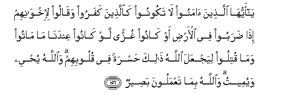

#يَا أَيُّهَا الَّذِينَ آمَنُوا لَا تَكُونُوا كَالَّذِينَ كَفَرُوا وَقَالُوا لِإِخْوَانِهِمْ إِذَا ضَرَبُوا فِي الْأَرْضِ أَوْ كَانُوا غُزًّى لَوْ كَانُوا عِنْدَنَا مَا مَاتُوا وَمَا قُتِلُوا لِيَجْعَلَ اللَّهُ ذَٰلِكَ حَسْرَةً فِي قُلُوبِهِمْ ۗ وَاللَّهُ يُحْيِي وَيُمِيتُ ۗ وَاللَّهُ بِمَا تَعْمَلُونَ بَصِيرٌ 

##Ya ayyuha allatheena amanoo la takoonoo kaallatheena kafaroo waqaloo li-ikhwanihim itha daraboo fee al-ardi aw kanoo ghuzzan law kanoo AAindana ma matoo wama qutiloo liyajAAala Allahu thalika hasratan fee quloobihim waAllahu yuhyee wayumeetu waAllahu bima taAAmaloona baseerun 

## 翻译(Translation)：

| Translator | 译文(Translation)                                            |
| :--------: | ------------------------------------------------------------ |
|    马坚    | 信道的人们啊！你们不要象不信道的人一样；当他们的同胞出门病故，或阵亡前线的时候，他们说：假若他们同我们坐在家里，那么，他们不致病故或阵亡。（你们不要象他们那样说）以便真主以此为他们心里（所独有）的悔恨。真主能使死人复活，能使活人死亡。真主是明察他们的行为的。 |
|  YUSUFALI  | O ye who believe! Be not like the Unbelievers, who say of their brethren, when they are travelling through the Earth or engaged in fighting: "If they had stayed with us, they would not have died, or been slain." This that Allah may make it a cause of sighs and regrets in their hearts. It is Allah that gives Life and Death, and Allah sees well all that ye do. |
| PICKTHALL  | O ye who believe! Be not as those who disbelieved and said of their brethren who went abroad in the land or were fighting in the field: If they had been (here) with us they would not have died or been killed: that Allah may make it anguish in their hearts. Allah giveth life and causeth death; and Allah is Seer of what ye do. |
|   SHAKIR   | O you who believe! be not like those who disbelieve and say of their brethren when they travel in the earth or engage in fighting: Had they been with us, they would not have died and they would not have been slain; so Allah makes this to be an intense regret in their hearts; and Allah gives life and causes death and Allah sees what you do. |

---

## 对位释义(Words Interpretation)：

| No   | العربية | 中文    | English | 曾用词 |
| ---- | ------: | ------- | ------- | ------ |
| 序号 |    阿文 | Chinese | 英文    | Used   |
| 3:156.1  | يَا       | 啊             | Oh                 | 见2:21.1   |
| 3:156.2  | أَيُّهَا     | 语气词         | O                  | 见2:21.2   |
| 3:156.3  | الَّذِينَ    | 谁，那些       | those who          | 见2:6.2    |
| 3:156.4  | آمَنُوا    | 诚信           | believe            | 见2:9.4    |
| 3:156.5  | لَا       | 不，不是，没有 | no                 | 见2:2.3    |
| 3:156.6  | تَكُونُوا   | 你们是         | You will be        | 见2:41.8   |
| 3:156.7  | كَالَّذِينَ   | 像那些人       | like those         | 见3:105.3  |
| 3:156.8  | كَفَرُوا    | 不信           | disbelieve         | 见2:6.3    |
| 3:156.9  | وَقَالُوا   | 和他们说       | and they say       | 见2:80.1   |
| 3:156.10 | لِإِخْوَانِهِمْ | 至他们的众兄弟 | of their brethren  |            |
| 3:156.11 | إِذَا      | 当时           | when               | 见2:156.2  |
| 3:156.12 | ضَرَبُوا    | 他们旅行       | they travel        |            |
| 3:156.13 | فِي       | 在             | in                 | 见2:10.1   |
| 3:156.14 | الْأَرْضِ    | 大地           | Earth              | 见2:22.4   |
| 3:156.15 | أَوْ       | 或             | or                 | 见2:19.1   |
| 3:156.16 | كَانُوا    | 他们是         | they were          | 见2:10:11  |
| 3:156.17 | غُزًّى      | 战斗           | fighting           |            |
| 3:156.18 | لَوْ       | 如果           | If                 | 见2:102.72 |
| 3:156.19 | كَانُوا    | 他们是         | they were          | 见2:10:11  |
| 3:156.20 | عِنْدَنَا    | 在我们那里     | with us            |            |
| 3:156.21 | مَا       | 什么           | what/ that which   | 见2:17.8   |
| 3:156.22 | مَاتُوا    | 他们死亡       | they have died     |            |
| 3:156.23 | وَمَا      | 和不           | And not            | 见2:9.9    |
| 3:156.24 | قُتِلُوا    | 他们被杀       | been killed        |            |
| 3:156.25 | لِيَجْعَلَ    | 以便他使       | to make            |            |
| 3:156.26 | اللَّهُ     | 安拉，真主     | Allah              | 见2:7.2 |
| 3:156.27 | ذَٰلِكَ      | 这个           | this               | 见2:2.1    |
| 3:156.28 | حَسْرَةً     | 悔恨           | regret             |            |
| 3:156.29 | فِي       | 在             | in                 | 见2:10.1   |
| 3:156.30 | قُلُوبِهِمْ   | 他们的心       | Their hearts       | 见2:7.4    |
| 3:156.31 | وَاللَّهُ    | 和安拉，真主   | and Allah          | 见2:19.17  |
| 3:156.32 | يُحْيِي     | 他给生命       | brings ... to life | 见2:73.5   |
| 3:156.33 | وَيُمِيتُ    | 和他使死亡     | and causes to die  | 见2:258.19 |
| 3:156.34 | وَاللَّهُ    | 和安拉，真主   | and Allah          | 见2:19.17  |
| 3:156.35 | بِمَا      | 在什么         | in what            | 见2:4.3    |
| 3:156.36 | تَعْمَلُونَ   | 你们行为       | you do             | 见2:74.37  |
| 3:156.37 | بَصِيرٌ     | 明察           | sees well          | 见2:96.23  |

---
