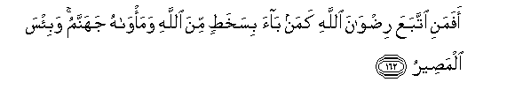

#أَفَمَنِ اتَّبَعَ رِضْوَانَ اللَّهِ كَمَنْ بَاءَ بِسَخَطٍ مِنَ اللَّهِ وَمَأْوَاهُ جَهَنَّمُ ۚ وَبِئْسَ الْمَصِيرُ 

##Afamani ittabaAAa ridwana Allahi kaman baa bisakhatin mina Allahi wama/wahu jahannamu wabi/sa almaseeru 

## 翻译(Translation)：

| Translator | 译文(Translation)                                            |
| :--------: | ------------------------------------------------------------ |
|    马坚    | 难道追求真主喜悦的人，象应受真主谴怒的人吗？他的归宿是火狱，那归宿真恶劣。 |
|  YUSUFALI  | Is the man who follows the good pleasure of Allah Like the man who draws on himself the wrath of Allah, and whose abode is in Hell?- A woeful refuge! |
| PICKTHALL  | Is one who followeth the pleasure of Allah as one who hath earned condemnation from Allah, whose habitation is the Fire, a hapless journey's end? |
|   SHAKIR   | Is then he who follows the pleasure of Allah like him who has made himself deserving of displeasure from Allah, and his abode is hell; and it is an evil destination. |

---

## 对位释义(Words Interpretation)：

| No   | العربية | 中文    | English | 曾用词 |
| ---- | ------: | ------- | ------- | ------ |
| 序号 |    阿文 | Chinese | 英文    | Used   |
| 3:162.1  | أَفَمَنِ   | 难道然后谁 | Is then who            |            |
| 3:162.2  | اتَّبَعَ   | 他追求     | he follows             |            |
| 3:162.3  | رِضْوَانَ  | 喜悦       | the pleasure           |            |
| 3:162.4  | اللَّهِ   | 真主的     | of Allah               | 见2:23.17  |
| 3:162.5  | كَمَنْ    | 像谁       | like who               |            |
| 3:162.6  | بَاءَ    | 应受       | made himself deserving |            |
| 3:162.7  | بِسَخَطٍ   | 以愤怒     | of displeasure         |            |
| 3:162.8  | مِنَ     | 从         | from                   | 见2:19.3 |
| 3:162.9  | اللَّهِ   | 真主的     | of Allah               | 见2:23.17  |
| 3:162.10 | وَمَأْوَاهُ | 和他的住所 | and his abode          |            |
| 3:162.11 | جَهَنَّمُ   | 火狱       | hell                   | 见2:206.10 |
| 3:162.12 | وَبِئْسَ   | 和恶劣     | and evil               | 见2:126.29 |
| 3:162.13 | الْمَصِيرُ | 结果       | destination            | 见2:126.30 |

---
