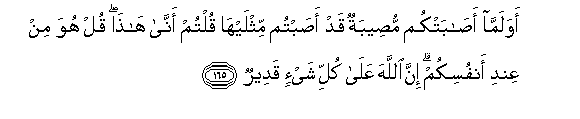

#أَوَلَمَّا أَصَابَتْكُمْ مُصِيبَةٌ قَدْ أَصَبْتُمْ مِثْلَيْهَا قُلْتُمْ أَنَّىٰ هَٰذَا ۖ قُلْ هُوَ مِنْ عِنْدِ أَنْفُسِكُمْ ۗ إِنَّ اللَّهَ عَلَىٰ كُلِّ شَيْءٍ قَدِيرٌ 

##Awa lamma asabatkum museebatun qad asabtum mithlayha qultum anna hatha qul huwa min AAindi anfusikum inna Allaha AAala kulli shay-in qadeerun 

## 翻译(Translation)：

| Translator | 译文(Translation)                                            |
| :--------: | ------------------------------------------------------------ |
|    马坚    | 你们所遭受的损失，只有你们所加给敌人的损失的一半，你们怎么还说：这是从哪里来的呢? 你说：这是你们自作自受的。真主对于万事确是全能的。 |
|  YUSUFALI  | What! When a single disaster smites you, although ye smote (your enemies) with one twice as great, do ye say?- "Whence is this?" Say (to them): "It is from yourselves: For Allah hath power over all things." |
| PICKTHALL  | And was it so, when a disaster smote you, though ye had smitten (them with a disaster) twice (as great), that ye said: How is this? Say (unto them, O Muhammad): It is from yourselves. Lo! Allah is Able to do all things. |
|   SHAKIR   | What! when a misfortune befell you, and you had certainly afflicted (the unbelievers) with twice as much, you began to say: Whence is this? Say: It is from yourselves; surely Allah has power over all things. |

---

## 对位释义(Words Interpretation)：

| No   | العربية | 中文    | English | 曾用词 |
| ---- | ------: | ------- | ------- | ------ |
| 序号 |    阿文 | Chinese | 英文    | Used   |
| 3:165.1  | أَوَلَمَّا   | 当           | What! when   |            |
| 3:165.2  | أَصَابَتْكُمْ | 遭受你们     | befell you   |            |
| 3:165.3  | مُصِيبَةٌ   | 灾难         | a misfortune | 见2:156.4  |
| 3:165.4  | قَدْ      | 当然         | may          | 见2:60.14  |
| 3:165.5  | أَصَبْتُمْ   | 你们使痛苦   | you smote    |            |
| 3:165.6  | مِثْلَيْهَا  | 它的两倍     | its twice    |            |
| 3:165.7  | قُلْتُمْ    | 你们说       | You said     | 见2:55.2   |
| 3:165.8  | أَنَّىٰ     | 如何         | how          | 见2:223.6  |
| 3:165.9  | هَٰذَا     | 这个，此     | This         | 见2:25.20  |
| 3:165.10 | قُلْ      | 你说         | Say          | 见2:80.8   |
| 3:165.11 | هُوَ      | 他是         | He is        | 见2:29.1   |
| 3:165.12 | مِنْ      | 从           | from         | 见2:4.8    |
| 3:165.13 | عِنْدِ     | 以           | with         | 见2:54.20  |
| 3:165.14 | أَنْفُسِكُمْ  | 你们自己     | yourselves   | 见2:235.13 |
| 3:165.15 | إِنَّ      | 的确         | surely       | 见2:6.1    |
| 3:165.16 | اللَّهَ    | 安拉，真主   | Allah        | 见1:1.2    |
| 3:165.17 | عَلَىٰ     | 至           | On           | 见2:5.2    |
| 3:165.18 | كُلِّ      | 所有         | All          | 见2:20.23  |
| 3:165.19 | شَيْءٍ     | 事物         | Thing        | 见2:20.24  |
| 3:165.20 | قَدِيرٌ    | 全能，大能的 | Mighty       | 见2:20.25  |

---
