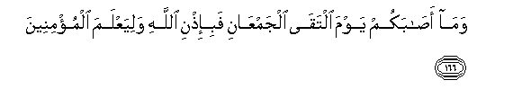

#وَمَا أَصَابَكُمْ يَوْمَ الْتَقَى الْجَمْعَانِ فَبِإِذْنِ اللَّهِ وَلِيَعْلَمَ الْمُؤْمِنِينَ 

##Wama asabakum yawma iltaqa aljamAAani fabi-ithni Allahi waliyaAAlama almu/mineena 

## 翻译(Translation)：

| Translator | 译文(Translation)                                            |
| :--------: | ------------------------------------------------------------ |
|    马坚    | 两军交战之日，你们所遭受的损失，是依据真主的意旨的，他要认识确信的人， |
|  YUSUFALI  | What ye suffered on the day the two armies Met, was with the leave of Allah, in order that He might test the believers,- |
| PICKTHALL  | That which befell you, on the day when the two armies met, was by permission of Allah; that He might know the true believers; |
|   SHAKIR   | And what befell you on the day when the two armies met (at Ohud) was with Allah's knowledge, and that He might know the believers |

---

## 对位释义(Words Interpretation)：

| No   | العربية | 中文    | English | 曾用词 |
| ---- | ------: | ------- | ------- | ------ |
| 序号 |    阿文 | Chinese | 英文    | Used   |
| 3:166.1 | وَمَا      | 和什么           | and that           | 见2:4.6    |
| 3:166.2 | أَصَابَكُمْ   | 他降临你们  | had befallen you   | 见3:153.21 |
| 3:166.3 | يَوْمَ      | 日，日子，时候的 | day                | 见1:4.2    |
| 3:166.4 | الْتَقَى    | 它相遇           | it met             | 见3:155.6  |
| 3:166.5 | الْجَمْعَانِ  | 两军             | the two armies     | 见3:155.7  |
| 3:166.6 | فَبِإِذْنِ    | 然后以许可       | then by permission | 参2:97.10  |
| 3:166.7 | اللَّهِ     | 真主的           | of Allah           | 见2:23.17  |
| 3:166.8 | وَلِيَعْلَمَ   | 和以便他知道     | and may to know    | 见3:140.14 |
| 3:166.9 | الْمُؤْمِنِينَ | 信士们           | the believers      | 见2:223.16 |

---
