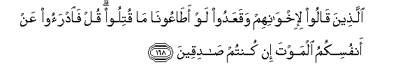

#الَّذِينَ قَالُوا لِإِخْوَانِهِمْ وَقَعَدُوا لَوْ أَطَاعُونَا مَا قُتِلُوا ۗ قُلْ فَادْرَءُوا عَنْ أَنْفُسِكُمُ الْمَوْتَ إِنْ كُنْتُمْ صَادِقِينَ 

##Allatheena qaloo li-ikhwanihim waqaAAadoo law ataAAoona ma qutiloo qul faidraoo AAan anfusikumu almawta in kuntum sadiqeena 

## 翻译(Translation)：

| Translator | 译文(Translation)                                            |
| :--------: | ------------------------------------------------------------ |
|    马坚    | 他们不肯参加战斗，却对自己的教胞说：假若他们顺从我们，他们不会阵亡。你说：你们为自身抵御死亡吧，如果你们是诚实的。 |
|  YUSUFALI  | (They are) the ones that say, (of their brethren slain), while they themselves sit (at ease): "If only they had listened to us they would not have been slain." Say: "Avert death from your own selves, if ye speak the truth." |
| PICKTHALL  | Those who, while they sat at home, said of their brethren (who were fighting for the cause of Allah): If they had been guided by us they would not have been slain. Say (unto them, O Muhammad): Then avert death from yourselves if ye are truthful. |
|   SHAKIR   | Those who said of their brethren whilst they (themselves) held back: Had they obeyed us, they would not have been killed. Say: Then avert death from yourselves if you speak the truth. |

---

## 对位释义(Words Interpretation)：

| No   | العربية | 中文    | English | 曾用词 |
| ---- | ------: | ------- | ------- | ------ |
| 序号 |    阿文 | Chinese | 英文    | Used   |
| 3:168.1  | الَّذِينَ    | 谁，那些       | those who         | 见2:6.2    |
| 3:168.2  | قَالُوا    | 他们说，       | They said         | 见2:11.8   |
| 3:168.3  | لِإِخْوَانِهِمْ | 至他们的众兄弟 | of their brethren | 见3:156.10 |
| 3:168.4  | وَقَعَدُوا   | 和他们坐       | while they sat    |            |
| 3:168.5  | لَوْ       | 如果           | If                | 见2:102.72 |
| 3:168.6  | أَطَاعُونَا  | 他们服从我们   | they obeyed us    |            |
| 3:168.7  | مَا       | 不             | not               | 见2:120.24 |
| 3:168.8  | قُتِلُوا    | 他们被杀       | been killed       | 见3:156.24 |
| 3:168.9  | قُلْ       | 你说           | Say               | 见2:80.8   |
| 3:168.10 | فَادْرَءُوا  | 然后抵御       | Then avert        |            |
| 3:168.11 | عَنْ       | 从             | on                | 见2:48.6   |
| 3:168.12 | أَنْفُسِكُمُ   | 你们自己       | yourselves        | 参2:235.13 |
| 3:168.13 | الْمَوْتَ    | 死亡           | the death         | 见2:19.16  |
| 3:168.14 | إِنْ       | 如果           | if                | 见2:23.18  |
| 3:168.15 | كُنْتُمْ     | 你们           | You               | 见2:23.2   |
| 3:168.16 | صَادِقِينَ   | 诚实的         | Honest            | 见2:23.20  |

---
