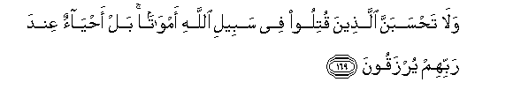

#وَلَا تَحْسَبَنَّ الَّذِينَ قُتِلُوا فِي سَبِيلِ اللَّهِ أَمْوَاتًا ۚ بَلْ أَحْيَاءٌ عِنْدَ رَبِّهِمْ يُرْزَقُونَ 

##Wala tahsabanna allatheena qutiloo fee sabeeli Allahi amwatan bal ahyaon AAinda rabbihim yurzaqoona 

## 翻译(Translation)：

| Translator | 译文(Translation)                                            |
| :--------: | ------------------------------------------------------------ |
|    马坚    | 为主道而阵亡的人，你绝不要认为他们是死的，其实，他们是活着的，他们在真主那里享受给养。 |
|  YUSUFALI  | Think not of those who are slain in Allah's way as dead. Nay, they live, finding their sustenance in the presence of their Lord; |
| PICKTHALL  | Think not of those, who are slain in the way of Allah, as dead. Nay, they are living. With their Lord they have provision. |
|   SHAKIR   | And reckon not those who are killed in Allah's way as dead; nay, they are alive (and) are provided sustenance from their Lord; |

---

## 对位释义(Words Interpretation)：

| No   | العربية | 中文    | English | 曾用词 |
| ---- | ------: | ------- | ------- | ------ |
| 序号 |    阿文 | Chinese | 英文    | Used   |
| 3:169.1  | وَلَا    | 也不       | and not             | 见1:7.8    |
| 3:169.2  | تَحْسَبَنَّ  | 你认为     | you think           |            |
| 3:169.3  | الَّذِينَ  | 谁，那些   | those who           | 见2:6.2    |
| 3:169.4  | قُتِلُوا  | 他们被杀   | been killed         | 见3:156.24 |
| 3:169.5  | فِي     | 在         | in                  | 见2:10.1   |
| 3:169.6  | سَبِيلِ   | 道路       | the way             | 见2:154.6  |
| 3:169.7  | اللَّهِ   | 真主的     | of Allah            | 见2:23.17  |
| 3:169.8  | أَمْوَاتًا | 死         | Dead                | 见2:28.5   |
| 3:169.9  | بَلْ     | 不然       | Nay, but            | 见2:88.4   |
| 3:169.10 | أَحْيَاءٌ  | 活的       | alive               | 见2:154.10 |
| 3:169.11 | عِنْدَ    | 以         | with                | 见2:54.20  |
| 3:169.12 | رَبِّهِمْ   | 他们的主   | their Lord          | 见2:5.5    |
| 3:169.13 | يُرْزَقُونَ | 他们被供给 | they have provision |            |

---
