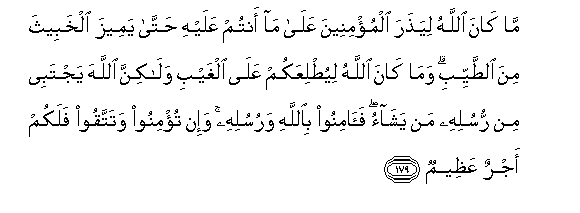

# مَا كَانَ اللَّهُ لِيَذَرَ الْمُؤْمِنِينَ عَلَىٰ مَا أَنْتُمْ عَلَيْهِ حَتَّىٰ يَمِيزَ الْخَبِيثَ مِنَ الطَّيِّبِ ۗ وَمَا كَانَ اللَّهُ لِيُطْلِعَكُمْ عَلَى الْغَيْبِ وَلَٰكِنَّ اللَّهَ يَجْتَبِي مِنْ رُسُلِهِ مَنْ يَشَاءُ ۖ فَآمِنُوا بِاللَّهِ وَرُسُلِهِ ۚ وَإِنْ تُؤْمِنُوا وَتَتَّقُوا فَلَكُمْ أَجْرٌ عَظِيمٌ 

##Ma kana Allahu liyathara almu/mineena AAala ma antum AAalayhi hatta yameeza alkhabeetha mina alttayyibi wamakana Allahu liyutliAAakum AAala alghaybi walakinna Allaha yajtabee min rusulihi man yashao faaminoo biAllahi warusulihi wa-in tu/minoo watattaqoo falakum ajrun AAatheemun 

## 翻译(Translation)：

| Translator | 译文(Translation)                                            |
| :--------: | ------------------------------------------------------------ |
|    马坚    | 真主不致于让信士们常在你们的现状之下，（但他试验你们），直到他甄别恶劣的与善良的。真主不致于使你们窥见幽玄，但真主拣选他所意欲的人做使者；故你们当确信真主和众使者。如果你们信道，而且敬畏，那末，你们将受重大的报酬。 |
|  YUSUFALI  | Allah will not leave the believers in the state in which ye are now, until He separates what is evil from what is good nor will He disclose to you the secrets of the Unseen. But He chooses of His Messengers (For the purpose) whom He pleases. So believe in Allah. And His messengers: And if ye believe and do right, ye have a reward without measure. |
| PICKTHALL  | It is not (the purpose) of Allah to leave you in your present state till He shall separate the wicked from the good. And it is not (the purpose of) Allah to let you know the Unseen. But Allah chooseth of His messengers whom He will, (to receive knowledge thereof). So believe in Allah and His messengers. If ye believe and ward off (evil), yours will be a vast reward. |
|   SHAKIR   | On no account will Allah leave the believers in the condition which you are in until He separates the evil from the good; nor is Allah going to make you acquainted with the unseen, but Allah chooses of His messengers whom He pleases; therefore believe in Allah and His messengers; and if you believe and guard (against evil), then you shall have a great reward. |

---

## 对位释义(Words Interpretation)：

| No   | العربية | 中文    | English | 曾用词 |
| ---- | ------: | ------- | ------- | ------ |
| 序号 |    阿文 | Chinese | 英文    | Used   |
| 3:179.1  | مَا       | 不           | not                  | 见2:120.24 |
| 3:179.2  | كَانَ      | 他是         | It was               | 见2:75.6   |
| 3:179.3  | اللَّهُ     | 安拉，真主   | Allah                | 见2:7.2 |
| 3:179.4  | لِيَذَرَ     | 他使         | he leave             |            |
| 3:179.5  | الْمُؤْمِنِينَ | 信士们       | the believers        | 见2:223.16 |
| 3:179.6  | عَلَىٰ      | 至           | On                   | 见2:5.2    |
| 3:179.7  | مَا       | 什么         | what/ that which     | 见2:17.8   |
| 3:179.8  | أَنْتُمْ     | 你们         | you                  | 见2:85.2   |
| 3:179.9  | عَلَيْهِ     | 在他         | on him               | 见2:37.7   |
| 3:179.10 | حَتَّىٰ      | 直到         | Until                | 见2:55.8   |
| 3:179.11 | يَمِيزَ     | 他区别       | He separates         |            |
| 3:179.12 | الْخَبِيثَ   | 坏的事物     | the bad              | 见2:267.17 |
| 3:179.13 | مِنَ       | 从           | from                 | 见2:19.3 |
| 3:179.14 | الطَّيِّبِ    | 好的事物     | the good             |            |
| 3:179.15 | وَمَا      | 和不         | And not              | 见2:9.9    |
| 3:179.16 | كَانَ      | 他是         | It was               | 见2:75.6   |
| 3:179.17 | اللَّهُ     | 安拉，真主   | Allah                | 见2:7.2 |
| 3:179.18 | لِيُطْلِعَكُمْ  | 他使你们知道 | to let you know      |            |
| 3:179.19 | عَلَى      | 至           | On                   | 见2:5.2    |
| 3:179.20 | الْغَيْبِ    | 幽玄的       | of the things unseen | 见3:44.4   |
| 3:179.21 | وَلَٰكِنَّ     | 并且但是     | and but              | 见2:12.5   |
| 3:179.22 | اللَّهَ     | 安拉，真主   | Allah                | 见2:9.2 |
| 3:179.23 | يَجْتَبِي    | 他选择       | He chooses           |            |
| 3:179.24 | مِنْ       | 从           | from                 | 见2:4.8    |
| 3:179.25 | رُسُلِهِ     | 他的众使者   | His messengers       | 见2:285.20 |
| 3:179.26 | مَنْ       | 谁           | who                  | 见2:97.2   |
| 3:179.27 | يَشَاءُ     | 他意欲       | He pleases           | 见2:90.18  |
| 3:179.28 | فَآمِنُوا   | 因此诚信     | so believe           | 参2:9.4    |
| 3:179.29 | بِاللَّهِ    | 在真主       | in Allah             | 见2:8.6    |
| 3:179.30 | وَرُسُلِهِ    | 和他的众使者 | And his messengers   | 见2:98.6   |
| 3:179.31 | وَإِنْ      | 和如果       | and if               | 见2:137.9  |
| 3:179.32 | تُؤْمِنُوا   | 你们诚信     | you believe          | 见3:73.2   |
| 3:179.33 | وَتَتَّقُوا   | 和敬畏       | and guarding         | 见2:224.8  |
| 3:179.34 | فَلَكُمْ     | 然后对你们   | then for you         | 见2:279.11 |
| 3:179.35 | أَجْرٌ      | 报酬         | reward               | 见3:172.14 |
| 3:179.36 | عَظِيمٌ     | 重大         | Great                | 见2:7.12   |

---
