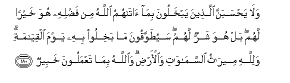

# وَلَا يَحْسَبَنَّ الَّذِينَ يَبْخَلُونَ بِمَا آتَاهُمُ اللَّهُ مِنْ فَضْلِهِ هُوَ خَيْرًا لَهُمْ ۖ بَلْ هُوَ شَرٌّ لَهُمْ ۖ سَيُطَوَّقُونَ مَا بَخِلُوا بِهِ يَوْمَ الْقِيَامَةِ ۗ وَلِلَّهِ مِيرَاثُ السَّمَاوَاتِ وَالْأَرْضِ ۗ وَاللَّهُ بِمَا تَعْمَلُونَ خَبِيرٌ 

##Wala yahsabanna allatheena yabkhaloona bima atahummu Allahu min fadlihi huwa khayran lahum bal huwa sharrun lahum sayutawwaqoona ma bakhiloo bihi yawma alqiyamati walillahi meerathu alssamawati waal-ardi waAllahu bimataAAmaloona khabeerun 

## 翻译(Translation)：

| Translator | 译文(Translation)                                            |
| :--------: | ------------------------------------------------------------ |
|    马坚    | 吝惜真主所赐的恩惠的人，绝不要认为他们的吝惜，对于他们是有益的，其实，那对于他们是有害的；复活日，他们所吝惜的（财产），要像一个项圈一样，套在他们的颈项上。天地间的遗产，只是真主的。真主是彻知你们的行为的。 |
|  YUSUFALI  | And let not those who covetously withhold of the gifts which Allah Hath given them of His Grace, think that it is good for them: Nay, it will be the worse for them: soon shall the things which they covetously withheld be tied to their necks Like a twisted collar, on the Day of Judgment. To Allah belongs the heritage of the heavens and the earth; and Allah is well-acquainted with all that ye do. |
| PICKTHALL  | And let not those who hoard up that which Allah hath bestowed upon them of His bounty think that it is better for them. Nay, it is worse for them. That which they hoard will be their collar on the Day of Resurrection. Allah's is the heritage of the heavens and the earth, and Allah is Informed of what ye do. |
|   SHAKIR   | And let not those deem, who are niggardly in giving away that which Allah has granted them out of His grace, that it is good for them; nay, it is worse for them; they shall have that whereof they were niggardly made to cleave to their necks on the resurrection day; and Allah's is the heritage of the heavens and the earth; and Allah is aware of what you do. |

---

## 对位释义(Words Interpretation)：

| No   | العربية | 中文    | English | 曾用词 |
| ---- | ------: | ------- | ------- | ------ |
| 序号 |    阿文 | Chinese | 英文    | Used   |
| 3:180.1  | وَلَا      | 也不             | and not                   | 见1:7.8    |
| 3:180.2  | يَحْسَبَنَّ    | 他们认为         | they think                | 见3:178.2  |
| 3:180.3  | الَّذِينَ    | 谁，那些         | those who                 | 见2:6.2    |
| 3:180.4  | يَبْخَلُونَ   | 他们吝啬         | they niggardly            |            |
| 3:180.5  | بِمَا      | 在什么           | in what                   | 见2:4.3    |
| 3:180.6  | آتَاهُمُ    | 他给他们         | he has given them         | 见3:170.3  |
| 3:180.7  | اللَّهُ     | 安拉，真主       | Allah                     | 见1:1.2    |
| 3:180.8  | مِنْ       | 从               | from                      | 见2:4.8    |
| 3:180.9  | فَضْلِهِ     | 他的恩惠         | His grace                 | 见2:90.15  |
| 3:180.10 | هُوَ       | 他是             | He is                     | 见2:29.1   |
| 3:180.11 | خَيْرًا     | 好的             | Good                      | 见2:158.20 |
| 3:180.12 | لَهُمْ      | 对他们           | for them                  | 见2:11.3   |
| 3:180.13 | بَلْ       | 不然             | Nay, but                  | 见2:88.4   |
| 3:180.14 | هُوَ       | 他是             | He is                     | 见2:29.1   |
| 3:180.15 | شَرٌّ       | 不好             | bad                       | 见2:216.19 |
| 3:180.16 | لَهُمْ      | 对他们           | for them                  | 见2:11.3   |
| 3:180.17 | سَيُطَوَّقُونَ  | 他们将被套在     | they will be their collar |            |
| 3:180.18 | مَا       | 什么             | what/ that which          | 见2:17.8   |
| 3:180.19 | بَخِلُوا    | 他们吝惜         | they were niggardly       | 参3:180.4  |
| 3:180.20 | بِهِ       | 以它             | with it                   | 见2:22.13  |
| 3:180.21 | يَوْمَ      | 日，日子，时候的 | day                       | 见1:4.2    |
| 3:180.22 | الْقِيَامَةِ  | 复活的           | Resurrection              | 见2:85.40  |
| 3:180.23 | وَلِلَّهِ     | 和归真主         | and to Allah              | 见2:115.1  |
| 3:180.24 | مِيرَاثُ    | 遗产             | the heritage              |            |
| 3:180.25 | السَّمَاوَاتِ | 和诸天的         | of the heavens            | 见2:33.16  |
| 3:180.26 | وَالْأَرْضِ   | 和土地           | and earth                 | 见2:33.17  |
| 3:180.27 | وَاللَّهُ    | 和安拉，真主     | and Allah                 | 见2:19.17  |
| 3:180.28 | بِمَا      | 在什么           | in what                   | 见2:4.3    |
| 3:180.29 | تَعْمَلُونَ   | 你们行为         | you do                    | 见2:74.37  |
| 3:180.30 | خَبِيرٌ     | 彻知             | informed                  | 见2:234.25 |

---
