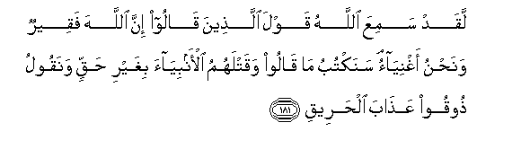

#لَقَدْ سَمِعَ اللَّهُ قَوْلَ الَّذِينَ قَالُوا إِنَّ اللَّهَ فَقِيرٌ وَنَحْنُ أَغْنِيَاءُ ۘ سَنَكْتُبُ مَا قَالُوا وَقَتْلَهُمُ الْأَنْبِيَاءَ بِغَيْرِ حَقٍّ وَنَقُولُ ذُوقُوا عَذَابَ الْحَرِيقِ 

##Laqad samiAAa Allahu qawla allatheena qaloo inna Allaha faqeerun wanahnu aghniyaon sanaktubu ma qaloo waqatlahumu al-anbiyaa bighayri haqqin wanaqoolu thooqoo AAathaba alhareeqi 

## 翻译(Translation)：

| Translator | 译文(Translation)                                            |
| :--------: | ------------------------------------------------------------ |
|    马坚    | 真主确已听见有些人说：真主确是贫穷的，我们确是富足的。我要记录他们所说的话，和他们枉杀众先知的行为。我要说：他们尝试烧灼的刑罚吧。 |
|  YUSUFALI  | Allah hath heard the taunt of those who say: "Truly, Allah is indigent and we are rich!"- We shall certainly record their word and (their act) of slaying the prophets in defiance of right, and We shall say: "Taste ye the penalty of the Scorching Fire! |
| PICKTHALL  | Verily Allah heard the saying of those who said, (when asked for contributions to the war): "Allah, forsooth, is poor, and we are rich!" We shall record their saying with their slaying of the prophets wrongfully and We shall say: Taste ye the punishment of burning! |
|   SHAKIR   | Allah has certainly heard the saying of those who said: Surely Allah is poor and we are rich. I will record what they say, and their killing the prophets unjustly, and I will say: Taste the chastisement of burning. |

---

## 对位释义(Words Interpretation)：

| No   | العربية | 中文    | English | 曾用词 |
| ---- | ------: | ------- | ------- | ------ |
| 序号 |    阿文 | Chinese | 英文    | Used   |
| 3:181.1  | لَقَدْ      | 必定         | Certainly         | 见3:164.1  |
| 3:181.2  | سَمِعَ      | 他听见       | he heard          |            |
| 3:181.3  | اللَّهُ     | 安拉，真主   | Allah             | 见2:7.2 |
| 3:181.4  | قَوْلَ      | 话           | the saying        |            |
| 3:181.5  | الَّذِينَ    | 谁，那些     | those who         | 见2:6.2    |
| 3:181.6  | قَالُوا    | 他们说，     | They said         | 见2:11.8   |
| 3:181.7  | إِنَّ       | 的确         | surely            | 见2:6.1    |
| 3:181.8  | اللَّهَ     | 安拉，真主   | Allah             | 见2:9.2 |
| 3:181.9  | فَقِيرٌ     | 贫穷         | poor              |            |
| 3:181.10 | وَنَحْنُ     | 和我们       | and we            | 见2:30.18  |
| 3:181.11 | أَغْنِيَاءُ   | 富有的       | rich              |            |
| 3:181.12 | سَنَكْتُبُ    | 我们将记录   | We shall record   |            |
| 3:181.13 | مَا       | 什么         | what/ that which  | 见2:17.8   |
| 3:181.14 | قَالُوا    | 他们说，     | They said         | 见2:11.8   |
| 3:181.15 | وَقَتْلَهُمُ   | 和他们的杀害 | and their killing |            |
| 3:181.16 | الْأَنْبِيَاءَ | 众先知       | the prophets      | 见3:112.28 |
| 3:181.17 | بِغَيْرِ     | 在没有      | without           | 见2:61.54  |
| 3:181.18 | حَقٍّ       | 正确的，真理 | Right, truth      | 见2:121.5  |
| 3:181.19 | وَنَقُولُ    | 和我们说     | and We shall say  |            |
| 3:181.20 | ذُوقُوا    | 尝           | Taste             |            |
| 3:181.21 | عَذَابَ     | 刑罚         | the chastisement  | 见2:201.13 |
| 3:181.22 | الْحَرِيقِ   | 烧灼的       | of burning        |            |

---
