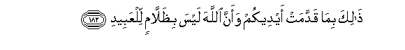

#ذَٰلِكَ بِمَا قَدَّمَتْ أَيْدِيكُمْ وَأَنَّ اللَّهَ لَيْسَ بِظَلَّامٍ لِلْعَبِيدِ 

##Thalika bima qaddamat aydeekum waanna Allaha laysa bithallamin lilAAabeedi 

## 翻译(Translation)：

| Translator | 译文(Translation)                                            |
| :--------: | ------------------------------------------------------------ |
|    马坚    | 这是因为你们曾经犯罪，又因为真主绝不是亏枉众仆的。           |
|  YUSUFALI  | "This is because of the (unrighteous deeds) which your hands sent on before ye: For Allah never harms those who serve Him." |
| PICKTHALL  | This is on account of that which your own hands have sent before (you to the judgment). Allah is no oppressor of (His) bondmen. |
|   SHAKIR   | This is for what your own hands have sent before and because Allah is not in the least unjust to the servants. |

---

## 对位释义(Words Interpretation)：

| No   | العربية | 中文    | English | 曾用词 |
| ---- | ------: | ------- | ------- | ------ |
| 序号 |    阿文 | Chinese | 英文    | Used   |
| 3:182.1 | ذَٰلِكَ    | 这个       | this             | 见2:2.1    |
| 3:182.2 | بِمَا    | 在什么     | in what          | 见2:4.3    |
| 3:182.3 | قَدَّمَتْ   | 之前作下的 | have sent before | 见2:95.5   |
| 3:182.4 | أَيْدِيكُمْ | 你们的手   | your hands       | 参2:79.20  |
| 3:182.5 | وَأَنَّ    | 和那个     | and that         | 见2:165.28 |
| 3:182.6 | اللَّهَ   | 安拉，真主 | Allah            | 见2:9.2 |
| 3:182.7 | لَيْسَ    | 它不是     | It is not        | 见2:177.1  |
| 3:182.8 | بِظَلَّامٍ  | 在不公正   | in unjust        |            |
| 3:182.9 | لِلْعَبِيدِ | 对众仆     | to the servants  |            |

---
