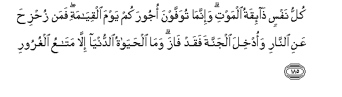

#كُلُّ نَفْسٍ ذَائِقَةُ الْمَوْتِ ۗ وَإِنَّمَا تُوَفَّوْنَ أُجُورَكُمْ يَوْمَ الْقِيَامَةِ ۖ فَمَنْ زُحْزِحَ عَنِ النَّارِ وَأُدْخِلَ الْجَنَّةَ فَقَدْ فَازَ ۗ وَمَا الْحَيَاةُ الدُّنْيَا إِلَّا مَتَاعُ الْغُرُورِ 

##Kullu nafsin tha-iqatu almawti wa-innama tuwaffawna ojoorakum yawma alqiyamati faman zuhziha AAani alnnari waodkhila aljannata faqad faza wama alhayatu alddunya illa mataAAu alghuroori 

## 翻译(Translation)：

| Translator | 译文(Translation)                                            |
| :--------: | ------------------------------------------------------------ |
|    马坚    | 人人都要尝死的滋味。在复活日，你们才得享受你们的完全报酬。谁得远离火狱，而入乐园，谁已成功。今世的生活，只是虚幻的享受。 |
|  YUSUFALI  | Every soul shall have a taste of death: And only on the Day of Judgment shall you be paid your full recompense. Only he who is saved far from the Fire and admitted to the Garden will have attained the object (of Life): For the life of this world is but goods and chattels of deception. |
| PICKTHALL  | Every soul will taste of death. And ye will be paid on the Day of Resurrection only that which ye have fairly earned. Whoso is removed from the Fire and is made to enter paradise, he indeed is triumphant. The life of this world is but comfort of illusion. |
|   SHAKIR   | Every soul shall taste of death, and you shall only be paid fully your reward on the resurrection day; then whoever is removed far away from the fire and is made to enter the garden he indeed has attained the object; and the life of this world is nothing but a provision of vanities. |

---

## 对位释义(Words Interpretation)：

| No   | العربية | 中文    | English | 曾用词 |
| ---- | ------: | ------- | ------- | ------ |
| 序号 |    阿文 | Chinese | 英文    | Used   |
| 3:185.1  | كُلُّ      | 所有             | All                  | 见2:20.23  |
| 3:185.2  | نَفْسٍ     | 一个人           | one                  | 见2:48.5   |
| 3:185.3  | ذَائِقَةُ   | 品尝             | taste                |            |
| 3:185.4  | الْمَوْتِ   | 死亡             | the death            | 见2:19.16  |
| 3:185.5  | وَإِنَّمَا   | 和仅仅           | and only             | 参2:11.9   |
| 3:185.6  | تُوَفَّوْنَ   | 你们获得         | you shall be paid    |            |
| 3:185.7  | أُجُورَكُمْ  | 你们的报酬       | your reward          |            |
| 3:185.8  | يَوْمَ     | 日，日子，时候的 | day                  | 见1:4.2    |
| 3:185.9  | الْقِيَامَةِ | 复活的           | Resurrection         | 见2:85.40  |
| 3:185.10 | فَمَنْ     | 无论谁           | whosoever            | 见2:38.9   |
| 3:185.11 | زُحْزِحَ    | 他被远离         | is removed far away  |            |
| 3:185.12 | عَنِ      | 关于             | about                | 见2:189.2  |
| 3:185.13 | النَّارِ   | 火狱             | the Fire             | 见2:24.7   |
| 3:185.14 | وَأُدْخِلَ   | 和他被进入       | and is made to enter |            |
| 3:185.15 | الْجَنَّةَ   | 天园             | Paradise             | 见2:35.7   |
| 3:185.16 | فَقَدْ     | 然后当然         | then may             | 见2:108.15 |
| 3:185.17 | فَازَ     | 他成功           | he is triumphant     |            |
| 3:185.18 | وَمَا     | 和不             | And not              | 见2:9.9    |
| 3:185.19 | الْحَيَاةُ  | 生活             | the life             | 见2:212.4  |
| 3:185.20 | الدُّنْيَا  | 今世             | this world           | 见2:85.38  |
| 3:185.21 | إِلَّا     | 除了             | Except               | 见2:9.7    |
| 3:185.22 | مَتَاعُ    | 享受             | a provision          | 见3:14.18  |
| 3:185.23 | الْغُرُورِ  | 虚幻的           | of vanities          |            |

---
