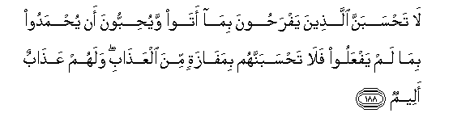

#لَا تَحْسَبَنَّ الَّذِينَ يَفْرَحُونَ بِمَا أَتَوْا وَيُحِبُّونَ أَنْ يُحْمَدُوا بِمَا لَمْ يَفْعَلُوا فَلَا تَحْسَبَنَّهُمْ بِمَفَازَةٍ مِنَ الْعَذَابِ ۖ وَلَهُمْ عَذَابٌ أَلِيمٌ 

##La tahsabanna allatheena yafrahoona bima ataw wayuhibboona an yuhmadoo bima lam yafAAaloo fala tahsabannahum bimafazatin mina alAAathabi walahum AAathabun aleemun 

## 翻译(Translation)：

| Translator | 译文(Translation)                                            |
| :--------: | ------------------------------------------------------------ |
|    马坚    | 有些人对于自己做过的事，洋洋得意；对于自己未曾做过的事，爱受赞颂，你绝不要认为他们将脱离刑罚，其实，他们将受痛苦的刑罚。 |
|  YUSUFALI  | Think not that those who exult in what they have brought about, and love to be praised for what they have not done,- think escape the penalty. For them is a penalty Grievous indeed. |
| PICKTHALL  | Think not that those who exult in what they have given, and love to be praised for what they have not done - Think not, they are in safety from the doom. A painful doom is theirs. |
|   SHAKIR   | Do not think those who rejoice for what they have done and love that they should be praised for what they have not done-- so do by no means think them to be safe from the chastisement, and they shall have a painful chastisement. |

---

## 对位释义(Words Interpretation)：

| No   | العربية | 中文    | English | 曾用词 |
| ---- | ------: | ------- | ------- | ------ |
| 序号 |    阿文 | Chinese | 英文    | Used   |
| 3:188.1  | لَا      | 不，不是，没有 | no                     | 见2:2.3   |
| 3:188.2  | تَحْسَبَنَّ   | 你认为         | you think              | 见3:169.2 |
| 3:188.3  | الَّذِينَ   | 谁，那些       | those who              | 见2:6.2   |
| 3:188.4  | يَفْرَحُونَ  | 他们洋洋得意   | they rejoice           |           |
| 3:188.5  | بِمَا     | 在什么         | in what                | 见2:4.3   |
| 3:188.6  | أَتَوْا    | 他们做过       | they have done         |           |
| 3:188.7  | وَيُحِبُّونَ  | 和他们喜爱     | and they love          |           |
| 3:188.8  | أَنْ      | 该             | that                   | 见2:26.5  |
| 3:188.9  | يُحْمَدُوا  | 他们被赞颂     | they should be praised |           |
| 3:188.10 | بِمَا     | 在什么         | in what                | 见2:4.3   |
| 3:188.11 | لَمْ      | 不，没有       | did not                | 见2:6.8   |
| 3:188.12 | يَفْعَلُوا  | 他们做         | they do                | 见3:115.2 |
| 3:188.13 | فَلَا     | 因此不         | shall not              | 见2:22.18 |
| 3:188.14 | تَحْسَبَنَّهُمْ | 你认为他们     | you think them         |           |
| 3:188.15 | بِمَفَازَةٍ  | 在脱离         | to escape              |           |
| 3:188.16 | مِنَ      | 从             | from                   | 见2:19.3 |
| 3:188.17 | الْعَذَابِ  | 刑罚           | Torment                | 见2:49.8  |
| 3:188.18 | وَلَهُمْ    | 和对他们       | and for them           | 见2:7.10  |
| 3:188.19 | عَذَابٌ    | 煎熬，刑罚     | torment, punishment    | 见2:7.11  |
| 3:188.20 | أَلِيمٌ    | 痛苦，疼痛     | A painful              | 见2:10.9  |

---
