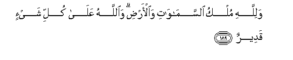

#وَلِلَّهِ مُلْكُ السَّمَاوَاتِ وَالْأَرْضِ ۗ وَاللَّهُ عَلَىٰ كُلِّ شَيْءٍ قَدِيرٌ 

##Walillahi mulku alssamawati waal-ardi waAllahu AAala kulli shay-in qadeerun 

## 翻译(Translation)：

| Translator | 译文(Translation)                                            |
| :--------: | ------------------------------------------------------------ |
|    马坚    | 天地的国权归真主所有。真主对于万事是全能的。                 |
|  YUSUFALI  | To Allah belongeth the dominion of the heavens and the earth; and Allah hath power over all things. |
| PICKTHALL  | Unto Allah belongeth the Sovereignty of the heavens and the earth. Allah is Able to do all things. |
|   SHAKIR   | And Allah's is the kingdom of the heavens and the earth, and Allah has power over all things. |

---

## 对位释义(Words Interpretation)：

| No   | العربية | 中文    | English | 曾用词 |
| ---- | ------: | ------- | ------- | ------ |
| 序号 |    阿文 | Chinese | 英文    | Used   |
| 3:189.1 | وَلِلَّهِ     | 和归真主     | and to Allah   | 见2:115.1 |
| 3:189.2 | مُلْكُ      | 国权         | the kingdom    | 见2:102.6 |
| 3:189.3 | السَّمَاوَاتِ | 和诸天的     | of the heavens | 见2:33.16 |
| 3:189.4 | وَالْأَرْضِ   | 和土地       | and earth      | 见2:33.17 |
| 3:189.5 | وَاللَّهُ    | 和安拉，真主 | and Allah      | 见2:19.17 |
| 3:189.6 | عَلَىٰ      | 至           | On             | 见2:5.2   |
| 3:189.7 | كُلِّ       | 所有         | All            | 见2:20.23 |
| 3:189.8 | شَيْءٍ      | 事物         | Thing          | 见2:20.24 |
| 3:189.9 | قَدِيرٌ     | 全能，大能的 | Mighty         | 见2:20.25 |

---
