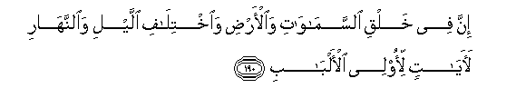

#إِنَّ فِي خَلْقِ السَّمَاوَاتِ وَالْأَرْضِ وَاخْتِلَافِ اللَّيْلِ وَالنَّهَارِ لَآيَاتٍ لِأُولِي الْأَلْبَابِ 

##Inna fee khalqi alssamawati waal-ardi waikhtilafi allayli waalnnahari laayatin li-olee al-albabi 

## 翻译(Translation)：

| Translator | 译文(Translation)                                            |
| :--------: | ------------------------------------------------------------ |
|    马坚    | 天地的创造，昼夜的轮流，在有理智的人看来，此中确有许多迹象。 |
|  YUSUFALI  | Behold! in the creation of the heavens and the earth, and the alternation of night and day,- there are indeed Signs for men of understanding,- |
| PICKTHALL  | Lo! In the creation of the heavens and the earth and (in) the difference of night and day are tokens (of His Sovereignty) for men of understanding, |
|   SHAKIR   | Most surely in the creation of the heavens and the earth and the alternation of the night and the day there are signs for men who understand. |

---

## 对位释义(Words Interpretation)：

| No   | العربية | 中文    | English | 曾用词 |
| ---- | ------: | ------- | ------- | ------ |
| 序号 |    阿文 | Chinese | 英文    | Used   |
| 3:190.1  | إِنَّ       | 的确     | surely                 | 见2:6.1    |
| 3:190.2  | فِي       | 在       | in                     | 见2:10.1   |
| 3:190.3  | خَلْقِ      | 创造     | the creation           | 见2:164.3  |
| 3:190.4  | السَّمَاوَاتِ | 和诸天的 | of the heavens         | 见2:33.16  |
| 3:190.5  | وَالْأَرْضِ   | 和土地   | and earth              | 见2:33.17  |
| 3:190.6  | وَاخْتِلَافِ  | 和轮流的 | and the alternation of | 见2:164.6  |
| 3:190.7  | اللَّيْلِ    | 夜       | the night              | 见2:164.7  |
| 3:190.8  | وَالنَّهَارِ  | 和白天   | and the day            | 见2:164.8  |
| 3:190.9  | لَآيَاتٍ    | 必定迹象 | are signs              | 见2:164.41 |
| 3:190.10 | لِأُولِي    | 对那些人 | for those who          | 见3:13.28  |
| 3:190.11 | الْأَلْبَابِ  | 理智的   | of understanding       | 见2:179.7  |

---
