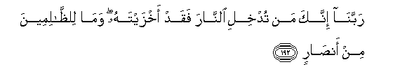

#رَبَّنَا إِنَّكَ مَنْ تُدْخِلِ النَّارَ فَقَدْ أَخْزَيْتَهُ ۖ وَمَا لِلظَّالِمِينَ مِنْ أَنْصَارٍ 

##Rabbana innaka man tudkhili alnnara faqad akhzaytahu wama lilththalimeena min ansarin 

## 翻译(Translation)：

| Translator | 译文(Translation)                                            |
| :--------: | ------------------------------------------------------------ |
|    马坚    | 我们的主啊！你使谁入火狱，你确已凌辱谁了。不义的人，绝没有援助者。 |
|  YUSUFALI  | "Our Lord! any whom Thou dost admit to the Fire, Truly Thou coverest with shame, and never will wrong-doers Find any helpers! |
| PICKTHALL  | Our Lord! Whom Thou causest to enter the Fire: him indeed Thou hast confounded. For evil-doers there will be no helpers. |
|   SHAKIR   | Our Lord! surely whomsoever Thou makest enter the fire, him Thou hast indeed brought to disgrace, and there shall be no helpers for the unjust: |

---

## 对位释义(Words Interpretation)：

| No   | العربية | 中文    | English | 曾用词 |
| ---- | ------: | ------- | ------- | ------ |
| 序号 |    阿文 | Chinese | 英文    | Used   |
| 3:192.1  | رَبَّنَا     | 我们的主     | Our Lord                    | 见2:127.8  |
| 3:192.2  | إِنَّكَ      | 确实您       | surely you                  | 见2:32.9   |
| 3:192.3  | مَنْ       | 谁           | who                         | 见2:97.2   |
| 3:192.4  | تُدْخِلِ     | 你使进入     | you make enter              |            |
| 3:192.5  | النَّارَ    | 火狱         | the Fire                    | 见2:24.7   |
| 3:192.6  | فَقَدْ      | 然后当然     | then may                    | 见2:108.15 |
| 3:192.7  | أَخْزَيْتَهُ   | 你凌辱他     | you brought him to disgrace |            |
| 3:192.8  | وَمَا      | 和不         | And not                     | 见2:9.9    |
| 3:192.9  | لِلظَّالِمِينَ | 为不义的人们 | to the wrong-doers          | 见2:270.13 |
| 3:192.10 | مِنْ       | 从           | from                        | 见2:4.8    |
| 3:192.11 | أَنْصَارٍ    | 援助者       | helpers                     | 见2:270.15 |

---
