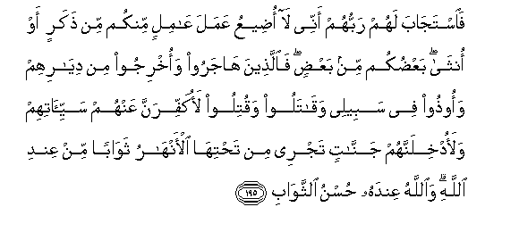

#فَاسْتَجَابَ لَهُمْ رَبُّهُمْ أَنِّي لَا أُضِيعُ عَمَلَ عَامِلٍ مِنْكُمْ مِنْ ذَكَرٍ أَوْ أُنْثَىٰ ۖ بَعْضُكُمْ مِنْ بَعْضٍ ۖ فَالَّذِينَ هَاجَرُوا وَأُخْرِجُوا مِنْ دِيَارِهِمْ وَأُوذُوا فِي سَبِيلِي وَقَاتَلُوا وَقُتِلُوا لَأُكَفِّرَنَّ عَنْهُمْ سَيِّئَاتِهِمْ وَلَأُدْخِلَنَّهُمْ جَنَّاتٍ تَجْرِي مِنْ تَحْتِهَا الْأَنْهَارُ ثَوَابًا مِنْ عِنْدِ اللَّهِ ۗ وَاللَّهُ عِنْدَهُ حُسْنُ الثَّوَابِ 

##Faistajaba lahum rabbuhum annee la odeeAAu AAamala AAamilin minkum min thakarin aw ontha baAAdukum min baAAdin faallatheena hajaroo waokhrijoo min diyarihim waoothoo fee sabeelee waqataloo waqutiloo laokaffiranna AAanhum sayyi-atihim walaodkhilannahum jannatin tajree min tahtiha al-anharu thawaban min AAindi Allahi waAllahu AAindahu husnu alththawabi 

## 翻译(Translation)：

| Translator | 译文(Translation)                                            |
| :--------: | ------------------------------------------------------------ |
|    马坚    | 他们的主应答了他们：我绝不使你们中任何一个行善者徒劳无酬，无论他是男的，还是女的--男女是相生的--迁居异乡者、被人驱逐者、为主道而受害者、参加战斗者、被敌杀伤者，我必消除他们的过失，我必使他们进那下临诸河的乐园。这是从真主发出的报酬。真主那里，有优美的报酬。 |
|  YUSUFALI  | And their Lord hath accepted of them, and answered them: "Never will I suffer to be lost the work of any of you, be he male or female: Ye are members, one of another: Those who have left their homes, or been driven out therefrom, or suffered harm in My Cause, or fought or been slain,- verily, I will blot out from them their iniquities, and admit them into Gardens with rivers flowing beneath;- A reward from the presence of Allah, and from His presence is the best of rewards." |
| PICKTHALL  | And their Lord hath heard them (and He saith): Lo! I suffer not the work of any worker, male or female, to be lost. Ye proceed one from another. So those who fled and were driven forth from their homes and suffered damage for My cause, and fought and were slain, verily I shall remit their evil deeds from them and verily I shall bring them into Gardens underneath which rivers flow - A reward from Allah. And with Allah is the fairest of rewards. |
|   SHAKIR   | So their Lord accepted their prayer: That I will not waste the work of a worker among you, whether male or female, the one of you being from the other; they, therefore, who fled and were turned out of their homes and persecuted in My way and who fought and were slain, I will most certainly cover their evil deeds, and I will most certainly make them enter gardens beneath which rivers flow; a reward from Allah, and with Allah is yet better reward. |

---

## 对位释义(Words Interpretation)：

| No   | العربية | 中文    | English | 曾用词 |
| ---- | ------: | ------- | ------- | ------ |
| 序号 |    阿文 | Chinese | 英文    | Used   |
| 3:195.1  | فَاسْتَجَابَ   | 然后他回答         | so he accepted                     |            |
| 3:195.2  | لَهُمْ       | 对他们             | for them                           | 见2:11.3   |
| 3:195.3  | رَبُّهُمْ      | 他们的主           | their Lord                         |            |
| 3:195.4  | أَنِّي       | 确实我             | surely I                           | 见3:49.5   |
| 3:195.5  | لَا        | 不，不是，没有     | no                                 | 见2:2.3    |
| 3:195.6  | أُضِيعُ      | 我忽视             | I waste                            |            |
| 3:195.7  | عَمَلَ       | 工作               | the work                           |            |
| 3:195.8  | عَامِلٍ      | 一个工作者的       | of a worker                        |            |
| 3:195.9  | مِنْكُمْ      | 从你们             | Of you                             | 见2:65.5   |
| 3:195.10 | مِنْ        | 从                 | from                               | 见2:4.8    |
| 3:195.11 | ذَكَرٍ       | 男性               | male                               |            |
| 3:195.12 | أَوْ        | 或                 | or                                 | 见2:19.1   |
| 3:195.13 | أُنْثَىٰ      | 一个女的           | a female                           | 见3:36.7   |
| 3:195.14 | بَعْضُكُمْ     | 你们有些人         | some of you                        | 见2:36.10  |
| 3:195.15 | مِنْ        | 从                 | from                               | 见2:4.8    |
| 3:195.16 | بَعْضٍ       | 一部分             | Some                               | 见2:76.11  |
| 3:195.17 | فَالَّذِينَ    | 因此那些人         | so those who                       | 参2:6.2    |
| 3:195.18 | هَاجَرُوا    | 他们迁居           | they emigrate                      | 见2:218.5  |
| 3:195.19 | وَأُخْرِجُوا   | 和他们被驱逐       | and they were driven forth         | 参2:243.5  |
| 3:195.20 | مِنْ        | 从                 | from                               | 见2:4.8    |
| 3:195.21 | دِيَارِهِمْ    | 他们的家           | their homes                        | 见2:85.10  |
| 3:195.22 | وَأُوذُوا    | 和他们受害         | and persecuted                     |            |
| 3:195.23 | فِي        | 在                 | in                                 | 见2:10.1   |
| 3:195.24 | سَبِيلِي     | 我的道路           | My way                             |            |
| 3:195.25 | وَقَاتَلُوا   | 和他们战斗         | and they fought                    |            |
| 3:195.26 | وَقُتِلُوا    | 和他们被杀         | and been killed                    | 参3:156.24 |
| 3:195.27 | لَأُكَفِّرَنَّ    | 必定我消除         | verily I shall remit               |            |
| 3:195.28 | عَنْهُمْ      | 在他们             | on them                            | 见3:10.6   |
| 3:195.29 | سَيِّئَاتِهِمْ   | 他们的罪行         | their evil deeds                   |            |
| 3:195.30 | وَلَأُدْخِلَنَّهُمْ | 和必定我使他们进入 | and verily I shall bring them into |            |
| 3:195.31 | جَنَّاتٍ      | 天园               | Paradises                          | 见2:25.8   |
| 3:195.32 | تَجْرِي      | 流过               | flow                               | 见2:25.9   |
| 3:195.33 | مِنْ        | 从                 | from                               | 见2:4.8    |
| 3:195.34 | تَحْتِهَا     | 下方               | Underneath                         | 见2:25.11  |
| 3:195.35 | الْأَنْهَارُ   | 河流               | Rivers                             | 见2:74.18  |
| 3:195.36 | ثَوَابًا     | 一个报酬           | a reward                           |            |
| 3:195.37 | مِنْ        | 从                 | from                               | 见2:4.8    |
| 3:195.38 | عِنْدِ       | 以                 | with                               | 见2:54.20  |
| 3:195.39 | اللَّهِ      | 真主的             | of Allah                           | 见2:23.17  |
| 3:195.40 | وَاللَّهُ     | 和安拉，真主       | and Allah                          | 见2:19.17  |
| 3:195.41 | حُسْنُ       | 优美               | the good                           | 见3:14.23  |
| 3:195.42 | الثَّوَابِ    | 众报酬的           | of rewards                         |            |

---
