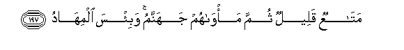

#مَتَاعٌ قَلِيلٌ ثُمَّ مَأْوَاهُمْ جَهَنَّمُ ۚ وَبِئْسَ الْمِهَادُ 

##MataAAun qaleelun thumma ma/wahum jahannamu wabi/sa almihadu 

## 翻译(Translation)：

| Translator | 译文(Translation)                                            |
| :--------: | ------------------------------------------------------------ |
|    马坚    | 那是些微的享受，将来他们的归宿是火狱。那卧褥真恶劣！         |
|  YUSUFALI  | Little is it for enjoyment: Their ultimate abode is Hell: what an evil bed (To lie on)! |
| PICKTHALL  | It is but a brief comfort. And afterward their habitation will be hell, an ill abode. |
|   SHAKIR   | A brief enjoyment! then their abode is hell, and evil is the resting-place. |

---

## 对位释义(Words Interpretation)：

| No   | العربية | 中文    | English | 曾用词 |
| ---- | ------: | ------- | ------- | ------ |
| 序号 |    阿文 | Chinese | 英文    | Used   |
| 3:197.1 | مَتَاعٌ   | 供给       | provision     | 见2:241.2  |
| 3:197.2 | قَلِيلٌ   | 些微的     | a brief       |            |
| 3:197.3 | ثُمَّ     | 然后       | Then          | 见2:28.7   |
| 3:197.4 | مَأْوَاهُمْ | 他们的归宿 | their abode   | 参3:162.10 |
| 3:197.5 | جَهَنَّمُ   | 火狱       | hell          | 见2:206.10 |
| 3:197.6 | وَبِئْسَ   | 和恶劣     | and evil      | 见2:126.29 |
| 3:197.7 | الْمِهَادُ | 卧褥       | resting place | 见2:206.12 |

---
