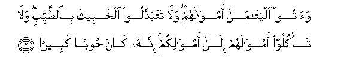

#وَآتُوا الْيَتَامَىٰ أَمْوَالَهُمْ ۖ وَلَا تَتَبَدَّلُوا الْخَبِيثَ بِالطَّيِّبِ ۖ وَلَا تَأْكُلُوا أَمْوَالَهُمْ إِلَىٰ أَمْوَالِكُمْ ۚ إِنَّهُ كَانَ حُوبًا كَبِيرًا 

##Waatoo alyatama amwalahum wala tatabaddaloo alkhabeetha bialttayyibi wala takuloo amwalahum ila amwalikum innahu kana hooban kabeeran 

## 翻译(Translation)：

| Translator | 译文(Translation)                                            |
| :--------: | ------------------------------------------------------------ |
|    马坚    | 你们应当把孤儿的财产交还他们，不要以（你们的）恶劣的（财产），换取（他们的）佳美的（财产），也不要把他们的财产并入你们的财产，而加以吞蚀。这确是大罪。 |
|  YUSUFALI  | To orphans restore their property (when they reach their age), nor substitute (your) worthless things for (their) good ones; and devour not their substance (by mixing it up) with your own. For this is indeed a great sin. |
| PICKTHALL  | Give unto orphans their wealth. Exchange not the good for the bad (in your management thereof) nor absorb their wealth into your own wealth. Lo! that would be a great sin. |
|   SHAKIR   | And give to the orphans their property, and do not substitute worthless (things) for (their) good (ones), and do not devour their property (as an addition) to your own property; this is surely a great crime. |

---

## 对位释义(Words Interpretation)：

| No   | العربية | 中文    | English | 曾用词 |
| ---- | ------: | ------- | ------- | ------ |
| 序号 |    阿文 | Chinese | 英文    | Used   |
| 4:2.1  | وَآتُوا   | 和你们应给 | and pay        | 见2:43.3   |
| 4:2.2  | الْيَتَامَىٰ | 孤儿       | the orphans    | 见2:220.6  |
| 4:2.3  | أَمْوَالَهُمْ | 他们的财产 | their property | 见2:261.4  |
| 4:2.4  | وَلَا     | 也不       | and not        | 见1:7.8    |
| 4:2.5  | تَتَبَدَّلُوا | 你们交换   | substitute     |            |
| 4:2.6  | الْخَبِيثَ  | 坏的事物   | the bad        | 见2:267.17 |
| 4:2.7  | بِالطَّيِّبِ  | 在好的事物 | for the good   | 参3:179.14 |
| 4:2.8  | وَلَا     | 也不       | and not        | 见1:7.8    |
| 4:2.9  | تَأْكُلُوا  | 你们吃    | eat up         | 见2:188.2  |
| 4:2.10 | أَمْوَالَهُمْ | 他们的财产 | their property | 见2:261.4  |
| 4:2.11 | إِلَىٰ     | 至         | to             | 见2:14.9   |
| 4:2.12 | أَمْوَالِكُمْ | 你们的财产 | your principal | 见2:279.13 |
| 4:2.13 | إِنَّهُ     | 确实他     | he is          | 见2:37.8   |
| 4:2.14 | كَانَ     | 他是       | It was         | 见2:75.6   |
| 4:2.15 | حُوبًا    | 一个罪     | a crime        |            |
| 4:2.16 | كَبِيرًا   | 大的       | large          | 见2:282.85 |

---
