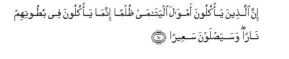

#إِنَّ الَّذِينَ يَأْكُلُونَ أَمْوَالَ الْيَتَامَىٰ ظُلْمًا إِنَّمَا يَأْكُلُونَ فِي بُطُونِهِمْ نَارًا ۖ وَسَيَصْلَوْنَ سَعِيرًا 

##Inna allatheena yakuloona amwala alyatama thulman innama yakuloona fee butoonihim naran wasayaslawna saAAeeran 

## 翻译(Translation)：

| Translator | 译文(Translation)                                            |
| :--------: | ------------------------------------------------------------ |
|    马坚    | 侵吞孤儿的财产的人，只是把火吞在自己的肚腹里，他们将入烈火之中。 |
|  YUSUFALI  | Those who unjustly eat up the property of orphans, eat up a Fire into their own bodies: They will soon be enduring a Blazing Fire! |
| PICKTHALL  | Lo! Those who devour the wealth of orphans wrongfully, they do but swallow fire into their bellies, and they will be exposed to burning flame. |
|   SHAKIR   | (As for) those who swallow the property of the orphans unjustly, surely they only swallow fire into their bellies and they shall enter burning fire. |

---

## 对位释义(Words Interpretation)：

| No   | العربية | 中文    | English | 曾用词 |
| ---- | ------: | ------- | ------- | ------ |
| 序号 |    阿文 | Chinese | 英文    | Used   |
| 4:10.1  | إِنَّ      | 的确       | surely               | 见2:6.1    |
| 4:10.2  | الَّذِينَ   | 谁，那些   | those who            | 见2:6.2    |
| 4:10.3  | يَأْكُلُونَ  | 他们吃     | they eat             | 见2:174.15 |
| 4:10.4  | أَمْوَالَ   | 财产       | the property         |            |
| 4:10.5  | الْيَتَامَىٰ | 孤儿       | the orphans          | 见2:220.6  |
| 4:10.6  | ظُلْمًا    | 不公正     | injustice            | 见3:108.10 |
| 4:10.7  | إِنَّمَا    | 仅仅       | only                 | 见2:11.9   |
| 4:10.8  | يَأْكُلُونَ  | 他们吃     | they eat             | 见2:174.15 |
| 4:10.9  | فِي      | 在         | in                   | 见2:10.1   |
| 4:10.10 | بُطُونِهِمْ  | 他们的肚子 | their bellies        | 见2:174.17 |
| 4:10.11 | نَارًا    | 火         | fire                 | 见2:17.5   |
| 4:10.12 | وَسَيَصْلَوْنَ | 和他们将入 | and they shall enter |            |
| 4:10.13 | سَعِيرًا   | 烈火       | a Blazing Fire       |            |

---
