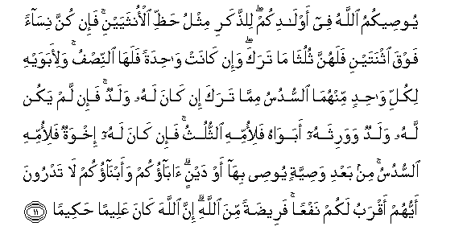

#يُوصِيكُمُ اللَّهُ فِي أَوْلَادِكُمْ ۖ لِلذَّكَرِ مِثْلُ حَظِّ الْأُنْثَيَيْنِ ۚ فَإِنْ كُنَّ نِسَاءً فَوْقَ اثْنَتَيْنِ فَلَهُنَّ ثُلُثَا مَا تَرَكَ ۖ وَإِنْ كَانَتْ وَاحِدَةً فَلَهَا النِّصْفُ ۚ وَلِأَبَوَيْهِ لِكُلِّ وَاحِدٍ مِنْهُمَا السُّدُسُ مِمَّا تَرَكَ إِنْ كَانَ لَهُ وَلَدٌ ۚ فَإِنْ لَمْ يَكُنْ لَهُ وَلَدٌ وَوَرِثَهُ أَبَوَاهُ فَلِأُمِّهِ الثُّلُثُ ۚ فَإِنْ كَانَ لَهُ إِخْوَةٌ فَلِأُمِّهِ السُّدُسُ ۚ مِنْ بَعْدِ وَصِيَّةٍ يُوصِي بِهَا أَوْ دَيْنٍ ۗ آبَاؤُكُمْ وَأَبْنَاؤُكُمْ لَا تَدْرُونَ أَيُّهُمْ أَقْرَبُ لَكُمْ نَفْعًا ۚ فَرِيضَةً مِنَ اللَّهِ ۗ إِنَّ اللَّهَ كَانَ عَلِيمًا حَكِيمًا 

##Yooseekumu Allahu fee awladikum lilththakari mithlu haththi alonthayayni fain kunna nisaan fawqa ithnatayni falahunna thulutha ma taraka wain kanat wahidatan falaha alnnisfu waliabawayhi likulli wahidin minhuma alssudusu mimma taraka in kana lahu waladun fain lam yakun lahu waladun wawarithahu abawahu faliommihi alththuluthu fain kana lahu ikhwatun faliommihi alssudusu min baAAdi wasiyyatin yoosee biha aw daynin abaokum waabnaokum la tadroona ayyuhum aqrabu lakum nafAAan fareedatan mina Allahi inna Allaha kana AAaleeman hakeeman 

## 翻译(Translation)：

| Translator | 译文(Translation)                                            |
| :--------: | ------------------------------------------------------------ |
|    马坚    | 真主为你们的子女而命令你们。一个男子，得两个女子的分子。如果亡人有两个以上的女子，那末，她们共得遗产的三分之二；如果只有一个女子，那末，她得二分之一。如果亡人有子女，那末，亡人的父母各得遗产的六分之一。如果他没有子女，那末，只有父母承受遗产，那末，他的母亲得三分之一。如果他有几个兄弟姐妹，那末，他母亲得六分之一。（这种分配），须在亡人所嘱的遗赠或清偿亡人所欠的债务之后。——你们的父母和子女，谁对于你们是更有裨益的，你们不知道——这是从真主降示的定制。真主确是全知的，确是至睿的。 |
|  YUSUFALI  | Allah (thus) directs you as regards your children's (inheritance): to the male, a portion equal to that of two females: if only daughters, two or more, their share is two-thirds of the inheritance; if only one, her share is a half. For parents, a sixth share of the inheritance to each, if the deceased left children; if no children, and the parents are the (only) heirs, the mother has a third; if the deceased left brothers (or sisters) the mother has a sixth. (The distribution in all cases is) after the payment of legacies and debts. Ye know not whether your parents or your children are nearest to you in benefit. These are settled portions ordained by Allah: and Allah is All-Knowing, All-wise. |
| PICKTHALL  | Allah chargeth you concerning (the provision for) your children: to the male the equivalent of the portion of two females, and if there be women more than two, then theirs is two-thirds of the inheritance, and if there be one (only) then the half. And to each of his parents a sixth of the inheritance, if he have a son; and if he have no son and his parents are his heirs, then to his mother appertaineth the third; and if he have brethren, then to his mother appertaineth the sixth, after any legacy he may have bequeathed, or debt (hath been paid). Your parents and your children: Ye know not which of them is nearer unto you in usefulness. It is an injunction from Allah. Lo! Allah is Knower, Wise. |
|   SHAKIR   | Allah enjoins you concerning your children: The male shall have the equal of the portion of two females; then if they are more than two females, they shall have two-thirds of what the deceased has left, and if there is one, she shall have the half; and as for his parents, each of them shall have the sixth of what he has left if he has a child, but if he has no child and (only) his two parents inherit him, then his mother shall have the third; but if he has brothers, then his mother shall have the sixth after (the payment of) a bequest he may have bequeathed or a debt; your parents and your children, you know not which of them is the nearer to you in usefulness; this is an ordinance from Allah: Surely Allah is Knowing, Wise. |

---

## 对位释义(Words Interpretation)：

| No   | العربية | 中文    | English | 曾用词 |
| ---- | ------: | ------- | ------- | ------ |
| 序号 |    阿文 | Chinese | 英文    | Used   |
| 4:11.1  | يُوصِيكُمُ   | 他命令你们     | He enjoins you         |            |
| 4:11.2  | اللَّهُ     | 安拉，真主     | Allah                  | 见2:7.2 |
| 4:11.3  | فِي       | 在             | in                     | 见2:10.1   |
| 4:11.4  | أَوْلَادِكُمْ  | 你们的子女     | your children          |            |
| 4:11.5  | لِلذَّكَرِ    | 为男子         | to the male            |            |
| 4:11.6  | مِثْلُ      | 相似的         | similar                | 见2:228.31 |
| 4:11.7  | حَظِّ       | 份额           | a portion              |            |
| 4:11.8  | الْأُنْثَيَيْنِ | 两个女子的     | of two females         |            |
| 4:11.9  | فَإِنْ      | 因此如果       | then if                | 见2:24.1   |
| 4:11.10 | كُنَّ       | 她们是         | they are               | 见2:228.17 |
| 4:11.11 | نِسَاءً     | 众女子         | women                  |            |
| 4:11.12 | فَوْقَ      | 之上           | above                  | 见3:55.17  |
| 4:11.13 | اثْنَتَيْنِ   | 两个姐妹       | two sisters            |            |
| 4:11.14 | فَلَهُنَّ     | 然后为她们     | then for them          |            |
| 4:11.15 | ثُلُثَا     | 三分之二       | two-thirds             |            |
| 4:11.16 | مَا       | 什么           | what/ that which       | 见2:17.8   |
| 4:11.17 | تَرَكَ      | 他留下         | he leave               | 见2:180.8  |
| 4:11.18 | وَإِنْ      | 和如果         | and if                 | 见2:137.9  |
| 4:11.19 | كَانَتْ     | 她是           | she was                | 见2:94.3   |
| 4:11.20 | وَاحِدَةً    | 一个的         | one                    | 见2:213.4  |
| 4:11.21 | فَلَهَا     | 然后为她       | then for she           |            |
| 4:11.22 | النِّصْفُ    | 一半           | a half                 |            |
| 4:11.23 | وَلِأَبَوَيْهِ  | 和为他的父母   | and as for his parents |            |
| 4:11.24 | لِكُلِّ      | 为每一个       | to each                |            |
| 4:11.25 | وَاحِدٍ     | 单一的         | one                    | 见2:61.9   |
| 4:11.26 | مِنْهُمَا    | 从他俩         | from these two         | 见2:102.36 |
| 4:11.27 | السُّدُسُ    | 六分之一       | a sixth                |            |
| 4:11.28 | مِمَّا      | 关于什么       | to what                | 见2:23.5   |
| 4:11.29 | تَرَكَ      | 他留下         | he leave               | 见2:180.8  |
| 4:11.30 | إِنْ       | 如果           | if                     | 见2:23.18  |
| 4:11.31 | كَانَ      | 他是           | It was                 | 见2:75.6   |
| 4:11.32 | لَهُ       | 对他           | for he                 | 见2:102.62 |
| 4:11.33 | وَلَدٌ      | 子女           | a son                  | 见3:47.6   |
| 4:11.34 | فَإِنْ      | 因此如果       | then if                | 见2:24.1   |
| 4:11.35 | لَمْ       | 不，没有       | did not                | 见2:6.8    |
| 4:11.36 | يَكُنْ      | 他是           | it is                  | 见2:196.62 |
| 4:11.37 | لَهُ       | 对他           | for he                 | 见2:102.62 |
| 4:11.38 | وَلَدٌ      | 子女           | a son                  | 见3:47.6   |
| 4:11.39 | وَوَرِثَهُ    | 和他继承他     | and he inherit him     |            |
| 4:11.40 | أَبَوَاهُ    | 他的父母亲     | his parents            |            |
| 4:11.41 | فَلِأُمِّهِ    | 然后为他的母亲 | then to his mother     |            |
| 4:11.42 | الثُّلُثُ    | 三分之一       | a third                |            |
| 4:11.43 | فَإِنْ      | 因此如果       | then if                | 见2:24.1   |
| 4:11.44 | كَانَ      | 他是           | It was                 | 见2:75.6   |
| 4:11.45 | لَهُ       | 对他           | for he                 | 见2:102.62 |
| 4:11.46 | إِخْوَةٌ     | 众兄弟         | brothers               |            |
| 4:11.47 | فَلِأُمِّهِ    | 然后为他的母亲 | then to his mother     | 见4:11.41  |
| 4:11.48 | السُّدُسُ    | 六分之一       | a sixth                | 见4:11.27  |
| 4:11.49 | مِنْ       | 从             | from                   | 见2:4.8    |
| 4:11.50 | بَعْدِ      | 之后           | after                  | 见2:27.6   |
| 4:11.51 | وَصِيَّةٍ     | 遗嘱           | a bequest              |            |
| 4:11.52 | يُوصِي     | 他遗嘱         | he have bequeathed     |            |
| 4:11.53 | بِهَا      | 在他们         | in them                | 见2:99.8   |
| 4:11.54 | أَوْ       | 或             | or                     | 见2:19.1   |
| 4:11.55 | دَيْنٍ      | 债务           | a debt                 |            |
| 4:11.56 | آبَاؤُكُمْ   | 你的父母亲     | your parents           |            |
| 4:11.57 | وَأَبْنَاؤُكُمْ | 和你们的众子女 | and your children      |            |
| 4:11.58 | لَا       | 不，不是，没有 | no                     | 见2:2.3    |
| 4:11.59 | تَدْرُونَ    | 你们知道       | you know               |            |
| 4:11.60 | أَيُّهُمْ     | 他们的哪个     | which of them          | 见3:44.13  |
| 4:11.61 | أَقْرَبُ     | 更接近         | nearer                 | 见2:237.25 |
| 4:11.62 | لَكُمْ      | 为你们         | For you                | 见2:22.3   |
| 4:11.63 | نَفْعًا     | 裨益           | in usefulness          |            |
| 4:11.64 | فَرِيضَةً    | 定制           | an ordinance           | 见2:236.13 |
| 4:11.65 | مِنَ       | 从             | from                   | 见2:4.8    |
| 4:11.66 | اللَّهِ     | 真主的         | of Allah               | 见2:23.17  |
| 4:11.67 | إِنَّ       | 的确           | surely                 | 见2:6.1    |
| 4:11.68 | اللَّهَ     | 安拉，真主     | Allah                  | 见2:9.2 |
| 4:11.69 | كَانَ      | 他是           | It was                 | 见2:75.6   |
| 4:11.70 | عَلِيمًا    | 全知的         | All-Knowing            |            |
| 4:11.71 | حَكِيمًا    | 至睿的         | All-wise               |            |

---
