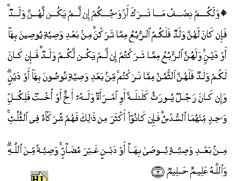

#۞ وَلَكُمْ نِصْفُ مَا تَرَكَ أَزْوَاجُكُمْ إِنْ لَمْ يَكُنْ لَهُنَّ وَلَدٌ ۚ فَإِنْ كَانَ لَهُنَّ وَلَدٌ فَلَكُمُ الرُّبُعُ مِمَّا تَرَكْنَ ۚ مِنْ بَعْدِ وَصِيَّةٍ يُوصِينَ بِهَا أَوْ دَيْنٍ ۚ وَلَهُنَّ الرُّبُعُ مِمَّا تَرَكْتُمْ إِنْ لَمْ يَكُنْ لَكُمْ وَلَدٌ ۚ فَإِنْ كَانَ لَكُمْ وَلَدٌ فَلَهُنَّ الثُّمُنُ مِمَّا تَرَكْتُمْ ۚ مِنْ بَعْدِ وَصِيَّةٍ تُوصُونَ بِهَا أَوْ دَيْنٍ ۗ وَإِنْ كَانَ رَجُلٌ يُورَثُ كَلَالَةً أَوِ امْرَأَةٌ وَلَهُ أَخٌ أَوْ أُخْتٌ فَلِكُلِّ وَاحِدٍ مِنْهُمَا السُّدُسُ ۚ فَإِنْ كَانُوا أَكْثَرَ مِنْ ذَٰلِكَ فَهُمْ شُرَكَاءُ فِي الثُّلُثِ ۚ مِنْ بَعْدِ وَصِيَّةٍ يُوصَىٰ بِهَا أَوْ دَيْنٍ غَيْرَ مُضَارٍّ ۚ وَصِيَّةً مِنَ اللَّهِ ۗ وَاللَّهُ عَلِيمٌ حَلِيمٌ 

##Walakum nisfu ma taraka azwajukum in lam yakun lahunna waladun fain kana lahunna waladun falakumu alrrubuAAu mimma tarakna min baAAdi wasiyyatin yooseena biha aw daynin walahunna alrrubuAAu mimma taraktum in lam yakun lakum waladun fain kana lakum waladun falahunna alththumunu mimma taraktum min baAAdi wasiyyatin toosoona biha aw daynin wain kana rajulun yoorathu kalalatan awi imraatun walahu akhun aw okhtun falikulli wahidin minhuma alssudusu fain kanoo akthara min thalika fahum shurakao fee alththuluthi min baAAdi wasiyyatin yoosa biha aw daynin ghayra mudarrin wasiyyatan mina Allahi waAllahu AAaleemun haleemun 

## 翻译(Translation)：

| Translator | 译文(Translation)                                            |
| :--------: | ------------------------------------------------------------ |
|    马坚    | 如果你们的妻室没有子女，那末，你们得受她们的遗产的二分之一。 如果她们有子女，那末，你们得受她们的遗产的四分之一。（这种分配）须在交付亡人所嘱的遗赠或清偿亡人所欠的债务之后。如果你们没有子女，那末，你们的妻室得你们遗产的四分之一。如果你们有子女，那末，她们得你们遗产的八分之一。（这种分配），须在交付亡人所嘱的遗赠或清偿亡人所欠的债务之后。如果被继承的男子或女子，上无父母，下无子女，只有（同母异父的）更多的兄弟和姐妹， 那末，他们和她们，均分遗产的三分之一。（这种分配）， 须在交付亡人所嘱的遗产之后。 |
|  YUSUFALI  | In what your wives leave, your share is a half, if they leave no child; but if they leave a child, ye get a fourth; after payment of legacies and debts. In what ye leave, their share is a fourth, if ye leave no child; but if ye leave a child, they get an eighth; after payment of legacies and debts. If the man or woman whose inheritance is in question, has left neither ascendants nor descendants, but has left a brother or a sister, each one of the two gets a sixth; but if more than two, they share in a third; after payment of legacies and debts; so that no loss is caused (to any one). Thus is it ordained by Allah; and Allah is All- Knowing, Most Forbearing. |
| PICKTHALL  | And unto you belongeth a half of that which your wives leave, if they have no child; but if they have a child then unto you the fourth of that which they leave, afte r any legacy they may have bequeathed, or debt (they ma y have contracted, hath been paid). And unto them belon geth the fourth of that which ye leave if ye have no ch ild, but if ye have a child then the eighth of that whi ch ye leave, after any legacy ye may have bequeathed, o r debt (ye may have contracted, hath been paid). And if a man or a woman have a distant heir (having left neit her parent nor child), and he (or she) have a brother o r a sister (only on the mother's side) then to each of them twain (the brother and the sister) the sixth, and if they be more than two, then they shall be sharers in the third, after any legacy that may have been bequeat hed or debt (contracted) not injuring (the heirs by wil ling away more than a third of the heritage) hath been. |
|   SHAKIR   | And you shall have half of what your wives leave if they have no child, but if they have a child, then you shall have a fourth of what they leave after (payment of) any bequest they may have bequeathed or a debt; and they shall have the fourth of what you leave if you have no child, but if you have a child then they shall have the eighth of what you leave after (payment of) a bequest you may have bequeathed or a debt; and if a man or a woman leaves property to be inherited by neither parents nor offspring, and he (or she) has a brother or a sister, then each of them two shall have the sixth, but if they are more than that, they shall be sharers in the third after (payment of) any bequest that may have been bequeathed or a debt that does not harm (others); this is an ordinance from Allah: and Allah is Knowing, Forbearing. |

---

## 对位释义(Words Interpretation)：

| No   | العربية | 中文    | English | 曾用词 |
| ---- | ------: | ------- | ------- | ------ |
| 序号 |    阿文 | Chinese | 英文    | Used   |
| 4:12.1  | وَلَكُمْ    | 和对你                   | and for you                   | 见2:36.13  |
| 4:12.2  | نِصْفُ     | 一半                     | half                          |            |
| 4:12.3  | مَا      | 什么                     | what/ that which              | 见2:17.8   |
| 4:12.4  | تَرَكَ     | 他留下                   | he leave                      | 见2:180.8  |
| 4:12.5  | أَزْوَاجُكُمْ | 你们的妻室               | your wives                    |            |
| 4:12.6  | إِنْ      | 如果                     | if                            | 见2:23.18  |
| 4:12.7  | لَمْ      | 不，没有                 | did not                       | 见2:6.8    |
| 4:12.8  | يَكُنْ     | 他是                     | it is                         | 见2:196.62 |
| 4:12.9  | لَهُنَّ     | 为她们                   | for them                      | 见2:187.13 |
| 4:12.10 | وَلَدٌ     | 子女                     | a son                         | 见3:47.6   |
| 4:12.11 | فَإِنْ     | 因此如果                 | then if                       | 见2:24.1   |
| 4:12.12 | كَانَ     | 他是                     | It was                        | 见2:75.6   |
| 4:12.13 | لَهُنَّ     | 为她们                   | for them                      | 见2:187.13 |
| 4:12.14 | وَلَدٌ     | 子女                     | a son                         | 见3:47.6   |
| 4:12.15 | فَلَكُمُ    | 然后为你们               | then for you                  |            |
| 4:12.16 | الرُّبُعُ   | 四分之一                 | a fourth                      |            |
| 4:12.17 | مِمَّا     | 关于什么                 | to what                       | 见2:23.5   |
| 4:12.18 | تَرَكْنَ    | 她们留下                 | they leave                    | 参2:180.8  |
| 4:12.19 | مِنْ      | 从                       | from                          | 见2:4.8    |
| 4:12.20 | بَعْدِ     | 之后                     | after                         | 见2:27.6   |
| 4:12.21 | وَصِيَّةٍ    | 遗嘱                     | a bequest                     | 见4:11.51  |
| 4:12.22 | يُوصِينَ   | 她们遗嘱                 | they have bequeathed          | 参4:11.52  |
| 4:12.23 | بِهَا     | 在他们                   | in them                       | 见2:99.8   |
| 4:12.24 | أَوْ      | 或                       | or                            | 见2:19.1   |
| 4:12.25 | دَيْنٍ     | 债务                     | a debt                        | 见4:11.55  |
| 4:12.26 | وَلَهُنَّ    | 和为她们                 | and for them                  | 见2:228.30 |
| 4:12.27 | الرُّبُعُ   | 四分之一                 | a fourth                      | 见4:12.16  |
| 4:12.28 | مِمَّا     | 关于什么                 | to what                       | 见2:23.5   |
| 4:12.29 | تَرَكْتُمْ   | 你们留下                 | you leave                     | 参2:180.8  |
| 4:12.30 | إِنْ      | 如果                     | if                            | 见2:23.18  |
| 4:12.31 | لَمْ      | 不，没有                 | did not                       | 见2:6.8    |
| 4:12.32 | يَكُنْ     | 他是                     | it is                         | 见2:196.62 |
| 4:12.33 | لَكُمْ     | 为你们                   | For you                       | 见2:22.3   |
| 4:12.34 | وَلَدٌ     | 子女                     | a son                         | 见3:47.6   |
| 4:12.35 | فَإِنْ     | 因此如果                 | then if                       | 见2:24.1   |
| 4:12.36 | كَانَ     | 他是                     | It was                        | 见2:75.6   |
| 4:12.37 | لَكُمْ     | 为你们                   | For you                       | 见2:22.3   |
| 4:12.38 | وَلَدٌ     | 子女                     | a son                         | 见3:47.6   |
| 4:12.39 | فَلَهُنَّ    | 然后为她们               | then for them                 | 见4:11.14  |
| 4:12.40 | الثُّمُنُ   | 八分之一                 | an eighth                     |            |
| 4:12.41 | مِمَّا     | 关于什么                 | to what                       | 见2:23.5   |
| 4:12.42 | تَرَكْتُمْ   | 你们留下                 | you leave                     | 见4:12.29  |
| 4:12.43 | مِنْ      | 从                       | from                          | 见2:4.8    |
| 4:12.44 | بَعْدِ     | 之后                     | after                         | 见2:27.6   |
| 4:12.45 | وَصِيَّةٍ    | 遗嘱                     | a bequest                     | 见4:11.51  |
| 4:12.46 | تُوصُونَ   | 你们遗嘱                 | you have bequeathed           | 参4:11.52  |
| 4:12.47 | بِهَا     | 在他们                   | in them                       | 见2:99.8   |
| 4:12.48 | أَوْ      | 或                       | or                            | 见2:19.1   |
| 4:12.49 | دَيْنٍ     | 债务                     | a debt                        | 见4:11.55  |
| 4:12.50 | وَإِنْ     | 和如果                   | and if                        | 见2:23.1 |
| 4:12.51 | كَانَ     | 他是                     | It was                        | 见2:75.6   |
| 4:12.52 | رَجُلٌ     | 一个男人                 | a man                         |            |
| 4:12.53 | يُورَثُ    | 被继承                   | be inherited                  |            |
| 4:12.54 | كَلَالَةً   | 无父母子女               | neither parents nor offspring |            |
| 4:12.55 | أَوِ      | 或                       | or                            | 见2:19.1   |
| 4:12.56 | امْرَأَةٌ   | 一个女人                 | a woman                       |            |
| 4:12.57 | وَلَهُ     | 和对他                   | and for he                    | 见2:266.21 |
| 4:12.58 | أَخٌ      | 一个兄弟                 | a brother                     |            |
| 4:12.59 | أَوْ      | 或                       | or                            | 见2:19.1   |
| 4:12.60 | أُخْتٌ     | 一个姊妹                 | a sister                      |            |
| 4:12.61 | فَلِكُلِّ    | 然后为每一个             | then to each                  | 参4:11.24  |
| 4:12.62 | وَاحِدٍ    | 单一的                   | one                           | 见2:61.9   |
| 4:12.63 | مِنْهُمَا   | 从他俩                   | from these two                | 见2:102.36 |
| 4:12.64 | السُّدُسُ   | 六分之一                 | a sixth                       | 见4:11.27  |
| 4:12.65 | فَإِنْ     | 因此如果                 | then if                       | 见2:24.1   |
| 4:12.66 | كَانُوا   | 他们是                   | they were                     | 见2:10:11  |
| 4:12.67 | أَكْثَرَ    | 大多数                   | most                          | 见2:243.25 |
| 4:12.68 | مِنْ      | 从                       | from                          | 见2:4.8    |
| 4:12.69 | ذَٰلِكَ     | 这个                     | this                          | 见2:2.1    |
| 4:12.70 | فَهُمْ     | 所以他们                 | so they                       | 见2:18.4   |
| 4:12.71 | شُرَكَاءُ   | 均分                     | share                         |            |
| 4:12.72 | فِي      | 在                       | in                            | 见2:10.1   |
| 4:12.73 | الثُّلُثِ   | 三分之一                 | a third                       |            |
| 4:12.74 | مِنْ      | 从                       | from                          | 见2:4.8    |
| 4:12.75 | بَعْدِ     | 之后                     | after                         | 见2:27.6   |
| 4:12.76 | وَصِيَّةٍ    | 遗嘱                     | a bequest                     | 见4:11.51  |
| 4:12.77 | يُوصَىٰ    | 它被遗嘱                 | it has been bequeathed        | 参4:11.52  |
| 4:12.78 | بِهَا     | 在他们                   | in them                       | 见2:99.8   |
| 4:12.79 | أَوْ      | 或                       | or                            | 见2:19.1   |
| 4:12.80 | دَيْنٍ     | 债务                     | a debt                        | 见4:11.55  |
| 4:12.81 | غَيْرَ     | 非，除了，除开，不是，但 | non, but                      | 见1:7.5    |
| 4:12.82 | مُضَارٍّ    | 妨害                     | harm                          |            |
| 4:12.83 | وَصِيَّةً    | 一个遗嘱                 | a bequest                     | 见2:240.6  |
| 4:12.84 | مِنَ      | 从                       | from                          | 见2:19.3 |
| 4:12.85 | اللَّهِ    | 真主的                   | of Allah                      | 见2:23.17  |
| 4:12.86 | وَاللَّهُ   | 和安拉，真主             | and Allah                     | 见2:19.17  |
| 4:12.87 | عَلِيمٌ    | 全知的                   | Knowing                       | 见2:29.19  |
| 4:12.88 | حَلِيمٌ    | 至容的                   | Forbearing                    | 见2:225.14 |

---
