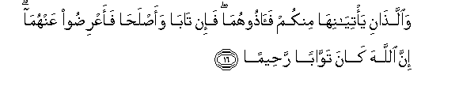

#وَاللَّذَانِ يَأْتِيَانِهَا مِنْكُمْ فَآذُوهُمَا ۖ فَإِنْ تَابَا وَأَصْلَحَا فَأَعْرِضُوا عَنْهُمَا ۗ إِنَّ اللَّهَ كَانَ تَوَّابًا رَحِيمًا 

##Waallathani yatiyaniha minkum faathoohuma fain taba waaslaha faaAAridoo AAanhuma inna Allaha kana tawwaban raheeman 

## 翻译(Translation)：

| Translator | 译文(Translation)                                            |
| :--------: | ------------------------------------------------------------ |
|    马坚    | 你们的男人，若作丑事，你们应当责备他们俩；如果他们俩悔罪自新，你们就应当原谅他们俩。真主确是至宥的，确是至慈的。 |
|  YUSUFALI  | If two men among you are guilty of lewdness, punish them both. If they repent and amend, leave them alone; for Allah is Oft-returning, Most Merciful. |
| PICKTHALL  | And as for the two of you who are guilty thereof, punish them both. And if they repent and improve, then let them be. Lo! Allah is ever relenting, Merciful. |
|   SHAKIR   | And as for the two who are guilty of indecency from among you, give them both a punishment; then if they repent and amend, turn aside from them; surely Allah is Oft-returning (to mercy), the Merciful. |

---

## 对位释义(Words Interpretation)：

| No   | العربية | 中文    | English | 曾用词 |
| ---- | ------: | ------- | ------- | ------ |
| 序号 |    阿文 | Chinese | 英文    | Used   |
| 4:16.1  | وَاللَّذَانِ  | 和这俩         | and as for the two     |          |
| 4:16.2  | يَأْتِيَانِهَا | 他俩做丑事     | who are guilty thereof |          |
| 4:16.3  | مِنْكُمْ     | 从你们         | Of you                 | 见2:65.5 |
| 4:16.4  | فَآذُوهُمَا  | 因此责备他们俩 | so punish them both    |          |
| 4:16.5  | فَإِنْ      | 因此如果       | then if                | 见2:24.1 |
| 4:16.6  | تَابَا     | 他们俩悔罪     | they repent            |          |
| 4:16.7  | وَأَصْلَحَا   | 和他们俩自新   | and amend              |          |
| 4:16.8  | فَأَعْرِضُوا  | 然后你们应原谅 | then leave             |          |
| 4:16.9  | عَنْهُمَا    | 从他俩         | on them                |          |
| 4:16.10 | إِنَّ       | 的确           | surely                 | 见2:6.1  |
| 4:16.11 | اللَّهَ     | 安拉，真主     | Allah                  | 见2:9.2 |
| 4:16.12 | كَانَ      | 他是           | It was                 | 见2:75.6 |
| 4:16.13 | تَوَّابًا    | 至宥的         | Oft-returning          |          |
| 4:16.14 | رَحِيمًا    | 至慈的         | Most Merciful          |          |

---
