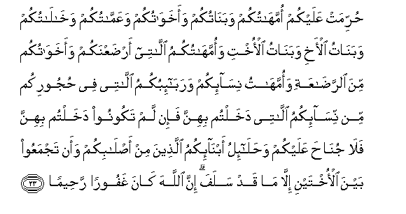

#حُرِّمَتْ عَلَيْكُمْ أُمَّهَاتُكُمْ وَبَنَاتُكُمْ وَأَخَوَاتُكُمْ وَعَمَّاتُكُمْ وَخَالَاتُكُمْ وَبَنَاتُ الْأَخِ وَبَنَاتُ الْأُخْتِ وَأُمَّهَاتُكُمُ اللَّاتِي أَرْضَعْنَكُمْ وَأَخَوَاتُكُمْ مِنَ الرَّضَاعَةِ وَأُمَّهَاتُ نِسَائِكُمْ وَرَبَائِبُكُمُ اللَّاتِي فِي حُجُورِكُمْ مِنْ نِسَائِكُمُ اللَّاتِي دَخَلْتُمْ بِهِنَّ فَإِنْ لَمْ تَكُونُوا دَخَلْتُمْ بِهِنَّ فَلَا جُنَاحَ عَلَيْكُمْ وَحَلَائِلُ أَبْنَائِكُمُ الَّذِينَ مِنْ أَصْلَابِكُمْ وَأَنْ تَجْمَعُوا بَيْنَ الْأُخْتَيْنِ إِلَّا مَا قَدْ سَلَفَ ۗ إِنَّ اللَّهَ كَانَ غَفُورًا رَحِيمًا 

##Hurrimat AAalaykum ommahatukum wabanatukum waakhawatukum waAAammatukum wakhalatukum wabanatu alakhi wabanatu alokhti waommahatukumu allatee ardaAAnakum waakhawatukum mina alrradaAAati waommahatu nisaikum warabaibukumu allatee fee hujoorikum min nisaikumu allatee dakhaltum bihinna fain lam takoonoo dakhaltum bihinna fala junaha AAalaykum wahalailu abnaikumu allatheena min aslabikum waan tajmaAAoo bayna alokhtayni illa ma qad salafa inna Allaha kana ghafooran raheeman 

## 翻译(Translation)：

| Translator | 译文(Translation)                                            |
| :--------: | ------------------------------------------------------------ |
|    马坚    | 真主严禁你们娶你们的母亲、女儿、姐妹、姑母、姨母、侄女、外甥女、乳母、同乳姐妹、岳母、以及你们所抚育的继女，即你们曾与她们的母亲同房的，如果你们与她们的母亲没有同房，那末，你们无妨娶她们。真主还严禁你们娶你们亲生儿子的媳妇，和同时娶两姐妹，但已往的不受惩罚。真主确是至赦的，确是至慈的。 |
|  YUSUFALI  | Prohibited to you (for marriage) are:- your mothers, daughters, sisters; father's sisters, mother's sisters; brother's daughters, sister's daughters; foster-mothers who gave you suck, foster-sisters; your wives' mothers; your step-daughters under your guardianship, born of your wives to whom ye have gone in,- no prohibition if ye have not gone in;- (those who have been) wives of your sons proceeding from your loins; and two sisters in wedlock at one and the same time, except for what is past; for Allah is Oft- forgiving, Most Merciful;- |
| PICKTHALL  | Forbidden unto you are your mothers, and your daughters, and your sisters, and your father's sisters, and your mother's sisters, and your brother's daughters and your sister's daughters, and your foster-mothers, and your foster-sisters, and your mothers-in-law, and your step-daughters who are under your protection (born) of your women unto whom ye have gone in - but if ye have not gone in unto them, then it is no sin for you (to marry their daughters) - and the wives of your sons who (spring) from your own loins. And (it is forbidden unto you) that ye should have two sisters together, except what hath already happened (of that nature) in the past. Lo! Allah is ever Forgiving, Merciful. |
|   SHAKIR   | Forbidden to you are your mothers and your daughters and your sisters and your paternal aunts and your maternal aunts and brothers' daughters and sisters' daughters and your mothers that have suckled you and your foster-sisters and mothers of your wives and your step-daughters who are in your guardianship, (born) of your wives to whom you have gone in, but if you have not gone in to them, there is no blame on you (in marrying them), and the wives of your sons who are of your own loins and that you should have two sisters together, except what has already passed; surely Allah is Forgiving, Merciful. |

---

## 对位释义(Words Interpretation)：

| No   | العربية | 中文    | English | 曾用词 |
| ---- | ------: | ------- | ------- | ------ |
| 序号 |    阿文 | Chinese | 英文    | Used   |
| 4:23.1  | حُرِّمَتْ     | 被禁止         | Forbidden                   |            |
| 4:23.2  | عَلَيْكُمْ    | 在你们         | on you                      | 见2:40.8   |
| 4:23.3  | أُمَّهَاتُكُمْ  | 你们的众母亲   | your mothers                |            |
| 4:23.4  | وَبَنَاتُكُمْ  | 和你们的众女儿 | and your daughters          |            |
| 4:23.5  | وَأَخَوَاتُكُمْ | 和你们的众姐妹 | and your sisters            |            |
| 4:23.6  | وَعَمَّاتُكُمْ  | 和你们的众姑母 | and your father's sisters   |            |
| 4:23.7  | وَخَالَاتُكُمْ | 和你们的众姨母 | and your mother's sisters   |            |
| 4:23.8  | وَبَنَاتُ    | 和众女儿       | and daughters               |            |
| 4:23.9  | الْأَخِ     | 兄弟的         | brother's                   |            |
| 4:23.10 | وَبَنَاتُ    | 和众女儿       | and daughters               | 见4:23.8   |
| 4:23.11 | الْأُخْتِ    | 姐妹的         | sister's                    |            |
| 4:23.12 | وَأُمَّهَاتُكُمُ | 和你们的众母亲 | and your mothers            | 参4:23.3   |
| 4:23.13 | اللَّاتِي   | 那个           | that                        |            |
| 4:23.14 | أَرْضَعْنَكُمْ  | 她哺乳你们     | have suckled you            |            |
| 4:23.15 | وَأَخَوَاتُكُمْ | 和你们的众姐妹 | and your sisters            | 见4:23.5   |
| 4:23.16 | مِنَ       | 从             | from                        | 见2:4.8    |
| 4:23.17 | الرَّضَاعَةِ  | 哺乳的         | foster                      |            |
| 4:23.18 | وَأُمَّهَاتُ   | 和众母亲       | and mothers                 |            |
| 4:23.19 | نِسَائِكُمْ   | 你们妻室的     | of your wives               | 见2:187.7  |
| 4:23.20 | وَرَبَائِبُكُمُ | 和你们的继女   | and your step-daughters     |            |
| 4:23.21 | اللَّاتِي   | 那个           | that                        | 见4:23.13  |
| 4:23.22 | فِي       | 在             | in                          | 见2:10.1   |
| 4:23.23 | حُجُورِكُمْ   | 你们的监护     | your guardianship           |            |
| 4:23.24 | مِنْ       | 从             | from                        | 见2:4.8    |
| 4:23.25 | نِسَائِكُمُ   | 你们的妻室     | your wives                  | 参2:187.7  |
| 4:23.26 | اللَّاتِي   | 那个           | that                        | 见4:23.13  |
| 4:23.27 | دَخَلْتُمْ    | 你们同房       | you have gone in            |            |
| 4:23.28 | بِهِنَّ      | 在她们         | to them                     |            |
| 4:23.29 | فَإِنْ      | 因此如果       | then if                     | 见2:24.1   |
| 4:23.30 | لَمْ       | 不，没有       | did not                     | 见2:6.8    |
| 4:23.31 | تَكُونُوا   | 你们是         | You will be                 | 见2:41.8   |
| 4:23.32 | دَخَلْتُمْ    | 你们同房       | you have gone in            | 见4:23.27  |
| 4:23.33 | بِهِنَّ      | 在她们         | to them                     | 见4:23.28  |
| 4:23.34 | فَلَا      | 因此不         | shall not                   | 见2:22.18  |
| 4:23.35 | جُنَاحَ     | 罪             | sin                         | 见2:158.13 |
| 4:23.36 | عَلَيْكُمْ    | 在你们         | on you                      | 见2:40.8   |
| 4:23.37 | وَحَلَائِلُ   | 和众妻         | and the wives               |            |
| 4:23.38 | أَبْنَائِكُمُ  | 你们众儿子的   | of your sons                |            |
| 4:23.39 | الَّذِينَ    | 谁，那些       | those who                   | 见2:6.2    |
| 4:23.40 | مِنْ       | 从             | from                        | 见2:4.8    |
| 4:23.41 | أَصْلَابِكُمْ  | 你们的亲骨肉   | your own loins              |            |
| 4:23.42 | وَأَنْ      | 和那个         | and that                    | 见2:169.5  |
| 4:23.43 | تَجْمَعُوا   | 你们同时娶     | in wedlock at the same time |            |
| 4:23.44 | بَيْنَ      | 之间           | between                     | 见2:66.4   |
| 4:23.45 | الْأُخْتَيْنِ  | 两姐妹         | two sisters                 |            |
| 4:23.46 | إِلَّا      | 除了           | Except                      | 见2:9.7    |
| 4:23.47 | مَا       | 什么           | what/ that which            | 见2:17.8   |
| 4:23.48 | قَدْ       | 当然           | may                         | 见2:60.14  |
| 4:23.49 | سَلَفَ      | 过去           | passed                      | 见2:275.34 |
| 4:23.50 | إِنَّ       | 的确           | surely                      | 见2:6.1    |
| 4:23.51 | اللَّهَ     | 安拉，真主     | Allah                       | 见2:9.2 |
| 4:23.52 | كَانَ      | 他是           | It was                      | 见2:75.6   |
| 4:23.53 | غَفُورًا    | 至赦的         | Forgiving                   |            |
| 4:23.54 | رَحِيمًا    | 至慈的         | Most Merciful               | 见4:16.14  |

---
