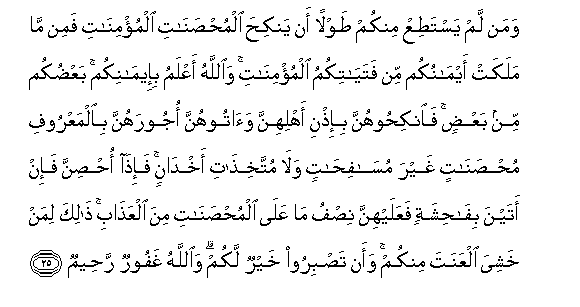

#وَمَنْ لَمْ يَسْتَطِعْ مِنْكُمْ طَوْلًا أَنْ يَنْكِحَ الْمُحْصَنَاتِ الْمُؤْمِنَاتِ فَمِنْ مَا مَلَكَتْ أَيْمَانُكُمْ مِنْ فَتَيَاتِكُمُ الْمُؤْمِنَاتِ ۚ وَاللَّهُ أَعْلَمُ بِإِيمَانِكُمْ ۚ بَعْضُكُمْ مِنْ بَعْضٍ ۚ فَانْكِحُوهُنَّ بِإِذْنِ أَهْلِهِنَّ وَآتُوهُنَّ أُجُورَهُنَّ بِالْمَعْرُوفِ مُحْصَنَاتٍ غَيْرَ مُسَافِحَاتٍ وَلَا مُتَّخِذَاتِ أَخْدَانٍ ۚ فَإِذَا أُحْصِنَّ فَإِنْ أَتَيْنَ بِفَاحِشَةٍ فَعَلَيْهِنَّ نِصْفُ مَا عَلَى الْمُحْصَنَاتِ مِنَ الْعَذَابِ ۚ ذَٰلِكَ لِمَنْ خَشِيَ الْعَنَتَ مِنْكُمْ ۚ وَأَنْ تَصْبِرُوا خَيْرٌ لَكُمْ ۗ وَاللَّهُ غَفُورٌ رَحِيمٌ 

##Waman lam yastatiAA minkum tawlan an yankiha almuhsanati almuminati famin ma malakat aymanukum min fatayatikumu almuminati waAllahu aAAlamu bieemanikum baAAdukum min baAAdin fainkihoohunna biithni ahlihinna waatoohunna ojoorahunna bialmaAAroofi muhsanatin ghayra masafihatin wala muttakhithati akhdanin faitha ohsinna fain atayna bifahishatin faAAalayhinna nisfu ma AAala almuhsanati mina alAAathabi thalika liman khashiya alAAanata minkum waan tasbiroo khayrun lakum waAllahu ghafoorun raheemun 

## 翻译(Translation)：

| Translator | 译文(Translation)                                            |
| :--------: | ------------------------------------------------------------ |
|    马坚    | 你们当中在能力方面谁不能娶信道的自由女，谁可以娶友所管辖的信道的奴婢。真主是知道你们的信仰的。你们彼此是同教的，故你们取得她们的主人的许可后，可娶她们为妻室，你们应当把她们的聘仪照例交给她们，但她们应当是贞节的，不可是淫荡的，也不可是有情人的。她们既婚之后，如果作了丑事，那末，她们应受自由女所应受的刑罚的一半。这是特许你们中恐陷于奸淫的人规定的。你们能坚忍，那对于你们是更好的。真主是至赦的，是至慈的。 |
|  YUSUFALI  | If any of you have not the means wherewith to wed free believing women, they may wed believing girls from among those whom your right hands possess: And Allah hath full knowledge about your faith. Ye are one from another: Wed them with the leave of their owners, and give them their dowers, according to what is reasonable: They should be chaste, not lustful, nor taking paramours: when they are taken in wedlock, if they fall into shame, their punishment is half that for free women. This (permission) is for those among you who fear sin; but it is better for you that ye practice self-restraint. And Allah is Oft-forgiving, Most Merciful. |
| PICKTHALL  | And whoso is not able to afford to marry free, believing women, let them marry from the believing maids whom your right hands possess. Allah knoweth best (concerning) your faith. Ye (proceed) one from another; so wed them by permission of their folk, and give unto them their portions in kindness, they being honest, not debauched nor of loose conduct. And if when they are honourably married they commit lewdness they shall incur the half of the punishment (prescribed) for free women (in that case). This is for him among you who feareth to commit sin. But to have patience would be better for you. Allah is Forgiving, Merciful. |
|   SHAKIR   | And whoever among you has not within his power ampleness of means to marry free believing women, then (he may marry) of those whom your right hands possess from among your believing maidens; and Allah knows best your faith: you are (sprung) the one from the other; so marry them with the permission of their masters, and give them their dowries justly, they being chaste, not fornicating, nor receiving paramours; and when they are taken in marriage, then if they are guilty of indecency, they shall suffer half the punishment which is (inflicted) upon free women. This is for him among you who fears falling into evil; and that you abstain is better for you, and Allah is Forgiving, Merciful. |

---

## 对位释义(Words Interpretation)：

| No   | العربية | 中文    | English | 曾用词 |
| ---- | ------: | ------- | ------- | ------ |
| 序号 |    阿文 | Chinese | 英文    | Used   |
| 4:25.1  | وَمَنْ      | 和谁                     | and who                    | 见2:108.11 |
| 4:25.2  | لَمْ       | 不，没有                 | did not                    | 见2:6.8    |
| 4:25.3  | يَسْتَطِعْ    | 他能够                   | he is able to              |            |
| 4:25.4  | مِنْكُمْ     | 从你们                   | Of you                     | 见2:65.5   |
| 4:25.5  | طَوْلًا     | 提供                     | afford                     |            |
| 4:25.6  | أَنْ       | 该                       | that                       | 见2:26.5   |
| 4:25.7  | يَنْكِحَ     | 他结婚                   | he marry                   |            |
| 4:25.8  | الْمُحْصَنَاتِ | 自由女                   | free women                 |            |
| 4:25.9  | الْمُؤْمِنَاتِ | 众女信士们的             | believing women            |            |
| 4:25.10 | فَمِنْ      | 因此从                   | then from                  |            |
| 4:25.11 | مَا       | 什么                     | what/ that which           | 见2:17.8   |
| 4:25.12 | مَلَكَتْ     | 它拥有                   | possess                    | 见4:3.23   |
| 4:25.13 | أَيْمَانُكُمْ  | 你们的右手               | your right hands           | 见4:3.24   |
| 4:25.14 | مِنْ       | 从                       | from                       | 见2:4.8    |
| 4:25.15 | فَتَيَاتِكُمُ  | 你们的婢女               | your girls                 |            |
| 4:25.16 | الْمُؤْمِنَاتِ | 众女信士们的             | believing women            | 见4:25.9   |
| 4:25.17 | وَاللَّهُ    | 和安拉，真主             | and Allah                  | 见2:19.17  |
| 4:25.18 | أَعْلَمُ     | 至知                     | know best                  | 见2:30.25  |
| 4:25.19 | بِإِيمَانِكُمْ | 在你们的信仰             | in Your faith              | 参2:93.24  |
| 4:25.20 | بَعْضُكُمْ    | 你们有些人               | some of you                | 见2:36.10  |
| 4:25.21 | مِنْ       | 从                       | from                       | 见2:4.8    |
| 4:25.22 | بَعْضٍ      | 一部分                   | Some                       | 见2:76.11  |
| 4:25.23 | فَانْكِحُوهُنَّ | 因此你们与她们结婚       | so you marry them          |            |
| 4:25.24 | بِإِذْنِ     | 在许可                   | With permission            | 见2:102.50 |
| 4:25.25 | أَهْلِهِنَّ    | 她们监护人的             | of their owners            |            |
| 4:25.26 | وَآتُوهُنَّ   | 和你们给他们             | and give them              |            |
| 4:25.27 | أُجُورَهُنَّ   | 她们的聘仪               | their dowers               | 见4:24.27  |
| 4:25.28 | بِالْمَعْرُوفِ | 依照惯例                 | according to usage         | 见2:178.23 |
| 4:25.29 | مُحْصَنَاتٍ   | 她们是贞洁的             | they being chaste          |            |
| 4:25.30 | غَيْرَ      | 非，除了，除开，不是，但 | non, but                   | 见1:7.5    |
| 4:25.31 | مُسَافِحَاتٍ  | 淫荡的                   | lustful                    |            |
| 4:25.32 | وَلَا      | 也不                     | and not                    | 见1:7.8    |
| 4:25.33 | مُتَّخِذَاتِ   | 被有                     | taking                     |            |
| 4:25.34 | أَخْدَانٍ    | 秘密情人                 | paramours                  |            |
| 4:25.35 | فَإِذَا     | 然后当                   | then when                  | 见2:196.34 |
| 4:25.36 | أُحْصِنَّ     | 她们结婚                 | they are taken in marriage |            |
| 4:25.37 | فَإِنْ      | 因此如果                 | then if                    | 见2:24.1   |
| 4:25.38 | أَتَيْنَ     | 她们做                   | they are                   |            |
| 4:25.39 | بِفَاحِشَةٍ   | 在丑事                   | in guilty lewdness         | 见4:19.21  |
| 4:25.40 | فَعَلَيْهِنَّ   | 然后在她们               | then they                  |            |
| 4:25.41 | نِصْفُ      | 一半                     | half                       | 见4:12.2   |
| 4:25.42 | مَا       | 什么                     | what/ that which           | 见2:17.8   |
| 4:25.43 | عَلَى      | 至                       | On                         | 见2:5.2    |
| 4:25.44 | الْمُحْصَنَاتِ | 自由女                   | free women                 | 见4:25.8   |
| 4:25.45 | مِنَ       | 从                       | from                       | 见2:4.8    |
| 4:25.46 | الْعَذَابِ   | 刑罚                     | Torment                    | 见2:49.8   |
| 4:25.47 | ذَٰلِكَ      | 这个                     | this                       | 见2:2.1    |
| 4:25.48 | لِمَنْ      | 对谁                     | of who                     | 见2:154.3  |
| 4:25.49 | خَشِيَ      | 他畏惧                   | fears                      |            |
| 4:25.50 | الْعَنَتَ    | 罪                       | sin                        |            |
| 4:25.51 | مِنْكُمْ     | 从你们                   | Of you                     | 见2:65.5   |
| 4:25.52 | وَأَنْ      | 和那个                   | and that                   | 见2:169.5  |
| 4:25.53 | تَصْبِرُوا   | 你们坚忍                 | you are patient            | 见3:120.11 |
| 4:25.54 | خَيْرٌ      | 较好的                   | be better                  | 见2:54.18  |
| 4:25.55 | لَكُمْ      | 为你们                   | For you                    | 见2:22.3   |
| 4:25.56 | وَاللَّهُ    | 和安拉，真主             | and Allah                  | 见2:19.17  |
| 4:25.57 | غَفُورٌ     | 至赦的                   | Forgiving                  | 见2:173.24 |
| 4:25.58 | رَحِيمٌ     | 至慈的                   | Merciful                   | 见2:143.45 |

---
