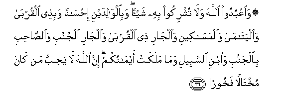

#۞ وَاعْبُدُوا اللَّهَ وَلَا تُشْرِكُوا بِهِ شَيْئًا ۖ وَبِالْوَالِدَيْنِ إِحْسَانًا وَبِذِي الْقُرْبَىٰ وَالْيَتَامَىٰ وَالْمَسَاكِينِ وَالْجَارِ ذِي الْقُرْبَىٰ وَالْجَارِ الْجُنُبِ وَالصَّاحِبِ بِالْجَنْبِ وَابْنِ السَّبِيلِ وَمَا مَلَكَتْ أَيْمَانُكُمْ ۗ إِنَّ اللَّهَ لَا يُحِبُّ مَنْ كَانَ مُخْتَالًا فَخُورًا 

##WaoAAbudoo Allaha wala tushrikoo bihi shayan wabialwalidayni ihsanan wabithee alqurba waalyatama waalmasakeeni waaljari thee alqurba waaljari aljunubi waalssahibi bialjanbi waibni alssabeeli wama malakat aymanukum inna Allaha la yuhibbu man kana mukhtalan fakhooran 

## 翻译(Translation)：

| Translator | 译文(Translation)                                            |
| :--------: | ------------------------------------------------------------ |
|    马坚    | 你们当崇拜真主，不要以任何物配他，当孝敬父母，当优待亲戚，当怜恤孤儿，当救济贫民，当亲爱近邻、远邻和伴侣，当款待旅客，当宽待奴仆。真主的确不喜爱傲慢的、矜夸的人。 |
|  YUSUFALI  | Serve Allah, and join not any partners with Him; and do good- to parents, kinsfolk, orphans, those in need, neighbors who are of kin, neighbors who are strangers, the companion by your side, the wayfarer (ye meet), and what your right hands possess: For Allah loveth not the arrogant, the vainglorious;- |
| PICKTHALL  | And serve Allah. Ascribe no thing as partner unto Him. (Show) kindness unto parents, and unto near kindred, and orphans, and the needy, and unto the neighbour who is of kin (unto you) and the neighbour who is not of kin, and the fellow-traveller and the wayfarer and (the slaves) whom your right hands possess. Lo! Allah loveth not such as are proud and boastful, |
|   SHAKIR   | And serve Allah and do not associate any thing with Him and be good to the parents and to the near of kin and the orphans and the needy and the neighbor of (your) kin and the alien neighbor, and the companion in a journey and the wayfarer and those whom your right hands possess; surely Allah does not love him who is proud, boastful; |

---

## 对位释义(Words Interpretation)：

| No   | العربية | 中文    | English | 曾用词 |
| ---- | ------: | ------- | ------- | ------ |
| 序号 |    阿文 | Chinese | 英文    | Used   |
| 4:36.1  | وَاعْبُدُوا    | 和崇拜         | and Worship       | 参2:21.4   |
| 4:36.2  | اللَّهَ       | 安拉，真主     | Allah             | 见1:1.2    |
| 4:36.3  | وَلَا        | 也不           | and not           | 见1:7.8    |
| 4:36.4  | تُشْرِكُوا     | 你们采配       | associate         |            |
| 4:36.5  | بِهِ         | 以它           | with it           | 见2:22.13  |
| 4:36.6  | شَيْئًا       | 一件事情       | a thing           | 见2:48.8   |
| 4:36.7  | وَبِالْوَالِدَيْنِ | 和至父母       | And to parents    | 见2:83.10  |
| 4:36.8  | إِحْسَانًا     | 孝敬           | kindness          | 见2:83.11  |
| 4:36.9  | وَبِذِي       | 和在有         | and to be         |            |
| 4:36.10 | الْقُرْبَىٰ     | 亲属           | kindred           | 见2:83.13  |
| 4:36.11 | وَالْيَتَامَىٰ   | 和孤儿         | And orphans       | 见2:83.14  |
| 4:36.12 | وَالْمَسَاكِينِ  | 和贫民         | And the poor      | 见2:83.15  |
| 4:36.13 | وَالْجَارِ     | 和邻居         | and the neighbor  |            |
| 4:36.14 | ذِي         | 有             | be                |            |
| 4:36.15 | الْقُرْبَىٰ     | 亲属           | kindred           | 见2:83.13  |
| 4:36.16 | وَالْجَارِ     | 和邻居         | and the neighbor  | 见4:36.13  |
| 4:36.17 | الْجُنُبِ      | 远的           | alien             |            |
| 4:36.18 | وَالصَّاحِبِ    | 和伴侣         | and the companion |            |
| 4:36.19 | بِالْجَنْبِ     | 在旁边         | by your side      |            |
| 4:36.20 | وَابْنِ       | 和儿子         | and Son           | 见2:177.27 |
| 4:36.21 | السَّبِيلِ     | 道路           | The way           | 见2:108.18 |
| 4:36.22 | وَمَا        | 和什么         | and that          | 见2:4.6    |
| 4:36.23 | مَلَكَتْ       | 它拥有         | possess           | 见4:3.23   |
| 4:36.24 | أَيْمَانُكُمْ    | 你们的右手     | your right hands  | 见4:3.24   |
| 4:36.25 | إِنَّ         | 的确           | surely            | 见2:6.1    |
| 4:36.26 | اللَّهَ       | 安拉，真主     | Allah             | 见1:1.2    |
| 4:36.27 | لَا         | 不，不是，没有 | no                | 见2:2.3    |
| 4:36.28 | يُحِبُّ        | 喜欢           | love              | 见2:190.12 |
| 4:36.29 | مَنْ         | 谁             | who               | 见2:97.2   |
| 4:36.30 | كَانَ        | 他是           | It was            | 见2:75.6   |
| 4:36.31 | مُخْتَالًا     | 傲慢的         | the arrogant      |            |
| 4:36.32 | فَخُورًا      | 矜夸的         | the vainglorious  |            |

---
