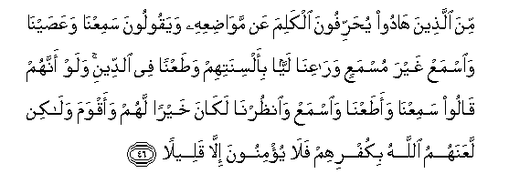

#مِنَ الَّذِينَ هَادُوا يُحَرِّفُونَ الْكَلِمَ عَنْ مَوَاضِعِهِ وَيَقُولُونَ سَمِعْنَا وَعَصَيْنَا وَاسْمَعْ غَيْرَ مُسْمَعٍ وَرَاعِنَا لَيًّا بِأَلْسِنَتِهِمْ وَطَعْنًا فِي الدِّينِ ۚ وَلَوْ أَنَّهُمْ قَالُوا سَمِعْنَا وَأَطَعْنَا وَاسْمَعْ وَانْظُرْنَا لَكَانَ خَيْرًا لَهُمْ وَأَقْوَمَ وَلَٰكِنْ لَعَنَهُمُ اللَّهُ بِكُفْرِهِمْ فَلَا يُؤْمِنُونَ إِلَّا قَلِيلً 

##Mina allatheena hadoo yuharrifoona alkalima AAan mawadiAAihi wayaqooloona samiAAna waAAasayna waismaAA ghayra musmaAAin waraAAina layyan bialsinatihim wataAAnan fee alddeeni walaw annahum qaloo samiAAna waataAAna waismaAA waonthurna lakana khayran lahum waaqwama walakin laAAanahumu Allahu bikufrihim fala yuminoona illa qaleelan 

## 翻译(Translation)：

| Translator | 译文(Translation)                                            |
| :--------: | ------------------------------------------------------------ |
|    马坚    | 犹太教徒中有一群人篡改经文，他们说：我们听而不从，愿你听而不闻，拉仪那，这是因为巧方谩骂，诽谤正教。假若他们说：我们既听且从，你听吧，温助尔那，这对他们是更好的，是更正的。但真主因他们不信道而弃绝他们，故他们除少数人外都不信道。 |
|  YUSUFALI  | Of the Jews there are those who displace words from their (right) places, and say: "We hear and we disobey"; and "Hear, may you not hear"; and "Rā’inā"; with a twist of their tongues and a slander to Faith. If only they had said: "We hear and we obey"; and "Do hear"; and "Do look at us"; it would have been better for them, and more proper; but Allah hath cursed them for their Unbelief; and but few of them will believe. |
| PICKTHALL  | Some of those who are Jews change words from their context and say: "We hear and disobey; hear thou as one who heareth not" and "Listen to us!" distorting with their tongues and slandering religion. If they had said: "We hear and we obey: hear thou, and look at us" it had been better for them, and more upright. But Allah hath cursed them for their disbelief, so they believe not, save a few. |
|   SHAKIR   | Of those who are Jews (there are those who) alter words from their places and say: We have heard and we disobey and: Hear, may you not be made to hear! and: Raina, distorting (the word) with their tongues and taunting about religion; and if they had said (instead): We have heard and we obey, and hearken, and unzurna it would have been better for them and more upright; but Allah has cursed them on account of their unbelief, so they do not believe but a little. |

---

## 对位释义(Words Interpretation)：

| No   | العربية | 中文    | English | 曾用词 |
| ---- | ------: | ------- | ------- | ------ |
| 序号 |    阿文 | Chinese | 英文    | Used   |
| 4:46.1  | مِنَ       | 从                       | from                     | 见2:4.8    |
| 4:46.2  | الَّذِينَ    | 谁，那些                 | those who                | 见2:6.2    |
| 4:46.3  | هَادُوا    | 犹太教徒                 | The Jews                 | 见2:62.5   |
| 4:46.4  | يُحَرِّفُونَ   | 他们篡改                 | they displace            |            |
| 4:46.5  | الْكَلِمَ    | 话语                     | words                    |            |
| 4:46.6  | عَنْ       | 从                       | on                       | 见2:48.6   |
| 4:46.7  | مَوَاضِعِهِ   | 他们的经文               | their context            |            |
| 4:46.8  | وَيَقُولُونَ  | 和他们说                 | and they tell            | 见3:75.31  |
| 4:46.9  | سَمِعْنَا    | 我们听了                 | we heard                 | 见2:93.13  |
| 4:46.10 | وَعَصَيْنَا   | 和我们不从               | And we disobeyed         | 见2:93.14  |
| 4:46.11 | وَاسْمَعْ    | 和愿你听                 | and you Hear             |            |
| 4:46.12 | غَيْرَ      | 非，除了，除开，不是，但 | non, but                 | 见1:7.5    |
| 4:46.13 | مُسْمَعٍ     | 听                       | hear                     |            |
| 4:46.14 | وَرَاعِنَا   | 和拉仪那                 | and Raina/Listen to us   | 参2:104.7  |
| 4:46.15 | لَيًّا      | 扭曲                     | distorting               |            |
| 4:46.16 | بِأَلْسِنَتِهِمْ | 在他们的众舌             | with their tongues       |            |
| 4:46.17 | وَطَعْنًا    | 和诽谤                   | and slandering           |            |
| 4:46.18 | فِي       | 在                       | in                       | 见2:10.1   |
| 4:46.19 | الدِّينِ    | 宗教                     | religion                 | 见2:256.4  |
| 4:46.20 | وَلَوْ      | 和如果                   | and if                   | 见2:20.14  |
| 4:46.21 | أَنَّهُمْ     | 确实他们                 | that they                | 见2:46.3   |
| 4:46.22 | قَالُوا    | 他们说，                 | They said                | 见2:11.8   |
| 4:46.23 | سَمِعْنَا    | 我们听了                 | we heard                 | 见2:93.13  |
| 4:46.24 | وَأَطَعْنَا   | 和我们服从               | and we obey              | 见2:285.23 |
| 4:46.25 | وَاسْمَعْ    | 和愿你听                 | and you Hear             | 见4:46.11  |
| 4:46.26 | وَانْظُرْنَا  | 和温助尔那               | and Unzurna/Look upon us | 参2:104.9  |
| 4:46.27 | لَكَانَ     | 必定他是                 | it were                  | 见3:110.17 |
| 4:46.28 | خَيْرًا     | 好的                     | Good                     | 见2:158.20 |
| 4:46.29 | لَهُمْ      | 对他们                   | for them                 | 见2:11.3   |
| 4:46.30 | وَأَقْوَمَ    | 和更正的                 | and more upright         |            |
| 4:46.31 | وَلَٰكِنْ     | 并且但是                 | and but                  | 见2:12.5   |
| 4:46.32 | لَعَنَهُمُ    | 弃绝他们                 | has cursed them          | 见2:88.5   |
| 4:46.33 | اللَّهُ     | 安拉，真主               | Allah                    | 见1:1.2    |
| 4:46.34 | بِكُفْرِهِمْ   | 因为他们的不信           | for their unbelief       | 见2:88.7   |
| 4:46.35 | فَلَا      | 因此不                   | shall not                | 见2:22.18  |
| 4:46.36 | يُؤْمِنُونَ   | 他们确信                 | they believe             | 见2:3.2    |
| 4:46.37 | إِلَّا      | 除了                     | Except                   | 见2:9.7    |
| 4:46.38 | قَلِيلً     | 一些                     | few                      |            |

---
