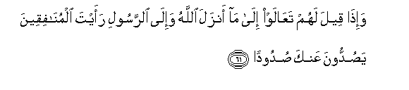

#وَإِذَا قِيلَ لَهُمْ تَعَالَوْا إِلَىٰ مَا أَنْزَلَ اللَّهُ وَإِلَى الرَّسُولِ رَأَيْتَ الْمُنَافِقِينَ يَصُدُّونَ عَنْكَ صُدُودًا 

##Waitha qeela lahum taAAalaw ila ma anzala Allahu waila alrrasooli raayta almunafiqeena yasuddoona AAanka sudoodan 

## 翻译(Translation)：

| Translator | 译文(Translation)                                            |
| :--------: | ------------------------------------------------------------ |
|    马坚    | 有人对他们说：你们来向真主和使者起诉吧，你会看到伪信者回避你。 |
|  YUSUFALI  | When it is said to them: "Come to what Allah hath revealed, and to the Messenger.": Thou seest the hypocrites avert their faces from thee in disgust. |
| PICKTHALL  | And when it is said unto them: Come unto that which Allah hath revealed and unto the messenger, thou seest the hypocrites turn from thee with aversion. |
|   SHAKIR   | And when it is said to them: Come to what Allah has revealed and to the Apostle, you will see the hypocrites turning away from you with (utter) aversion. |

---

## 对位释义(Words Interpretation)：

| No   | العربية | 中文    | English | 曾用词 |
| ---- | ------: | ------- | ------- | ------ |
| 序号 |    阿文 | Chinese | 英文    | Used   |
| 4:61.1  | وَإِذَا      | 和当                   | and when         | 见2:11.1   |
| 4:61.2  | قِيلَ       | 告诉                   | said             | 见2:11.2   |
| 4:61.3  | لَهُمْ       | 对他们                 | for them         | 见2:11.3   |
| 4:61.4  | تَعَالَوْا    | 你们来                 | Come             | 见3:61.11  |
| 4:61.5  | إِلَىٰ       | 至                     | to               | 见2:14.9   |
| 4:61.6  | مَا        | 什么                   | what/ that which | 见2:17.8   |
| 4:61.7  | أَنْزَلَ      | 下降，颁降，降示，揭秘 | get down         | 见2:4.4    |
| 4:61.8  | اللَّهُ      | 安拉，真主             | Allah            | 见2:7.2 |
| 4:61.9  | وَإِلَى      | 和至                   | and to           | 见2:210.14 |
| 4:61.10 | الرَّسُولِ    | 使者                   | the Messenger    | 参3:172.4  |
| 4:61.11 | رَأَيْتَ      | 你看                   | you will see     |            |
| 4:61.12 | الْمُنَافِقِينَ | 众伪信者               | the hypocrites   |            |
| 4:61.13 | يَصُدُّونَ     | 他们回避               | turning away     |            |
| 4:61.14 | عَنْكَ       | 在你                   | on you           | 见2:120.3  |
| 4:61.15 | صُدُودًا     | 回避                   | in disgust       |            |

---
