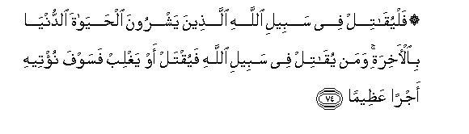

#۞ فَلْيُقَاتِلْ فِي سَبِيلِ اللَّهِ الَّذِينَ يَشْرُونَ الْحَيَاةَ الدُّنْيَا بِالْآخِرَةِ ۚ وَمَنْ يُقَاتِلْ فِي سَبِيلِ اللَّهِ فَيُقْتَلْ أَوْ يَغْلِبْ فَسَوْفَ نُؤْتِيهِ أَجْرًا عَظِيمًا 

##Falyuqatil fee sabeeli Allahi allatheena yashroona alhayata alddunya bialakhirati waman yuqatil fee sabeeli Allahi fayuqtal aw yaghlib fasawfa nuteehi ajran AAatheeman 

## 翻译(Translation)：

| Translator | 译文(Translation)                                            |
| :--------: | ------------------------------------------------------------ |
|    马坚    | 以后世生活出卖今世生活的人，教他们为主道而战吧！谁为主道而战，以致杀身成仁，或杀敌致果，我将赏赐谁重大的报酬。 |
|  YUSUFALI  | Let those fight in the Cause of Allah who sell the life of this world for the hereafter. To him who fighteth in the cause of Allah,- whether he is slain or gets victory - soon shall We give him a reward of great (value). |
| PICKTHALL  | Let those fight in the way of Allah who sell the life of this world for the other. Whoso fighteth in the way of Allah, be he slain or be he victorious, on him We shall bestow a vast reward. |
|   SHAKIR   | Therefore let those fight in the way of Allah, who sell this world's life for the hereafter; and whoever fights in the way of Allah, then be he slain or be he victorious, We shall grant him a mighty reward. |

---

## 对位释义(Words Interpretation)：

| No   | العربية | 中文    | English | 曾用词 |
| ---- | ------: | ------- | ------- | ------ |
| 序号 |    阿文 | Chinese | 英文    | Used   |
| 4:74.1  | فَلْيُقَاتِلْ | 然后使他战斗 | Therefore let those fight |            |
| 4:74.2  | فِي      | 在           | in                        | 见2:10.1   |
| 4:74.3  | سَبِيلِ    | 道路         | the way                   | 见2:154.6  |
| 4:74.4  | اللَّهِ    | 真主的       | of Allah                  | 见2:23.17  |
| 4:74.5  | الَّذِينَ   | 谁，那些     | those who                 | 见2:6.2    |
| 4:74.6  | يَشْرُونَ   | 他们卖       | they sell                 |            |
| 4:74.7  | الْحَيَاةَ  | 生活         | Life                      | 见2:85.37  |
| 4:74.8  | الدُّنْيَا  | 今世         | this world                | 见2:85.38  |
| 4:74.9  | بِالْآخِرَةِ | 后世         | the Hereafter             | 见2:86.6   |
| 4:74.10 | وَمَنْ     | 和谁         | and who                   | 见2:108.11 |
| 4:74.11 | يُقَاتِلْ   | 他战斗       | he fights                 |            |
| 4:74.12 | فِي      | 在           | in                        | 见2:10.1   |
| 4:74.13 | سَبِيلِ    | 道路         | the way                   | 见2:154.6  |
| 4:74.14 | اللَّهِ    | 真主的       | of Allah                  | 见2:23.17  |
| 4:74.15 | فَيُقْتَلْ   | 然后他被杀   | then be he slain          |            |
| 4:74.16 | أَوْ      | 或           | or                        | 见2:19.1   |
| 4:74.17 | يَغْلِبْ    | 他胜利       | be he victorious          |            |
| 4:74.18 | فَسَوْفَ    | 然后将       | soon shall                | 见4:30.6   |
| 4:74.19 | نُؤْتِيهِ   | 我们给他     | We give him               |            |
| 4:74.20 | أَجْرًا    | 报酬         | reward                    | 见4:40.14  |
| 4:74.21 | عَظِيمًا   | 大的         | great                     | 见4:27.13  |

---
