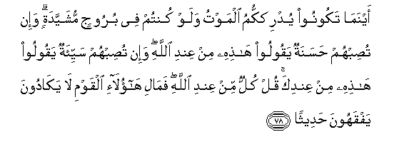

#أَيْنَمَا تَكُونُوا يُدْرِكْكُمُ الْمَوْتُ وَلَوْ كُنْتُمْ فِي بُرُوجٍ مُشَيَّدَةٍ ۗ وَإِنْ تُصِبْهُمْ حَسَنَةٌ يَقُولُوا هَٰذِهِ مِنْ عِنْدِ اللَّهِ ۖ وَإِنْ تُصِبْهُمْ سَيِّئَةٌ يَقُولُوا هَٰذِهِ مِنْ عِنْدِكَ ۚ قُلْ كُلٌّ مِنْ عِنْدِ اللَّهِ ۖ فَمَالِ هَٰؤُلَاءِ الْقَوْمِ لَا يَكَادُونَ يَفْقَهُونَ حَدِيثًا 

##Aynama takoonoo yudrikkumu almawtu walaw kuntum fee buroojin mushayyadatin wain tusibhum hasanatun yaqooloo hathihi min AAindi Allahi wain tusibhum sayyiatun yaqooloo hathihi min AAindika qul kullun min AAindi Allahi famali haolai alqawmi la yakadoona yafqahoona hadeethan 

## 翻译(Translation)：

| Translator | 译文(Translation)                                            |
| :--------: | ------------------------------------------------------------ |
|    马坚    | 你们无论在什么地方，死亡总要追及你们，即使你们在高大的堡垒里。如果他们获得福利，他们就说：这是真主所降赐的。如果他们遭遇祸患，他们就说：这是你所召致的。你说：祸福都是真主所降的。这些民众， 怎么几乎一句话都不懂呢？ |
|  YUSUFALI  | "Wherever ye are, death will find you out, even if ye are in towers built up strong and high!" If some good befalls them, they say, "This is from Allah".; but if evil, they say, "This is from thee" (O Prophet). Say: "All things are from Allah." But what hath come to these people, that they fail to understand a single fact? |
| PICKTHALL  | Wheresoever ye may be, death will overtake you, even though ye were in lofty towers. Yet if a happy thing befalleth them they say: This is from Allah; and if an evil thing befalleth them they say: This is of thy doing (O Muhammad). Say (unto them): All is from Allah. What is amiss with these people that they come not nigh to understand a happening ? |
|   SHAKIR   | Wherever you are, death will overtake you, though you are in lofty towers, and if a benefit comes to them, they say: This is from Allah; and if a misfortune befalls them, they say: This is from you. Say: All is from Allah, but what is the matter with these people that they do not make approach to understanding what is told (them)? |

---

## 对位释义(Words Interpretation)：

| No   | العربية | 中文    | English | 曾用词 |
| ---- | ------: | ------- | ------- | ------ |
| 序号 |    阿文 | Chinese | 英文    | Used   |
| 4:78.1  | أَيْنَمَا  | 无论何处       | Wherever         |            |
| 4:78.2  | تَكُونُوا | 你们是         | You will be      | 见2:41.8   |
| 4:78.3  | يُدْرِكْكُمُ | 它追及你们     | overtake you     |            |
| 4:78.4  | الْمَوْتُ  | 死亡           | the death        | 见2:19.16  |
| 4:78.5  | وَلَوْ    | 和如果         | and if           | 见2:20.14  |
| 4:78.6  | كُنْتُمْ   | 你们是         | You are          | 见2:23.2   |
| 4:78.7  | فِي     | 在             | in               | 见2:10.1   |
| 4:78.8  | بُرُوجٍ   | 堡垒           | towers           |            |
| 4:78.9  | مُشَيَّدَةٍ  | 高大的         | lofty            |            |
| 4:78.10 | وَإِنْ    | 和如果         | and if           | 见2:23.1 |
| 4:78.11 | تُصِبْهُمْ  | 它使他们获得   | befalls them     |            |
| 4:78.12 | حَسَنَةٌ   | 好             | good             | 见3:120.3  |
| 4:78.13 | يَقُولُوا | 他们说         | they say         |            |
| 4:78.14 | هَٰذِهِ    | 这个           | this             | 见2:35.15  |
| 4:78.15 | مِنْ     | 从             | from             | 见2:4.8    |
| 4:78.16 | عِنْدِ    | 以             | with             | 见2:54.20  |
| 4:78.17 | اللَّهِ   | 真主的         | of Allah         | 见2:23.17  |
| 4:78.18 | وَإِنْ    | 和如果         | and if           | 见2:23.1 |
| 4:78.19 | تُصِبْهُمْ  | 它使他们获得   | befalls them     | 见4:78.11  |
| 4:78.20 | سَيِّئَةٌ   | 不幸           | disaster         | 见3:120.7  |
| 4:78.21 | يَقُولُوا | 他们说         | they say         | 见4:78.13  |
| 4:78.22 | هَٰذِهِ    | 这个           | this             | 见2:35.15  |
| 4:78.23 | مِنْ     | 从             | from             | 见2:4.8    |
| 4:78.24 | عِنْدِكَ   | 以你那里       | with you         | 参2:54.20  |
| 4:78.25 | قُلْ     | 你说           | Say              | 见2:80.8   |
| 4:78.26 | كُلٌّ     | 所有           | All              | 见2:20.23  |
| 4:78.27 | مِنْ     | 从             | from             | 见2:4.8    |
| 4:78.28 | عِنْدِ    | 以             | with             | 见2:54.20  |
| 4:78.29 | اللَّهِ   | 真主的         | of Allah         | 见2:23.17  |
| 4:78.30 | فَمَالِ   | 因此什么       | but what         |            |
| 4:78.31 | هَٰؤُلَاءِ  | 这些           | Those            | 见2:31.12  |
| 4:78.32 | الْقَوْمِ  | 人们           | folk             | 见2:250.14 |
| 4:78.33 | لَا     | 不，不是，没有 | no               | 见2:2.3    |
| 4:78.34 | يَكَادُونَ | 他们似乎       | make approach to |            |
| 4:78.35 | يَفْقَهُونَ | 他们了解       | understand       |            |
| 4:78.36 | حَدِيثًا  | 一句话         | a single fact    | 见4:42.14  |

---
