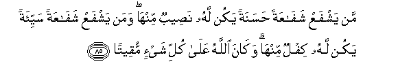

#مَنْ يَشْفَعْ شَفَاعَةً حَسَنَةً يَكُنْ لَهُ نَصِيبٌ مِنْهَا ۖ وَمَنْ يَشْفَعْ شَفَاعَةً سَيِّئَةً يَكُنْ لَهُ كِفْلٌ مِنْهَا ۗ وَكَانَ اللَّهُ عَلَىٰ كُلِّ شَيْءٍ مُقِيتًا 

##Man yashfaAA shafaAAatan hasanatan yakun lahu naseebun minha waman yashfaAA shafaAAatan sayyiatan yakun lahu kiflun minha wakana Allahu AAala kulli shayin muqeetan 

## 翻译(Translation)：

| Translator | 译文(Translation)                                            |
| :--------: | ------------------------------------------------------------ |
|    马坚    | 谁赞助善事，谁得一份善报；谁赞助恶事，谁受一份恶报。真主对于万事是全能的。 |
|  YUSUFALI  | Whoever interceded in a good cause becomes a partner therein: And whoever recommends and helps an evil cause, shares in its burden: And Allah hath power over all things. |
| PICKTHALL  | Whoso interveneth in a good cause will have the reward thereof, and whoso interveneth in an evil cause will bear the consequence thereof. Allah overseeth all things. |
|   SHAKIR   | Whoso interveneth in a good cause will have the reward thereof, and whoso interveneth in an evil cause will bear the consequence thereof. Allah overseeth all things. |

---

## 对位释义(Words Interpretation)：

| No   | العربية | 中文    | English | 曾用词 |
| ---- | ------: | ------- | ------- | ------ |
| 序号 |    阿文 | Chinese | 英文    | Used   |
| 4:85.1  | مَنْ    | 谁         | who           | 见2:97.2   |
| 4:85.2  | يَشْفَعْ  | 他调停     | he interceded |            |
| 4:85.3  | شَفَاعَةً | 调停       | intercede     |            |
| 4:85.4  | حَسَنَةً  | 好的       | good          | 见2:201.8  |
| 4:85.5  | يَكُنْ   | 他是       | it is         | 见2:196.62 |
| 4:85.6  | لَهُ    | 对他       | for he        | 见2:102.62 |
| 4:85.7  | نَصِيبٌ  | 一部分     | portion       | 见2:202.3  |
| 4:85.8  | مِنْهَا  | 从它       | From it       | 见2:25.15  |
| 4:85.9  | وَمَنْ   | 和谁       | and who       | 见2:108.11 |
| 4:85.10 | يَشْفَعْ  | 他调停     | he interceded | 见4:85.2   |
| 4:85.11 | شَفَاعَةً | 调停       | intercede     | 见4:85.3   |
| 4:85.12 | سَيِّئَةً  | 恶         | evil          | 见2:81.4   |
| 4:85.13 | يَكُنْ   | 他是       | it is         | 见2:196.62 |
| 4:85.14 | لَهُ    | 对他       | for he        | 见2:102.62 |
| 4:85.15 | كِفْلٌ   | 负担       | burden        |            |
| 4:85.16 | مِنْهَا  | 从它       | From it       | 见2:25.15  |
| 4:85.17 | وَكَانَ  | 和他是     | and he was    | 见2:34.11  |
| 4:85.18 | اللَّهُ  | 安拉，真主 | Allah         | 见1:1.2    |
| 4:85.19 | عَلَىٰ   | 至         | On            | 见2:5.2    |
| 4:85.20 | كُلِّ    | 所有       | All           | 见2:20.23  |
| 4:85.21 | شَيْءٍ   | 事物       | Thing         | 见2:20.24  |
| 4:85.22 | مُقِيتًا | 全能的     | hath power    |            |

---
